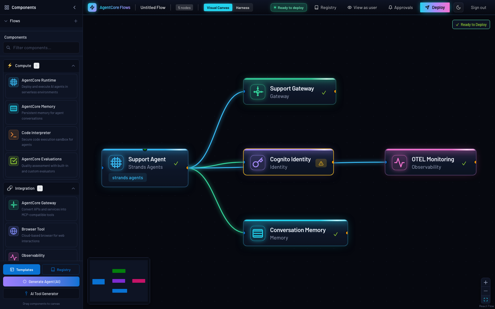
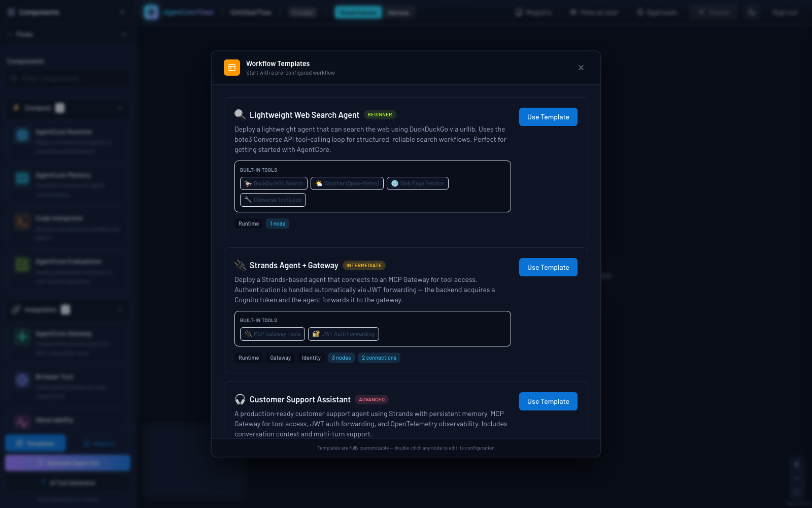
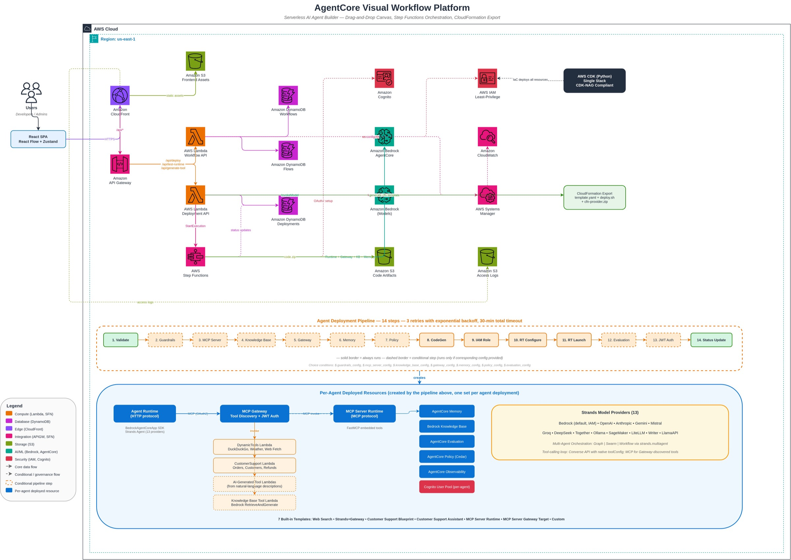

# AgentCore Visual Workflow Platform

[](https://github.com/aws-samples/sample-agentcore-lowcode-nocode/actions/workflows/ci.yml)

A visual workflow builder for **AWS Bedrock AgentCore** that lets you design, configure, and deploy AI agents through a drag-and-drop canvas interface. Inspired by n8n's node-based editor, built for AWS Bedrock AgentCore. Deployed to AWS with API Gateway, Lambda, Step Functions, DynamoDB, and CloudFront — fully serverless, pay-per-request.



<details>
<summary>More screenshots</summary>

**Template gallery** — six one-click starting points from beginner to advanced:



</details>

## Architecture



> The editable diagram source is at [`docs/architecture.drawio`](docs/architecture.drawio). Open it in [draw.io](https://app.diagrams.net/) to view or edit.

## Key Features

- **Visual Canvas** — Drag-and-drop AgentCore components (Runtime, Gateway, Memory, Knowledge Base, Browser, Identity, Observability, Policy, Connectors) and wire them together with real-time validation.
- **Two authoring paths, one deploy pipeline** — Build agents on the canvas (code-generated AgentCore **Runtime**) or as a config-driven **AgentCore Harness** (`deploymentMode: "runtime" | "harness"`); both share the same Gateway, Memory, connector, test, and teardown surfaces.
- **Real SaaS connectors** — Jira, Asana, Slack, GitHub, Salesforce, or any OpenAPI spec as Gateway targets with API-key or OAuth2 outbound auth; credentials live only in Secrets Manager.
- **Template Gallery + CloudFormation Export** — Six one-click templates, plus downloadable self-contained CloudFormation stacks (`deploy.sh`, `teardown.sh`, code artifacts) so external users can deploy without the platform.
- **AI generation** — Describe a tool or a whole agent in natural language; Claude on Bedrock generates a deployable Lambda tool or a validated canvas spec.
- **Multi-target gateways** — One gateway can carry multiple targets of different families at once (Lambda tools, external MCP servers from a curated catalog or a custom endpoint, OpenAPI specs, Smithy models), each with the right outbound auth.
- **Dynamic Gateway tool pipeline** — Selected tools deploy as a single Lambda behind an MCP Gateway with Cognito OAuth2; agents discover them at runtime via `tools/list`.
- **13 model providers & multi-agent patterns** — Bedrock (default), OpenAI, Anthropic, Gemini, Mistral, Ollama, Groq, DeepSeek, Together, LiteLLM, SageMaker, Writer, LlamaAPI; Graph / Swarm / Workflow orchestration via Strands Agents SDK.
- **Knowledge Base (RAG)** — 5 data source types, 3 vector stores (S3 Vectors, OpenSearch Serverless auto-provisioned, Aurora PostgreSQL), configurable parsing/chunking, plus agentic retrieval strategies.
- **Enterprise governance** — Scope-based RBAC/ABAC, Cedar policy enforcement, agent registry with approval workflow, versioning & rollback, cost budgets, audit analytics, HITL approvals, VPC-egress runtimes, OIDC federation. See [Enterprise Capabilities](docs/ENTERPRISE_CAPABILITIES.md).
- **Full manifest-driven teardown** — Every deploy records the sub-resources it creates; delete tears down everything (runtime, gateway, Cognito, secrets, KB, vector stores, IAM roles) with no orphans.

## Prerequisites

- **AWS CLI** v2 — configured with credentials for the target account (`aws configure`)
- **Node.js** 20+ (CI runs on 22)
- **Python** 3.12+
- The deploy region **must be `us-east-1`** — the stack's WAF WebACL is CLOUDFRONT-scoped, which AWS only accepts there; `deploy.sh` fails fast otherwise.

No Docker installation required. CDK is invoked via `npx` (no global install needed).

## Quickstart

```bash
# Minimal deploy (dev environment, us-east-1)
COGNITO_USERS="user@example.com" ./scripts/deploy.sh

# Specific environment (the stack requires us-east-1 — its WAF WebACL is
# CLOUDFRONT-scoped, which AWS only accepts in us-east-1; deploy.sh fails fast otherwise)
COGNITO_USERS="user@example.com" ENVIRONMENT_NAME=prod ./scripts/deploy.sh
```

The deploy script validates prerequisites and AWS credentials, installs backend/Lambda Python dependencies, builds the AgentCore dependency bundles, runs `cdk deploy` via `npx` (API Gateway, Lambda, Step Functions, DynamoDB, S3, CloudFront), then builds and uploads the frontend and prints the URLs. Lambda code is packaged automatically by CDK — no Docker build or ECR push required. A first-time deploy takes roughly 15–20 minutes.

To also export OTLP traces from every platform Lambda and deployed agent to a backend like Langfuse, see the platform-level OTEL deploy mode in [Observability](docs/OBSERVABILITY.md).

## Accessing the Platform

After deployment completes, the script prints two URLs:

- **Frontend** — `https://dXXXXXXXXXX.cloudfront.net` — the visual workflow builder.
- **Backend API** — `https://XXXXXXXXXX.execute-api.region.amazonaws.com` — the API Gateway endpoint (CloudFront routes `/api/*` here automatically).

You can retrieve these at any time from the CloudFormation stack outputs (`CloudFrontUrl`, `ApiGatewayUrl`, `S3BucketName`):

```bash
aws cloudformation describe-stacks --stack-name agentcore-workflow-dev --region us-east-1 \
  --query "Stacks[0].Outputs" --output table
```

### First sign-in — assign a persona

`COGNITO_USERS` pre-creates Cognito **users** but assigns them to **no group**. Group membership grants capability **scopes**, so a brand-new user signs in effectively read-only (browse works; Clone/publish are disabled) until you assign a group:

> **Always pass `--region us-east-1`** (the stack is us-east-1). Without it the
> AWS CLI uses your shell/profile default region and the pool lookup returns
> empty, so `$POOL_ID` is blank and `admin-add-user-to-group` fails with
> `Invalid length for parameter UserPoolId, value: 0`.

```bash
POOL_ID=$(aws cognito-idp list-user-pools --max-results 40 --region us-east-1 \
  --query "UserPools[?Name=='agentcore-workflow-dev-users'].Id | [0]" --output text)

# Full access (all scopes) + admin UI + registry approver:
for g in g-admins-super t-admin registry-admin; do
  aws cognito-idp admin-add-user-to-group --user-pool-id "$POOL_ID" \
    --username you@example.com --group-name "$g" --region us-east-1
done

# ...or a standard end-user who can build/deploy/invoke + browse & clone the registry:
for g in g-users-default t-user; do
  aws cognito-idp admin-add-user-to-group --user-pool-id "$POOL_ID" \
    --username you@example.com --group-name "$g" --region us-east-1
done
```

**Sign out and back in** after changing groups — scopes are read from the ID token at sign-in. See [Personas](docs/PERSONAS.md) and [Registry & RBAC](docs/REGISTRY_AND_RBAC.md) for the full model.

## Cleanup

```bash
# Tear down all resources (prompts for confirmation)
./scripts/cleanup.sh

# Tear down a specific environment
ENVIRONMENT_NAME=prod ./scripts/cleanup.sh

# Non-interactive teardown (CI / scripted) — skips the confirmation prompt
FORCE_DESTROY=true ./scripts/cleanup.sh
```

The cleanup script validates credentials, deletes every AgentCore resource the
platform created (runtimes, gateways, memories, KBs, vector stores, Cognito
pools, secrets, IAM roles), empties the S3 buckets, runs `cdk destroy` on the
stack, and verifies all resources are removed. It is scoped strictly to the
`agentcore-workflow-<env>` stack and never touches unrelated resources in the
account.

## Running Tests

```bash
cd backend && pip install -e ".[dev]" && pytest   # backend unit + property tests
cd infra && pip install -r requirements.txt && pytest tests/ -v   # CDK assertions
cd frontend && npm install && npm test            # frontend tests
```

Integration tests run against a real deployed stack — see [Development](docs/DEVELOPMENT.md).

## Documentation

| Doc | Contents |
|-----|----------|
| [Enterprise Capabilities](docs/ENTERPRISE_CAPABILITIES.md) | Versioning & rollback, Cedar policy enforcement, evaluation, cost analytics, registry, prompt library, triggers, connectors, HITL, governance & FinOps |
| [Security & Hardening](docs/SECURITY_HARDENING.md) | Infrastructure hardening, CDK-NAG, tenant isolation, SSRF guards, pre-commit hooks |
| [Observability](docs/OBSERVABILITY.md) | Per-canvas and platform-level OTEL modes, OTEL deploy configuration |
| [Deployment Internals](docs/DEPLOYMENT_INTERNALS.md) | Infrastructure & agent deploy flows, gateway tool pipeline, code architecture, CFN export, packaging, templates, project structure |
| [API Reference](docs/API_REFERENCE.md) | Every API endpoint, configuration variables, SSM parameters |
| [Registry & RBAC](docs/REGISTRY_AND_RBAC.md) | Agent registry roles, approval workflow, persona assignment |
| [Personas](docs/PERSONAS.md) | Platform-wide group → scope model |
| [RBAC Rollout](docs/RBAC_ROLLOUT.md) | Advisory → enforce rollout procedure |
| [Costs](docs/COSTS.md) | AWS resources created + infrastructure pricing estimates |
| [Development](docs/DEVELOPMENT.md) | Local development, full test matrix, tech stack |
| [Data Retention](docs/DATA_RETENTION.md) | TTLs, PII posture, audit access |
| [MCP Catalog](docs/MCP_CATALOG.md) | External MCP catalog servers as Gateway targets |
| [MCP Gateway Integration](docs/MCP_GATEWAY_INTEGRATION.md) | MCP protocol details for gateway-connected agents |

## License

MIT-0 (MIT No Attribution). See [LICENSE](LICENSE).
