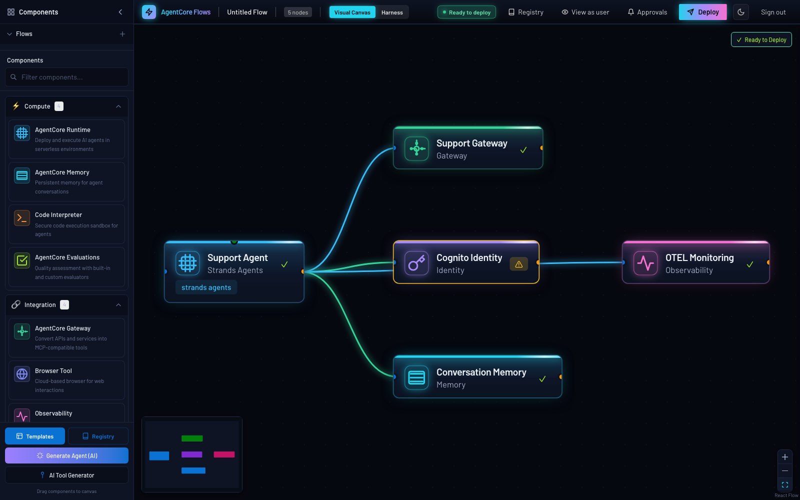
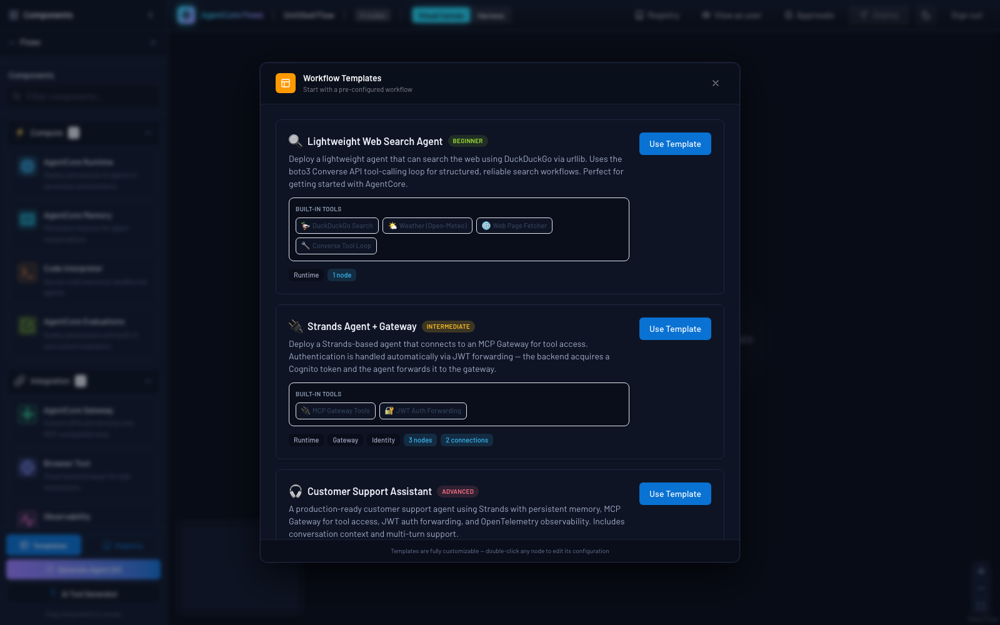
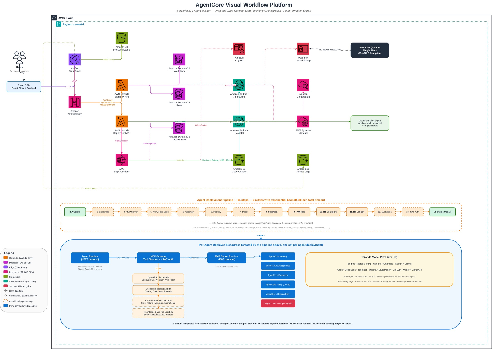

# AgentCore Visual Workflow Platform

[](https://github.com/aws-samples/sample-agentcore-lowcode-nocode/actions/workflows/ci.yml)

A visual workflow builder for **AWS Bedrock AgentCore** that lets you design, configure, and deploy AI agents through a drag-and-drop canvas interface. Inspired by n8n's node-based editor, built for AWS Bedrock AgentCore. Deployed to AWS with API Gateway, Lambda, Step Functions, DynamoDB, and CloudFront — fully serverless, pay-per-request.



<details>
<summary>More screenshots</summary>

**Template gallery** — six one-click starting points from beginner to advanced:



</details>

## Architecture



> The editable diagram source is at [`docs/architecture.drawio`](docs/architecture.drawio). Open it in [draw.io](https://app.diagrams.net/) to view or edit.

## Key Features

- **Visual Canvas** — Drag-and-drop AgentCore components (Runtime, Gateway, Memory, Knowledge Base, Browser, Identity, Observability, Policy, Connectors) and wire them together with real-time validation.
- **Two authoring paths, one deploy pipeline** — Build agents on the canvas (code-generated AgentCore **Runtime**) or as a config-driven **AgentCore Harness** (`deploymentMode: "runtime" | "harness"`); both share the same Gateway, Memory, connector, test, and teardown surfaces.
- **Real SaaS connectors** — Jira, Asana, Slack, GitHub, Salesforce, or any OpenAPI spec as Gateway targets with API-key or OAuth2 outbound auth; credentials live only in Secrets Manager.
- **Template Gallery + CloudFormation Export** — Six one-click templates, plus downloadable self-contained CloudFormation stacks (`deploy.sh`, `teardown.sh`, code artifacts) so external users can deploy without the platform.
- **AI generation** — Describe a tool or a whole agent in natural language; Claude on Bedrock generates a deployable Lambda tool or a validated canvas spec.
- **Multi-target gateways** — One gateway can carry multiple targets of different families at once (Lambda tools, external MCP servers from a curated catalog or a custom endpoint, OpenAPI specs, Smithy models), each with the right outbound auth.
- **Dynamic Gateway tool pipeline** — Selected tools deploy as a single Lambda behind an MCP Gateway with Cognito OAuth2; agents discover them at runtime via `tools/list`.
- **Bring your own LiteLLM** — Point an agent at a LiteLLM MCP proxy *instead of* AgentCore Gateway, or carry it *inside* one as an MCP target, and/or make a LiteLLM proxy the authoritative agent catalog. All opt-in and additive; the AgentCore Gateway and the built-in registry remain the defaults. See [Bring your own LiteLLM](#bring-your-own-litellm).
- **13 model providers & multi-agent patterns** — Bedrock (default), OpenAI, Anthropic, Gemini, Mistral, Ollama, Groq, DeepSeek, Together, LiteLLM, SageMaker, Writer, LlamaAPI; Graph / Swarm / Workflow orchestration via Strands Agents SDK.
- **Knowledge Base (RAG)** — 5 data source types, 3 vector stores (S3 Vectors, OpenSearch Serverless auto-provisioned, Aurora PostgreSQL), configurable parsing/chunking, plus agentic retrieval strategies.
- **Enterprise governance** — Scope-based RBAC/ABAC, Cedar policy enforcement, agent registry with approval workflow, versioning & rollback, cost budgets, audit analytics, HITL approvals, VPC-egress runtimes, OIDC federation. See [Enterprise Capabilities](docs/ENTERPRISE_CAPABILITIES.md).
- **Full manifest-driven teardown** — Every deploy records the sub-resources it creates; delete tears down everything (runtime, gateway, Cognito, secrets, KB, vector stores, IAM roles) with no orphans.

## Prerequisites

- **AWS CLI** v2 — configured with credentials for the target account (`aws configure`)
- **Node.js** 20+ (CI runs on 22)
- **Python** 3.12+
- **Any AWS region** — `us-east-1` is the default; see [Deploying to another region](#deploying-to-another-region) for the two things that differ elsewhere.

No Docker installation required. CDK is invoked via `npx` (no global install needed).

## Quickstart

```bash
# Minimal deploy (dev environment, us-east-1)
COGNITO_USERS="user@example.com" ./scripts/deploy.sh

# Specific environment
COGNITO_USERS="user@example.com" ENVIRONMENT_NAME=prod ./scripts/deploy.sh

# Another region (Frankfurt)
COGNITO_USERS="user@example.com" AWS_REGION=eu-central-1 ./scripts/deploy.sh
```

The deploy script validates prerequisites and AWS credentials, installs backend/Lambda Python dependencies, builds the AgentCore dependency bundles, runs `cdk deploy` via `npx` (API Gateway, Lambda, Step Functions, DynamoDB, S3, CloudFront), then builds and uploads the frontend and prints the URLs. Lambda code is packaged automatically by CDK — no Docker build or ECR push required. A first-time deploy takes roughly 15–20 minutes.

To also export OTLP traces from every platform Lambda and deployed agent to a backend like Langfuse, see the platform-level OTEL deploy mode in [Observability](docs/OBSERVABILITY.md).

### Deploying to another region

Set `AWS_REGION`. Everything is derived from it — Bedrock cross-region inference
profiles, Lambda regions, the frontend's `VITE_AWS_REGION`, and the generated
agent code. Two things genuinely differ outside `us-east-1`, both handled
automatically:

| | `us-east-1` | Any other region |
|---|---|---|
| **WAF** | One `CLOUDFRONT`-scoped WebACL on the CloudFront distribution | The same rule set as a `REGIONAL` WebACL on the Cognito user pool. The distribution runs without an edge ACL — AWS accepts only `CLOUDFRONT`-scoped ACLs there and creates those exclusively in `us-east-1`. Pass `CLOUDFRONT_WEB_ACL_ARN=arn:...` to also attach one you created in `us-east-1`. |
| **Account-global names** | Unqualified (unchanged) | Suffixed with the region, so two regions can coexist in one account |

Because `us-east-1` keeps its unqualified names, adding a second region **does not
rename or replace anything in an existing `us-east-1` deployment**.

One region-specific caveat worth knowing before you pick a region: Bedrock's
cross-region inference prefixes are `us.`, `eu.` and `apac.`, and the `apac.`
family covers only the older Claude models. In APAC, current-generation models
are published under *country* prefixes (`jp.` in `ap-northeast-1`, `au.` in
`ap-southeast-2`) or as `global.`, so an APAC deployment may need its model ID set
explicitly. `us-*` and `eu-*` regions need no such adjustment.

## Accessing the Platform

After deployment completes, the script prints two URLs:

- **Frontend** — `https://dXXXXXXXXXX.cloudfront.net` — the visual workflow builder.
- **Backend API** — `https://XXXXXXXXXX.execute-api.region.amazonaws.com` — the API Gateway endpoint (CloudFront routes `/api/*` here automatically).

You can retrieve these at any time from the CloudFormation stack outputs (`CloudFrontUrl`, `ApiGatewayUrl`, `S3BucketName`):

```bash
aws cloudformation describe-stacks --stack-name agentcore-workflow-dev \
  --region us-east-1 \
  --query "Stacks[0].Outputs" --output table
```

Substitute the region you deployed to. The stack, the user pool and the
distribution all live in that one region.

### First sign-in — assign a persona

`COGNITO_USERS` pre-creates Cognito **users** but assigns them to **no group**. Group membership grants capability **scopes**, so a brand-new user signs in effectively read-only (browse works; Clone/publish are disabled) until you assign a group:

> **Always pass `--region <the region you deployed to>`** — `us-east-1` below, but
> use `eu-central-1` if that is where you deployed. Without it the AWS CLI falls
> back to your shell/profile default region, the pool lookup returns empty, and
> `$POOL_ID` is blank, so `admin-add-user-to-group` fails with
> `Invalid length for parameter UserPoolId, value: 0`.

```bash
POOL_ID=$(aws cognito-idp list-user-pools --max-results 40 --region us-east-1 \
  --query "UserPools[?Name=='agentcore-workflow-dev-users'].Id | [0]" --output text)

# Full access (all scopes) + admin UI + registry approver:
for g in g-admins-super t-admin registry-admin; do
  aws cognito-idp admin-add-user-to-group --user-pool-id "$POOL_ID" \
    --username you@example.com --group-name "$g" --region us-east-1
done

# ...or a standard end-user who can build/deploy/invoke + browse & clone the registry:
for g in g-users-default t-user; do
  aws cognito-idp admin-add-user-to-group --user-pool-id "$POOL_ID" \
    --username you@example.com --group-name "$g" --region us-east-1
done
```

**Sign out and back in** after changing groups — scopes are read from the ID token at sign-in. See [Personas](docs/PERSONAS.md) and [Registry & RBAC](docs/REGISTRY_AND_RBAC.md) for the full model.

## Bring your own LiteLLM

If you already run a **LiteLLM proxy**, it can serve two roles here: as an **MCP
gateway** for individual agents, and as the **agent catalog** behind the Registry.
The two are independent — enable either, both, or neither.

For the gateway role there are **two different ways to wire it**, and they are not
the same thing, so the choice is worth making deliberately. Together with plain
AgentCore Gateway, an agent on the canvas has three supported shapes:

| On the canvas | What gets created | Use when |
|---|---|---|
| **Gateway node, Provider = AgentCore** *(default)* | A real AgentCore Gateway with your Lambda / OpenAPI / Smithy / MCP targets | The default. Nothing about it changes. |
| **Gateway node, Provider = LiteLLM** | No AgentCore Gateway at all — the agent talks straight to your proxy | LiteLLM *replaces* the gateway. Your proxy already aggregates every tool the agent needs. |
| **Gateway node, Provider = AgentCore, with a `Custom endpoint…` MCP target pointed at LiteLLM** | An AgentCore Gateway that carries your proxy as one `mcpServer` target | You want LiteLLM's tools **alongside** Lambda/OpenAPI targets, or you want AgentCore's inbound Cognito auth, semantic search and observability in front of it. |

The second and third are covered below; the third is a normal MCP target and needs
no LiteLLM-specific setting beyond the endpoint and key.

All of this is **additive**. AgentCore Gateway stays the default gateway, the
built-in DynamoDB catalog stays the default registry, and existing canvases,
stored flows and deployed agents are unaffected until someone explicitly opts in.
Nothing is migrated and nothing is deleted when you switch either one back.

### As the gateway itself, per agent

On the canvas, open the **Gateway** node and set **Provider** to
`LiteLLM MCP Gateway (your own proxy)`, then fill in:

| Field | Notes |
|---|---|
| **Base URL** | The proxy root (e.g. `https://litellm.example.com`), not an MCP path. `https` only. |
| **Virtual Key** | Sent as `x-litellm-api-key: Bearer <key>`. Write-only — minted into Secrets Manager on deploy and never returned to the browser or stored on the canvas. |
| **MCP Servers** *(optional)* | Comma-separated server aliases (`github, jira`) to scope this agent to. Blank means every server the key can see. |

Choosing `litellm` replaces the AgentCore target list entirely — there is no
Lambda/OpenAPI/Smithy target configuration on this path. At deploy time the
platform:

1. Runs the base URL through the same **SSRF guard** as every other outbound URL (`https`-only; private, loopback and link-local ranges rejected, including the instance-metadata address).
2. Mints the virtual key into Secrets Manager and drops the raw value before the deployment event is re-emitted.
3. **Probes the proxy** — `GET /v1/mcp/server`, then `GET /mcp-rest/tools/list` — and fails the deploy loudly if it serves zero tools, rather than shipping an agent with no tools.
4. Resolves the agent's MCP endpoint to `{base}/mcp/`, adding the `x-mcp-servers` header when you scoped it.

The generated agent authenticates with a **static bearer key**
(`GATEWAY_AUTH_MODE=static_bearer`) instead of the Cognito client-credentials
exchange AgentCore Gateway uses. Teardown deletes only the virtual-key secret —
your proxy is external, so the platform records it as informational and never
issues a delete against it.

> **The proxy must be reachable from the deploy Lambda.** The control plane has no
> VPC egress, so a VPC-private LiteLLM cannot be probed and the deploy will fail
> at step 3 even though a VPC-mode Runtime could reach it at invoke time.

There is also a platform-wide **fallback**, but read what it does before setting
it: it applies **only** to a gateway config that carries no provider field at all.
A per-agent choice always wins, and the canvas always writes one — so this row
changes nothing for agents built in the UI. What it does reach is configs that
omit the field: canvases saved before this feature existed, imported JSON, and
direct API deploys.

> **It is a tie-breaker, not a switch.** The row carries no base URL or virtual
> key, so a config it applies to has no LiteLLM connection details and its deploy
> fails with `LiteLLM gateway requires a base URL (litellm_base_url)`. On a stack
> with pre-existing canvases, setting this to `litellm` can therefore break
> AgentCore gateways that were working. Prefer the per-agent selector above.

Set it (there is no API route for this) with:

```bash
aws dynamodb put-item --region us-east-1 \
  --table-name agentcore-workflow-dev-tag-policy \
  --item '{"org_id":{"S":"default"},"sk":{"S":"SETTING#gateway_provider"},"value":{"S":"litellm"}}'
```

A per-agent choice on the canvas always wins over the default. A missing row, an
unreadable table, or an unrecognized value all resolve to `agentcore`, so the
existing behavior is what you get whenever anything is uncertain. The Lambda
environment variable `DEFAULT_GATEWAY_PROVIDER` overrides the row if set.

### As a target inside an AgentCore Gateway

The opposite trade from the section above: keep the AgentCore Gateway and hang the
LiteLLM proxy off it as one MCP target, so its tools sit next to your Lambda and
OpenAPI targets behind AgentCore's inbound Cognito auth.

Leave **Provider** on `AgentCore`, add a target of type **MCP Server**, pick
**`Custom endpoint…`**, and fill in:

| Field | Value for a LiteLLM proxy |
|---|---|
| **MCP Endpoint URL** | `https://litellm.example.com/mcp/` for every server the key can see, or `https://litellm.example.com/<alias>/mcp` to pin one |
| **Outbound Auth** | `API key` |
| **API Key** | The virtual key |
| **API Key Header** | Leave blank for `Authorization`, or set `x-litellm-api-key` |
| **Key Format** | `Bearer <key>` (the default) |

One thing differs from the provider path: server scoping is done **in the URL**,
not with the `x-mcp-servers` header — a Gateway target has no way to send an extra
header per request.

Readiness is still enforced. The deploy waits for the new target to finish
AgentCore's own `initialize` handshake against the proxy and **fails with the
reason** if it does not connect, so a wrong endpoint or key is a failed deploy
rather than an agent that quietly has no tools.

Tool names get **two** prefixes on this path — the Gateway prepends the target name,
and LiteLLM has already prepended its server alias — which can push the combined name
past the 64-character limit Bedrock enforces on tool names. Where that happens the
deployed agent shortens the name it shows the model (the tool's own name plus a short
unique suffix) and still calls the gateway by the full name, so nothing is dropped and
no configuration change is needed. Expect the shortened form in agent traces.

> **The key format matters here.** A custom MCP endpoint sends
> `Authorization: Bearer <key>` by default. That is what LiteLLM's MCP endpoint
> accepts — a bare `Authorization: <key>` with no scheme is rejected. Change
> **Key Format** to `Raw key` only for a server that documents a bare value
> (an `x-api-key` style server); it will break LiteLLM.

### As the agent registry

Open the **Registry** modal and find the **LiteLLM Registry** card, then enter the
proxy base URL and a virtual key:

- **Connect & test** — saves and probes the proxy **without** switching the catalog over, so you can confirm reachability first.
- **Connect & make authoritative** (or **Make authoritative** afterwards) — LiteLLM becomes the catalog.
- **Disconnect & use platform catalog** — reverts, and clears the stored connection, so the base URL has to be re-entered to reconnect.

These calls are **`registry-admin`-only**; the API answers `403` for anyone else.
`verified: false` after a save is not an error — it means the control plane could
not reach the proxy, which is normal for a VPC-private LiteLLM.

**What LiteLLM can and cannot back.** LiteLLM exposes no create/update/delete API
for MCP server records — registration happens in its Admin UI or `config.yaml` —
and its records have no canvas snapshot, owner, or review state. So:

| Registry surface | With LiteLLM active |
|---|---|
| list / search / get | Served by LiteLLM — it is the catalog |
| Pre-deploy governance gate | Served by LiteLLM — present-and-enabled is the approval signal |
| publish / update / delete / clone from a canvas | Platform **sidecar** in DynamoDB — fully mutable |
| the same operations on a **projected** LiteLLM entry | **`501`**, naming LiteLLM, rather than silently accepting a write that would then diverge |

The read-only limit is therefore **per entry, not per operation**: rows projected
from LiteLLM are read-only, rows published from a canvas stay fully mutable, and
on a slug collision the sidecar row wins. `GET /api/registry/litellm-config`
returns this as machine-readable `capabilities`.

The governance gate stays **fail-closed** — if the catalog cannot be read, deploys
referencing an integration return `503` rather than proceeding ungoverned. Your
existing DynamoDB entries are never read from, written to, or deleted while
LiteLLM is active, and they are all still there when you disconnect.

Note that not every LiteLLM release reports an enablement flag. Where it does not,
presence in the server list *is* the approval signal, so remove a server from
LiteLLM to stop it being deployable rather than relying on a disable toggle.

### Verifying against a real proxy

`scripts/verify-litellm.py` exercises both paths against a live LiteLLM. It issues
reads only, and asserts that writes to projected entries are refused.

Its docstring has the full setup recipe — no Docker needed, but budget time and
read the two warnings there before starting. LiteLLM's MCP endpoints require a
Postgres database (without one they return `No connected db.`), and first startup
spends roughly half an hour baselining 158 schema migrations during which
`/health/liveliness` returns nothing at all and the proxy looks like it has
crashed. It hasn't.

Full details: [MCP Gateway Integration](docs/MCP_GATEWAY_INTEGRATION.md) for the
gateway path and the endpoint wire shapes, [Registry & RBAC](docs/REGISTRY_AND_RBAC.md)
for the catalog path, and [API Reference](docs/API_REFERENCE.md) for every
endpoint and configuration variable.

## Cleanup

```bash
# Tear down all resources (prompts for confirmation)
./scripts/cleanup.sh

# Tear down a specific environment
ENVIRONMENT_NAME=prod ./scripts/cleanup.sh

# Non-interactive teardown (CI / scripted) — skips the confirmation prompt
FORCE_DESTROY=true ./scripts/cleanup.sh

# Also sweep resources that carry no owner tag (see below — off by default)
CLEANUP_INCLUDE_UNTAGGED=1 ./scripts/cleanup.sh
```

The cleanup script validates credentials, deletes every AgentCore resource the
platform created (runtimes, gateways, memories, KBs, vector stores, Cognito
pools, secrets, IAM roles), empties the S3 buckets, runs `cdk destroy` on the
stack, and verifies all resources are removed.

### Safe to run with more than one deployment in the account

Deploying and deleting repeatedly is expected, and so is running two deployments
side by side — dev + prod, two teams, or the same environment in two regions. The
resources above have **account-global names** with no deployment identity in them
(Cognito `AgentCore*`, secrets under `agentcore-connector/` and `agentcore-otel/`,
IAM roles `AgentCoreMemory-*` and `AgentCoreRuntime-*`), so a sweep by name prefix
would delete a co-resident deployment's resources.

Everything the platform creates is therefore tagged
**`AgentCoreStack={project}-{env}-{region}`** at creation, and teardown deletes only
what carries its own value. The region is part of the identity because IAM roles are
not regional, so a us-east-1 teardown must not claim a Frankfurt deployment's roles.
`ManagedBy=agentcore-flows` is also present but is *not* the gate — it names the
product, so it is on every deployment's resources alike.

Two consequences worth knowing:

- **Untagged resources are skipped**, and teardown tells you what it left and why. A
  resource created before this tag existed looks identical to one belonging to another
  deployment; skipping costs a manual delete, deleting a foreign credential cannot be
  undone. Pass `CLEANUP_INCLUDE_UNTAGGED=1` to sweep those too — safe only if this is
  the account's sole deployment.
- **CloudFormation-owned resources are left to `cdk destroy`.** The shared runtime
  execution role (`AgentCoreRuntime-{project}-{env}[-{region}]-shared`) is skipped by
  the orphan sweep by design; deleting it out from under a running deployment costs a
  redeploy plus AgentCore's 17–20 minute IAM propagation wait.

Two escape hatches exist in `cleanup.sh` and both are **off by default** for this
reason. `CLEANUP_INCLUDE_UNTAGGED=1` additionally sweeps untagged resources.
`CLEANUP_INCLUDE_FOREIGN_RUNTIMES=1` sweeps *every* AgentCore runtime, gateway,
memory, policy engine and credential provider in the region regardless of owner —
use it only in a single-tenant account you are willing to empty.

`scripts/verify-cleanup-ownership.sh` proves this against real AWS: it plants decoys
in every swept namespace — owned by this stack, owned by a different stack, and
untagged — runs the real sweep, and asserts only its own are gone. It removes
everything it plants. Run it in a scratch account, not production; it executes the
real teardown sweep.

## Running Tests

```bash
cd backend && pip install -e ".[dev]" && pytest   # backend unit + property tests
cd infra && pip install -r requirements.txt && pytest tests/ -v   # CDK assertions
cd frontend && npm install && npm test            # frontend tests
```

Integration tests run against a real deployed stack — see [Development](docs/DEVELOPMENT.md).

## Documentation

| Doc | Contents |
|-----|----------|
| [Enterprise Capabilities](docs/ENTERPRISE_CAPABILITIES.md) | Versioning & rollback, Cedar policy enforcement, evaluation, cost analytics, registry, prompt library, triggers, connectors, HITL, governance & FinOps |
| [Security & Hardening](docs/SECURITY_HARDENING.md) | Infrastructure hardening, CDK-NAG, tenant isolation, SSRF guards, pre-commit hooks |
| [Observability](docs/OBSERVABILITY.md) | Per-canvas and platform-level OTEL modes, OTEL deploy configuration |
| [Deployment Internals](docs/DEPLOYMENT_INTERNALS.md) | Infrastructure & agent deploy flows, gateway tool pipeline, code architecture, CFN export, packaging, templates, project structure |
| [API Reference](docs/API_REFERENCE.md) | Every API endpoint, configuration variables, SSM parameters |
| [Registry & RBAC](docs/REGISTRY_AND_RBAC.md) | Agent registry roles, approval workflow, persona assignment |
| [Personas](docs/PERSONAS.md) | Platform-wide group → scope model |
| [RBAC Rollout](docs/RBAC_ROLLOUT.md) | Advisory → enforce rollout procedure |
| [Costs](docs/COSTS.md) | AWS resources created + infrastructure pricing estimates |
| [Development](docs/DEVELOPMENT.md) | Local development, full test matrix, tech stack |
| [Data Retention](docs/DATA_RETENTION.md) | TTLs, PII posture, audit access |
| [MCP Catalog](docs/MCP_CATALOG.md) | External MCP catalog servers as Gateway targets |
| [MCP Gateway Integration](docs/MCP_GATEWAY_INTEGRATION.md) | MCP protocol details for gateway-connected agents |

## License

MIT-0 (MIT No Attribution). See [LICENSE](LICENSE).
