# AI Agent Factory

Enterprise samples for building, governing, and operating **agentic AI on AWS** — centered on Amazon Bedrock and Amazon Bedrock AgentCore.
**[Open the Journey documentation](https://aws-samples.github.io/sample-ai-agent-factory/)** — browsing requires no local setup or commands.



## What This Is

Four complementary projects that together show how enterprises move from learning to agent operations at scale. Each project is self-contained with its own deployment instructions and can be adopted independently.

> **Sample code** — MIT-0 License. Not an AWS service, AppSec-reviewed product, or compliance attestation. Review architecture, security, and costs before use.

## The Journey: Learn → Build → Govern → Scale

| Stage | Project | What It Does | Best For |
|-------|---------|--------------|----------|
| **1. Learn** | [Workshop](workshop-building-agentic-ai-platform/) | Hands-on modules for building enterprise platform patterns | Platform engineers learning the foundation |
| **2. Build** | [Self-Service](Agentic-ai-self-service/) | Visual drag-and-drop canvas for designing and deploying agents | Engineers shipping agents fast |
| **3. Govern** | [MCP Gateway](enterprise-mcp-governance-gateway/) | Per-tool-call authorization with [Cedar](https://www.cedarpolicy.com/) policies and Bedrock Guardrails | Security teams implementing tool governance |
| **4. Scale** | [Blueprint](enterprise-agentic-ai-platform-blueprint/) | Multi-account CDK reference with Organizations, SCPs, and CI/CD gates | Platform teams building enterprise infrastructure |

## Capability Architecture

The projects share architectural concepts expressed as capability contracts. A **capability contract** defines the outcomes and controls that any chosen implementation must preserve, regardless of product. The table below shows **what each capability does** and **one reference implementation** — alternatives are valid when those contracts are preserved.

| Capability | Purpose | Reference Implementation |
|------------|---------|-------------------------|
| LLM Gateway | Governed model access with auth, routing, and attribution | AgentCore Gateway inference targets, LiteLLM |
| Tool Gateway | Authenticated MCP discovery/invocation with policy | AgentCore Gateway with AWS_IAM |
| Agent Runtime | Immutable deployable execution with identity and scaling | AgentCore Runtime |
| Agent Memory | Actor-scoped storage with encryption and retention | AgentCore Memory with CMK |
| Identity | Short-lived credentials with tenant binding | AgentCore Identity, Cognito M2M |
| Registry | Ownership, lifecycle, and approval for agents/tools | AWS Agent Registry |
| Policy Engine | Fail-closed authorization with versioning | AgentCore PolicyEngine, Cedar |
| Delivery | Reviewed source, build, scan, gates, and rollback | CodePipeline, CodeBuild, ECR |
| Observability | Correlated logs/metrics/traces with fleet views | CloudWatch, X-Ray, OAM |
| Cost | Attribution by app/agent/tenant with budgets | Allocation tags, Budgets, CUR |

> **Replacements:** LiteLLM, AgentCore Gateway targets, and other components are reference choices. Substitutes must preserve the security, identity, tenancy, lifecycle, and evidence contracts. The support envelope applies only to the exact tested implementation.

## Quick Start

```bash
git clone https://github.com/aws-samples/sample-ai-agent-factory.git
cd sample-ai-agent-factory/<chosen-project>
# Example: cd sample-ai-agent-factory/workshop-building-agentic-ai-platform

# Follow the project's README for prerequisites and deployment
```

**Choose your project** (folder names are exact and case-sensitive):
- `workshop-building-agentic-ai-platform/` — Learn the patterns
- `Agentic-ai-self-service/` — Build agents visually
- `enterprise-mcp-governance-gateway/` — Govern tool access
- `enterprise-agentic-ai-platform-blueprint/` — Enterprise-scale reference

## Project Summaries

### Workshop — Learn the Foundation

Multi-module workshop composing AgentCore with an LLM Gateway (LiteLLM), MCP Gateway & Registry, and Strands Agents. Three tracks: Fast Path (1.5-2 hrs), Build the Platform (2-3 hrs), Full Journey (3-4 hrs).

**Prerequisites:** AWS CLI v2, basic AWS familiarity, Bedrock access. See README for supported regions.

→ [workshop-building-agentic-ai-platform/README.md](workshop-building-agentic-ai-platform/README.md)

### Self-Service — Build Agents Fast

Visual workflow builder for AgentCore: drag-and-drop canvas, template gallery, CloudFormation export, versioning/rollback, Cedar policy, and cost analytics.

**Prerequisites:** AWS CLI v2, Node.js 20+, Python 3.12+. See README for supported regions.

→ [Agentic-ai-self-service/README.md](Agentic-ai-self-service/README.md)

### MCP Gateway — Govern Every Tool Call

Deployable governance layer placing AgentCore Gateway in front of MCP tool servers. JWT authentication (Cognito), Cedar policy evaluation in ENFORCE mode, Bedrock Guardrail screening, and request/response Lambda interceptors.

**Prerequisites:** Node.js + AWS CDK, Python 3.12+, AWS credentials.

→ [enterprise-mcp-governance-gateway/README.md](enterprise-mcp-governance-gateway/README.md)

### Blueprint — Enterprise-Scale Reference

Multi-account CDK reference blueprint with AWS Organizations, SCPs, per-tenant Application Inference Profiles, PrivateLink egress, AgentCore Runtime/Gateway/Memory, Registry integration, CDK Pipelines with evaluation gates, and CloudWatch OAM observability.

This is an enterprise-scale reference blueprint with a bounded reviewed support envelope — not universal readiness for all environments. See the project README for tested configurations and known limitations.

**Prerequisites:** AWS Organizations, Node.js 20+, Python 3.12+, CDK experience.

→ [enterprise-agentic-ai-platform-blueprint/README.md](enterprise-agentic-ai-platform-blueprint/README.md)

## Important Notices

### Costs

All projects deploy **real, billable AWS resources** including ECS Fargate, DocumentDB, Aurora, NAT Gateways, Load Balancers, Lambda functions, and Amazon Bedrock invocations. **Tear down resources when finished** using each project's cleanup commands.

### Security

Each project documents its security posture in its README. Before use:
- Review IAM policies and trust relationships
- Understand network configuration and egress patterns
- Verify data classification and retention requirements
- Check compliance obligations for your organization

See [CONTRIBUTING.md](CONTRIBUTING.md#security-issue-notifications) for reporting security issues.

### Support Envelope

Each project documents its tested regions, prerequisites, and known limitations. The support envelope applies to the exact reference implementations tested — replacements require independent validation.

## Documentation Site

**[Open the Journey documentation](https://aws-samples.github.io/sample-ai-agent-factory/)** — browsing requires no local setup or commands.

GitHub Pages publishes the site automatically from `main` after a repository maintainer selects **GitHub Actions** once under **Settings → Pages**. Contributors who want to preview changes locally can follow [`docs-site/README.md`](docs-site/README.md).

## Contributing

See [CONTRIBUTING.md](CONTRIBUTING.md) for contribution guidelines.

## License

MIT-0 License. See [LICENSE](LICENSE). Bundled subprojects retain their own licenses — see LICENSE/NOTICE files in each folder.
