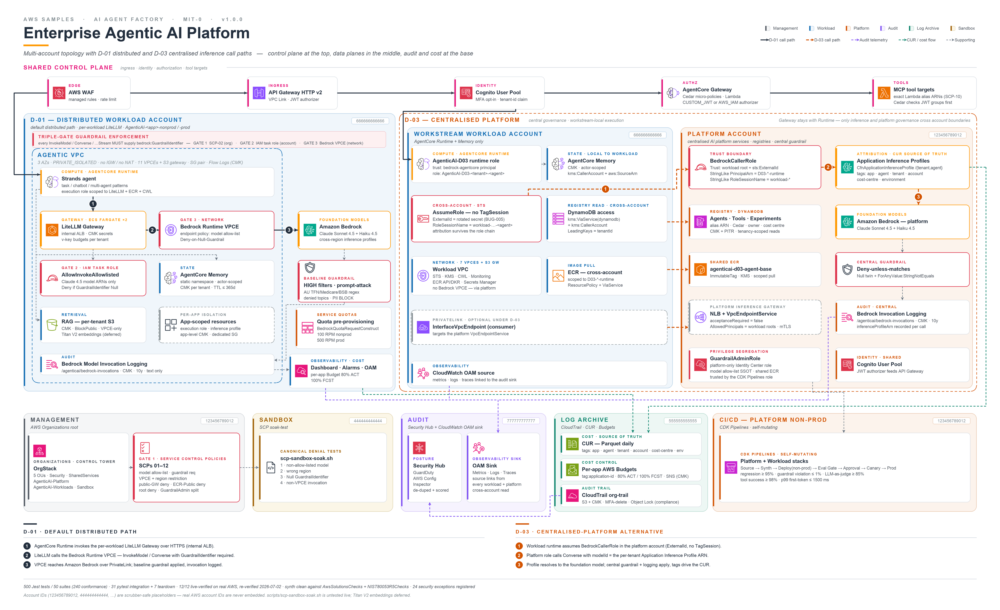

# Enterprise Agentic AI Platform Blueprint on AWS

    

A multi-account AWS CDK blueprint for running enterprise agentic AI workloads on **Amazon Bedrock AgentCore**, with org-level guardrails, tenant isolation, guardrailed inference, per-tool Cedar authorisation, and per-application cost attribution.

This is one of the samples in [`aws-samples/sample-ai-agent-factory`](https://github.com/aws-samples/sample-ai-agent-factory) — it is the **governed platform foundation** an organisation stands up once, so that agent-building teams have a secured landing zone to deploy onto. See [§1.2](#12-how-this-fits-with-the-other-samples-in-this-repository) for how it relates to the sibling samples.

> **Status.** Sample / reference content published under MIT-0. It is **not** an AppSec-reviewed product — run your own security review before deploying to any regulated or customer-facing environment, and read [§15](#15-known-limitations-and-honest-disclaimers) for what has and has not been verified against live AWS. 500 Jest tests across 50 suites, plus pytest coverage on the offline eval gate, integration suites, and teardown. The D-03 v3 + gap-closure surface was verified end-to-end on a real two-account deploy in `us-east-1` (MCP `tools/list` + `tools/call` through the CUSTOM_JWT gateway, per-developer Cedar entitlement allow/deny), then torn down to zero residuals. Full history in [`CHANGELOG.md`](CHANGELOG.md).
>
> **This deploys real, billable AWS resources** across multiple accounts — see [§8 Cost](#8-cost) before deploying and [§16 Cleanup](#16-cleanup) when you are done.



> *Drawio source: [`assets/architecture-diagram.drawio`](assets/architecture-diagram.drawio).*

---

## Table of Contents

1. [Overview](#1-overview)
2. [Architecture](#2-architecture)
3. [Deviations](#3-deviations)
4. [AWS Services Used](#4-aws-services-used)
5. [Prerequisites](#5-prerequisites)
6. [Deployment](#6-deployment)
7. [Running the Guidance](#7-running-the-guidance)
8. [Cost](#8-cost)
9. [Operations](#9-operations)
10. [Security](#10-security)
11. [Choice architecture](#11-choice-architecture)
12. [Compliance](#12-compliance)
13. [Multi-account topology](#13-multi-account-topology)
14. [Architecture Decision Records](#14-architecture-decision-records)
15. [Known limitations and honest disclaimers](#15-known-limitations-and-honest-disclaimers)
16. [Cleanup](#16-cleanup)
17. [Contributors and License](#17-contributors-and-license)

---

## 1. Overview

Agentic AI platforms at enterprise scale need the same controls ordinary systems need — identity, network isolation, audit, cost attribution, tenancy — plus agentic-specific ones: model allow-listing, Bedrock Guardrails on every inference call, Cedar micro-policies on AgentCore Gateway, memory-namespace isolation, and evaluation gates before promotion.

This blueprint delivers all of the above as a deployable AWS CDK app spanning a real AWS Organization, in two mutually-exclusive deployment patterns.

**Default distributed pattern (D-01)** — `apps/workload-account/`. Everything lives in the workload account: baseline SCPs 01–08 at the OU, per-account VPC (11 interface VPCEs + 1 S3 gateway, no IGW/NAT), baseline Bedrock Guardrail, LiteLLM in the inference path with a triple-gate guardrail enforcement (SCP + IAM deny + VPCE policy), AgentCore Runtime/Gateway/Identity/Memory/Registry, API Gateway as the primary auth boundary, CloudWatch cross-account observability, CDK Pipelines with a mandatory evaluation gate, and three Strands agent blueprints.

**Centralised-platform alternative (D-03 v3)** — `apps/platform-account/` + `apps/workload-account/lib/d03-workload-agent-stack.ts`. A platform-governed, per-workstream AgentCore Gateway is deployed **into** the workstream account, removing the cross-account Runtime→Gateway hop while keeping platform governance via three layers:

1. **Synth** — the AWS Bedrock AgentCore Registry is the tool SSOT (`packages/agent-registry/`); each tool is a `RegistryRecord` (`gatewayTargetArn` pinned to a Lambda alias, `cedarPolicy`, `ownerTeam`, `costCentre`). Workstream Gateway synth calls `GetRegistryRecord` per subscribed id and **fails at synth** on any non-`APPROVED` record.
2. **Deploy** — SCP-09 denies `bedrock-agentcore:Create/Update/Delete*` on Gateway resources from every principal except the platform `AgenticAI-D03-GatewayAdmin` role.
3. **Runtime** — the Gateway service role's identity policy lists the exact N subscribed tool ARNs (no wildcards); SCP-10 denies `lambda:InvokeFunction` to any non-catalogued ARN.

Cross-account Bedrock calls go through a `BedrockCallerRole` (`sts:ExternalId` + `aws:PrincipalArn` + `RoleSessionName` trust conditions); per-tenant Application Inference Profiles carry CUR attribution tags in place of `sts:TagSession` (which does not propagate across role chains — `BUG-005`).

### 1.1 Day-in-the-life — how a developer ships an agent

Workstream accounts are the developer's primary surface; the platform account holds governance + the central Registry and developers do not log into it.

1. **Onboarding (platform team, one-time).** `D03PlatformCoreStack` provisions three Identity Center permission sets per workstream — `AgenticAI-WS-Dev-<ws>` (deploy + observability + Registry consumer), `-Ro-` (read-only), `-Apv-` (pipeline approve).
2. **Discover + subscribe.** `agenticai registry search` / `subscribe` appends record ids to `cdk.context.json`; synth resolves each via `GetRegistryRecord` and emits the resolved cross-account Lambda ARNs into the service role (no wildcards).
3. **Build + eval + submit.** `agenticai dev eval` runs the same 7-category scoring the CI gate runs; `agenticai submit` renders the PR body. The pipeline runs Source → Synth → Deploy(nonprod) → Evaluation Gate → Manual Approval → 5 % canary + soak → Prod.
4. **Per-developer entitlement.** A Curator can pin `metadata.allowedGroups` on a record; the Gateway then runs in `CUSTOM_JWT` mode and the per-tool Lambda's Cedar wrapper (`@agenticai/tool-cedar-wrapper`) denies on `cognito:groups` mismatch before user code runs. Until AgentCore PolicyEngine GAs, this Cedar evaluation lives inside each tool Lambda (TODO-GW-POLICY-ENGINE in §3.3).

### 1.2 How this fits with the other samples in this repository

`sample-ai-agent-factory` collects complementary samples covering different layers of an AI Agent Factory. This one is the **platform foundation** — the multi-account landing zone, org guardrails, and governance surface. It is deliberately infrastructure-heavy and assumes a real AWS Organization.

| Sample | Layer | Relationship to this blueprint |
|---|---|---|
| [`workshop-building-agentic-ai-platform/`](../workshop-building-agentic-ai-platform/) | Learn the foundation | Closest neighbour. A guided 300-level workshop over the same building blocks (LLM Gateway via LiteLLM, MCP Gateway + Registry, Strands agents) in a **single account**. **Start there** if you want to understand the pattern hands-on; come here when you need the multi-account, SCP-governed, CI/CD-gated production form of it. |
| [`Agentic-ai-self-service/`](../Agentic-ai-self-service/) | Build agents | The builder experience that sits **on top of** a foundation like this one. It gives teams a visual canvas for authoring and deploying AgentCore agents; this blueprint provides the governed accounts, model allow-list, guardrails, and cost attribution those agents deploy into. |
| [`enterprise-mcp-governance-gateway/`](../enterprise-mcp-governance-gateway/) | Govern tool calls | Overlapping but distinct depth on per-tool-call authorisation. That sample evaluates Cedar in the AgentCore Gateway's **PolicyEngine in `ENFORCE` mode** and is the better reference for the request-path interceptor and OAuth 3LO connector patterns. This blueprint currently evaluates Cedar **inside each tool Lambda** (§3.3, `TODO-GW-POLICY-ENGINE`) and adds the org-level layers around it — SCP-09/10/11, the Registry as tool SSOT, and synth-time subscription validation. |

Pick this sample if your question is *"how do I govern agentic AI across many accounts and many teams?"*. Pick one of the others if your question is *"how do I learn this?"*, *"how do I ship an agent quickly?"*, or *"how do I authorise a single tool call?"*.

---

## 2. Architecture

See `assets/architecture-diagram.png` (editable `.drawio` source alongside). Control-level detail below.

### 2.1 Account topology

| Role | OU | Purpose |
|---|---|---|
| Management | Root | AWS Organization, OUs, SCPs 01-12 (01-08 baseline; 09-10 D-03 Gateway; 11 Registry; 12 developer permission sets) |
| Log Archive | Security | CloudTrail org trail + CUR + CWL cross-account destination |
| Audit | Security | CloudWatch OAM sink, Security Hub master |
| Platform non-prod / prod | AgenticAI-Platform | Guardrail Admin, Registry, CDK Pipelines (plus LiteLLM/Gateway/Cognito under D-03) |
| Workload non-prod / prod | AgenticAI-Workloads | Per-application agent stacks |
| SCP Sandbox | AgenticAI-Sandbox | Soaks new SCPs before promotion |

### 2.2 Network

Per workload account (`packages/agentic-vpc/`): VPC with 3 AZs, **private-isolated subnets only** (no IGW/NAT); interface VPCEs for AgentCore (data/control/gateway), Bedrock (runtime/management), ECR, CloudWatch, STS, KMS + S3 gateway endpoint (11 interface + 1 gateway). Endpoint policies scoped to the local account root; the Bedrock Runtime endpoint restricts `InvokeModel`/`Converse` to the allow-listed model ARNs and denies when `GuardrailIdentifier` is Null. VPC Flow Logs → CMK-encrypted log group.

### 2.3 Bedrock governance

- **Model allow-list SSOT** — `PLATFORM_ALLOWED_MODELS` (`packages/platform-baselines/`) = Claude Sonnet 4.5 + Haiku 4.5, flowing into SCP-01, the Bedrock VPCE policy, the LiteLLM router config, and AgentCore execution-role IAM. A conformance test diffs all four for drift.
- **Guardrail triple-gate** — every invocation carries a `GuardrailIdentifier`, enforced by SCP-02 (org), an IAM identity-policy deny (`Null: bedrock:GuardrailIdentifier` twinned with `ForAnyValue:StringNotEquals` positive allow-list), and the Bedrock VPCE policy.
- **Guardrail profiles** — Baseline (mandatory default: HIGH content filters, prompt-attack detection, AU TFN/Medicare/BSB regex, PII BLOCK/ANONYMIZE), Internal Tool, Customer-Facing (both opt-in, platform-approved).
- **Segregation of duties** — `GuardrailAdminRole` in the platform account only; SCP-05 (`ArnNotLike` on role + assumed-role session forms) denies guardrail mutation everywhere else.
- **Model Invocation Logging** — CMK-encrypted `/agenticai/bedrock-invocations`, text-only delivery; under D-03 the record carries the per-tenant `inferenceProfileArn`.

### 2.4 AgentCore stack

- **Runtime** (`packages/agentcore-runtime/`) — per-agent execution role, immutable-tag ECR repo, CMK log group. Under D-03 the role is trusted by `bedrock-agentcore.amazonaws.com`.
- **Gateway** (`packages/agentcore-gateway/`) — API Gateway HTTP v2 + Cognito JWT authorizer + WAFv2 + VPC Link is the primary auth boundary; the internal ALB + Cedar micro-policies sit behind it.
- **Identity** (`packages/agentcore-identity/`) — Cognito User Pool + Token Vault CMK; 12-char password minimum, email verification, deletion protection, 1h access-token TTL.
- **Memory** (`packages/agentcore-memory/`) — per-tenant CMK; namespace template static at synth (only `{actorId}`/`{memoryStrategyId}`/`{sessionId}` vary at runtime); confused-deputy grant closed with `aws:SourceAccount` + `aws:SourceArn`.
- **Registry — tool SSOT** (`packages/agent-registry/`) — one org-wide `bedrock-agentcore` Registry (Authorization=`IAM`, Approval=`MANUAL`). Each tool is a `RegistryRecord`; workstream Gateway synth reads it via `GetRegistryRecord`. Four personas (Admin/Publisher/Curator/Consumer) map onto Identity Center permission sets.
- **Per-developer entitlement** (`packages/tool-cedar-wrapper/`) — a record may carry `metadata.allowedGroups`; when set the Gateway is forced into `CUSTOM_JWT` and the per-tool Cedar bundle binds each permit to a `CognitoGroup`. Enforced inside the tool Lambda until the AgentCore PolicyEngine API GAs.

### 2.5 Other constructs

- **RAG** (`packages/rag/`) — per-tenant CMK source bucket, versioned + access-logged + SSL-enforced, scoped `kbs/<tenant>/<kb>/` prefix, bucket policy denies any request not arriving via the workload VPCE.
- **LiteLLM (D-01)** (`packages/litellm-gateway/`) — per-account ECS Fargate behind an internal ALB, task-role allow-list + deny-on-null-guardrail, master key from Secrets Manager (CMK, injected via ECS `secrets:`).
- **Tenancy** (`packages/agentic-app/`) — per-app IAM role, per-app SG, memory namespace locked at synth, cost-allocation tags for per-app CUR.
- **Observability** (`packages/observability/`) — OAM source link to the Audit account, per-app dashboard + guardrail/latency alarms.
- **Cost** (`packages/cost-allocation/`) — per-app Budget filtered by `application-id`, alerts at 80 % ACTUAL + 100 % FORECASTED.
- **CI/CD** (`pipelines/`) — self-mutating platform pipeline + per-app workload pipeline with the mandatory sequence *Source → Synth → Deploy(nonprod) → Evaluation Gate → Manual Approval → Deploy(prod)*.

Evaluation-gate thresholds (defaults, overridable via `cdk.context.json`): regression pass ≥ 95 %, guardrail violation ≤ 1 %, LLM-as-judge quality ≥ 85 %, tool success ≥ 98 %, first-token p99 ≤ 1500 ms.

---

## 3. Deviations

Every conscious divergence from the source spec is recorded with the affected clauses, rationale, residual risks, and compensating controls. All three are publishable.

### 3.1 D-01 — LiteLLM in the inference path

Agents call Bedrock through a per-workload-account LiteLLM deployment rather than directly. The inference boundary shifts inside the account; the per-account quota/CUR/audit boundary is preserved.

- **Rationale.** Virtual-key per-team budgets (429-on-exceed), per-team cost attribution, unified observability, reuse of mature existing code.
- **Compensating controls.** Guardrails enforced three ways (LiteLLM `default_on` + IAM deny-on-null + VPCE policy); model allow-list SSOT; agent identity forwarded via Bedrock session tags for CloudTrail attribution; per-account deployment enforced at synth; PrivateLink-only; CMK everywhere.

### 3.2 D-02 — IaC authored in AWS CDK, not Terraform

Infrastructure is authored in AWS CDK (TypeScript + Python), synthesising CloudFormation. The spec's Terraform examples are re-implemented as CDK constructs with equivalent control semantics — same SCP bodies, VPCE policies, resource-based policies, Cedar policies, CMK wiring, guardrail attachment.

- **Compensating controls.** Every deviating construct cites the spec § it implements; cdk-nag `AwsSolutionsChecks` + `NIST80053R5Checks` Aspects mandatory; build-time SCP-size check; every suppression carries an inline `SEC-0NN` marker with owner, rationale and compensating control.

### 3.3 D-03 — Centralised-platform pattern

LiteLLM, API Gateway, WAF, Cognito, AgentCore Gateway, Registry, shared base-image ECR, and experiment-tracking DynamoDB live in the platform account and are consumed cross-account by agents on AgentCore Runtime in workload accounts. Memory stays in the workload account.

- **Rationale.** Central AI Platform team owns LiteLLM/Gateway/guardrails; product teams own agents. One deployment to upgrade; faster workload onboarding; consolidated guardrail enforcement.
- **Residual risks + compensating controls.** Platform SPOF → multi-AZ + per-env isolation + evaluation-gate-gated pipeline; per-workload quota → LiteLLM virtual-key budgets; **per-workload CUR** → platform-owned per-tenant Application Inference Profiles (the real fix for `BUG-005`: `sts:TagSession` does not survive role chaining); cross-account AssumeRole → `ExternalId` + `PrincipalArn`/`RoleSessionName` conditions; JWT replay → `tenantId` claim asserted against `sts:SourceAccount`; shared Registry/ECR tampering → per-tenant scoping + platform-pipeline-only writes; **per-developer scoping** → Cedar entitlement (`allowedGroups` + `CUSTOM_JWT` + `@agenticai/tool-cedar-wrapper`, fail-closed). **TODO-GW-POLICY-ENGINE**: when the AgentCore Gateway PolicyEngine API GAs, the wrapper retires and Cedar evaluation moves to the Gateway.
- **Equivalence obligations.** Guardrail-on-every-call, per-workload cost attribution, per-workload audit trail, model allow-list SSOT, tenancy isolation, and network isolation are all preserved and CI-asserted. Two-account live verification (2026-05-01): 12/12 behavioural assertions PASS; re-verified end-to-end 2026-07-02.

New deviations require product-owner sign-off documenting: affected spec clauses, rationale, residual risks, compensating controls, equivalence obligations, and the CI conformance tests that assert them.

---

## 4. AWS Services Used

Amazon Bedrock · Amazon Bedrock AgentCore (Runtime, Gateway, Identity, Memory, Registry) · Bedrock Guardrails · Bedrock Application Inference Profiles · AWS Organizations · AWS Control Tower · AWS IAM · IAM Identity Center · AWS STS · Amazon API Gateway · AWS WAF · Amazon Cognito · Amazon VPC + PrivateLink · Amazon ECR · AWS KMS · AWS CloudTrail · Amazon CloudWatch (+ cross-account OAM) · Amazon S3 (+ S3 Vectors) · AWS Service Quotas · AWS CodePipeline / CodeBuild · AWS Lambda · AWS Step Functions · AWS Cost and Usage Report · AWS Security Hub · Amazon GuardDuty · AWS Config · Amazon Inspector · AWS Secrets Manager · Amazon DynamoDB · Amazon ECS (Fargate, Graviton) · AWS Certificate Manager · AWS Budgets · Amazon Verified Permissions (Cedar).

---

## 5. Prerequisites

- **AWS Control Tower** landing zone (documented hard prerequisite).
- **AWS CLI** ≥ 2.15, **Node.js** ≥ 20 LTS, **Python** ≥ 3.12, **AWS CDK** ≥ 2.150.0.
- Bedrock model access approved for Claude Sonnet 4.5 + Haiku 4.5 in the target account(s).
- IAM Identity Center user with management-account access for the initial deploy.
- A GitHub repo + AWS CodeStar Connections V2 connection (CI/CD only).
- Corporate VPC CIDR allocation (or accept defaults `10.20.0.0/16`, `10.21.0.0/16`).

---

## 6. Deployment

### 6.1 One-time setup

```bash
git clone https://github.com/aws-samples/sample-ai-agent-factory.git
cd sample-ai-agent-factory/enterprise-agentic-ai-platform-blueprint
npm ci
npm run build
npm test     # 500 Jest tests across 50 suites expected

# Populate cdk.context.json with your account IDs + emails + CIDRs, then bootstrap:
export CDK_DEFAULT_ACCOUNT=<MGMT_ACCT>
export CDK_DEFAULT_REGION=us-west-2
npx cdk bootstrap "aws://$CDK_DEFAULT_ACCOUNT/$CDK_DEFAULT_REGION" --qualifier hnb659fds
```

> **Least privilege.** Set the CDK CloudFormation execution policy to a customer-managed policy scoped to the services these stacks provision — do **not** use `AdministratorAccess`. See `pipelines/bootstrap/bootstrap-cross-account.sh` (requires `CFN_EXECUTION_POLICY_ARN`); the required scope is documented inline there.

> **Worked example.** [`examples/reference-deployment-us-west-2/`](examples/reference-deployment-us-west-2/) is a complete 7-account `us-west-2` walkthrough with a fully populated `cdk.context.json` template (placeholder account ids), the Phase 1 → 8 deploy sequence, and the matching teardown. Use it as the concrete reference for the abstract steps below.

### 6.2 Path A — Default distributed (D-01)

1. Deploy Org + OUs + SCPs sandbox-first; run `bash scripts/scp-sandbox-soak.sh` (all four denial tests must pass) before attaching SCPs to the Workloads OU.
2. Provision accounts via Control Tower Account Factory (Log Archive, Audit, Sandbox, platform ×2, workload ×2).
3. `bash pipelines/bootstrap/bootstrap-cross-account.sh` (with a scoped `CFN_EXECUTION_POLICY_ARN`).
4. `npx cdk deploy --context stage=pipeline ... AgenticAI-PlatformPipelineStack AgenticAI-WorkloadPipelineStack` — the pipeline self-mutates and deploys platform + workload stacks with the evaluation gate + manual approval.

### 6.3 Path B — Centralised platform (D-03)

```bash
# Platform account
npx cdk deploy AgenticAI-D03-PlatformCoreStack \
  -c stage=d03-platform \
  -c 'agenticai/d03WorkloadAccountIds=["<workload-acct>"]' \
  -c 'agenticai/d03ExternalId=<rotated-secret>' \
  -c agenticai/d03EnableAgentRegistry=true \
  -c agenticai/d03RegistryName=agenticai-platform-registry

# Workload account
npx cdk deploy AgenticAI-D03-WorkloadAgentStack \
  -c stage=d03-workload \
  -c agenticai/d03PlatformAccountId=<platform-acct> \
  -c agenticai/d03ExternalId=<rotated-secret> \
  -c agenticai/tenantId=demo -c agenticai/agentId=primary

# Workstream Gateway (deployed INTO the workload account)
npx cdk deploy AgenticAI-D03-WorkstreamGateway-demo-primary \
  -c stage=d03-workstream-gateway \
  -c agenticai/tenantId=demo -c agenticai/agentId=primary \
  -c agenticai/d03PlatformAccountId=<platform-acct> \
  -c agenticai/d03WorkloadAccountId=<workload-acct> \
  -c 'agenticai/d03AllowedToolIds=["tool-echo","tool-ping"]' \
  -c agenticai/d03GatewayRoleArnOverride=<pre-created-gw-svc-role-arn>
```

> **Gateway service role.** Pre-create it out-of-band and import it via `agenticai/d03GatewayRoleArnOverride` so its IAM `RoleId` stays stable across rollbacks (tool Lambda resource policies capture the stable ARN). A freshly-created custom-resource role's authorization also takes minutes to propagate to the AgentCore control plane — either pre-create it (`agenticai/d03CrExecRoleArnOverride`) or let the built-in propagation gate wait it out.

### 6.4 Validation

```bash
python3 tests/smoke/smoke.py            # read-only sanity checks
pytest tests/integration/ -v            # full D-03 harness (needs live creds)
```

Fast checks: `npm test` green (500/50); `npx cdk synth` cdk-nag-clean with only the documented `SEC-0NN` suppressions; SCPs attached; VPCEs present; `bedrock:InvokeModel` without a `GuardrailIdentifier` returns `AccessDenied`; a non-allow-listed model returns `AccessDenied`.

Repository hygiene gates, runnable locally and suitable for wiring into CI: `npm run scrub` (fails on any AWS account ID, internal reference, or hardcoded developer path in the tree) and `gitleaks detect --config .gitleaks.toml`.

### 6.5 Common issues

| Symptom | Cause | Fix |
|---|---|---|
| `cdk bootstrap` `sts:AssumeRole` denied | Target not set up for cross-account trust | Assume admin in the target first, re-run |
| Bedrock `AccessDenied` | SCP-01/02 not matched | Confirm model on allow-list + `GuardrailIdentifier` supplied |
| Cross-account KMS decrypt fails | Bootstrap `aws-cdk-lib` < 2.150 | Re-bootstrap ≥ 2.150 |
| D-03 `CreateGateway` `not authorized` | Fresh CR role IAM not yet propagated to AgentCore | Pre-create the CR role or rely on the propagation gate |
| D-03 `CreateGatewayTarget` "role lacks permission to invoke Lambda" | Imported gateway role missing the invoke policy | Attach `lambda:InvokeFunction` on the tool alias ARNs to the pre-created role |
| `subnets in unsupported AZ` | AgentCore supports only `use1-az1/az2/az4` in `us-east-1` | Filter subnets by AZ ID (`AgentcoreCompatibleSubnetIdFirst` output) |

Rollback: `npx cdk destroy <stack>` per-stack, or `bash scripts/teardown.sh` for the full sweep.

---

## 7. Running the Guidance

Three Strands blueprints ship at v1 under `blueprints/` (plus LangGraph + CrewAI reference agents):

| Blueprint | Model mix | Pattern |
|---|---|---|
| `agenticai-task-agent` | Haiku 4.5 | Deterministic single-shot; max-iteration guard; streaming |
| `agenticai-chatbot-agent` | Sonnet 4.5 / Haiku 4.5 | Multi-turn; HITL escalation; Customer-Facing guardrail |
| `agenticai-multi-agent` | Sonnet supervisor + Haiku workers | Supervisor + N-worker dispatch |

Under D-01 you invoke via the per-workload LiteLLM endpoint fronted by API Gateway. Under D-03 agents run on AgentCore Runtime and reach tools through the workstream MCP Gateway and Bedrock via cross-account AssumeRole. Next steps: add a workload app (§13), swap the guardrail profile (§11), tune eval thresholds (§11), or add a region (§11).

---

## 8. Cost

Rough estimates (no measured 24-hour baseline yet — see §15). `us-west-2` pricing, 2026.

| Traffic profile | Monthly (USD, approx) |
|---|---|
| Dev / low (10K invocations/day, 500 tok) | ~$280 |
| Moderate (100K/day, 1K tok) | ~$1,100 |
| High (1M/day, 1.5K tok) | ~$9,000 |

At moderate traffic the largest lines are Bedrock inference (~$600, Haiku ≈ 4× cheaper than Sonnet) and the 11 interface VPCEs across 3 AZs (~$240). Optimisation levers: route tolerant workloads to Haiku, Flex tier for dev/test, batch inference, Provisioned Throughput for sustained steady-state, and tuning CloudWatch retention. Per-app Budgets (filtered by `application-id`) alert at 80 % ACTUAL / 100 % FORECASTED; override via `agenticai/monthlyBudgetUsd` + `agenticai/notificationEmail`.

LiteLLM's virtual-key spend view is the budget-alert source of truth; CUR is the chargeback source of truth. They diverge for retries, cached responses, and guardrail short-circuits — reconcile monthly (target drift ≤ 1 %).

---

## 9. Operations

**SLOs.** First-token p99 ≤ 1500 ms; guardrail violations ≤ 1 %; tool-call success ≥ 98 %; session success ≥ 95 %; API Gateway 5xx ≤ 0.1 %. Each has a CloudWatch alarm feeding a CMK-encrypted SNS topic.

**Runbooks** (`scripts/` + dashboards). Key incident classes and first moves:

- **Guardrail-violation spike** — inspect the dashboard, pull offending prompts from `/agenticai/bedrock-invocations`, classify (content / prompt-attack / PII / denied-topic), mitigate (WAF rule, pause agent via ECS scale-to-0 + API GW throttle, upgrade guardrail profile), add a regression case to the blueprint's `eval/cases.jsonl`.
- **Prompt injection** (OWASP LLM01) — capture sessions, isolate source (Cognito block for direct; S3 version-revert for poisoned RAG), add adversarial regression cases.
- **Tool-call spiral** — pull the session trace, identify the loop, cancel in-flight runs; prefer better termination signals over raising the max-iteration ceiling.
- **Bedrock throttling (429)** — check `ThrottledCount` vs quota, shed load via WAF rate-limit / route to Haiku, then request a quota increase or move to Provisioned Throughput.
- **LiteLLM p99 regression** — check ECS CPU/memory + Bedrock-side latency + VPCE/ALB health; scale the service or cycle tasks.
- **MCP target outage** — identify the failing target in the Gateway logs, circuit-break its Cedar route, activate fallbacks.
- **Cross-account KMS / SelfMutate failures** — usually a bootstrap `aws-cdk-lib` gap or a direct `cdk deploy` against the pipeline stack; re-bootstrap ≥ 2.150 or always flow changes through the pipeline.

**Change management.** All prod changes flow through the pipeline (evaluation gate + manual approval); no out-of-band `cdk deploy` to prod. Reviews: Well-Architected quarterly, cost monthly, security-exception expiry monthly, SCP drift quarterly, dependency/SBOM monthly, red-team quarterly. Quarterly chaos experiments (Bedrock throttling, VPCE failure, ECS task kill, KMS pending-delete) each carry a hypothesis + stop criteria.

---

## 10. Security

### 10.1 Threat model

STRIDE + OWASP LLM Top 10 + MITRE ATLAS applied to blueprint-authored controls (customer deployments extend it). Highlights:

- **Spoofing** — Cognito JWT authorizer at API Gateway; RBPs with `aws:SourceArn`/`aws:SourceAccount`; LiteLLM forwards agent identity for CloudTrail attribution.
- **Tampering** — SCPs inherited from the OU (workload IAM cannot override); SCP-05 guardrail-mutation deny; immutable-tag ECR + scan-on-push; config rendered from SSOT at synth.
- **Information disclosure** — Guardrail PII BLOCK/ANONYMIZE + AU regex; per-tenant IAM + SG + memory namespace + `dynamodb:LeadingKeys`; public-access-block + CMK on every bucket; `kms:ViaService` + `kms:CallerAccount` on cross-account grants; `scripts/scrub-security-leakage.sh` + gitleaks on every change.
- **Denial of service** — WAF rate limit at API Gateway; LiteLLM virtual-key budgets; per-account Bedrock quotas; agent max-iteration guard; circuit breaker on MCP targets.
- **Elevation of privilege** — ExternalId + `PrincipalArn`/`RoleSessionName` conditions on cross-account roles; pipeline role scoped to bootstrap roles; AgentRuntime trust is service-principal-only (`allowLocalRootAssume` opt-in, hard-disabled in prod).

**OWASP LLM Top 10** — prompt injection (guardrail PROMPT_ATTACK + pinned system prompts), insecure output (guardrail output filters + eval quality score), model DoS (rate limits + quotas), supply chain (Dependabot + license-check + SBOM + pinned SDK + image scan), sensitive-info disclosure (PII filters + Memory actor-scoping), insecure plugin design (Registry-declared tools + scoped Gateway targets), excessive agency (max-iteration + HITL), overreliance (evaluation gate + human review).

### 10.2 Security exceptions

Every cdk-nag / cfn-nag suppression carries an inline `SEC-0NN` marker recording the requirement, the justification, and the compensating control — 24 in total (`SEC-001`..`SEC-016`, `SEC-022`..`SEC-029`), each visible on the suppression itself in the CDK source. Suppressions without a marker fail CI. The markers distinguish **service-limitation** exceptions (e.g. AgentCore's action-family evaluator rejecting narrow per-action lists; Bedrock guardrail admin APIs lacking resource-level ARNs — reviewed when the upstream service adds support) from **framework** exceptions (CDK custom-resource / Provider internals — reviewed on each `aws-cdk-lib` major bump).

### 10.3 Shared responsibility

- **AWS** — managed services under the Shared Responsibility Model.
- **Platform team** — blueprint code, platform-account stacks, SCPs, base guardrail, CI/CD, Registry, shared ECR.
- **Delivery team** — per-application workload code (agent container, tools, prompts, eval corpus, inference-profile tagging, guardrail-profile selection from the approved list) and privacy compliance for any personal data they store (see the note in `packages/developer-access/src/workstream-roster.ts`).

Report security issues privately via the [AWS vulnerability reporting page](https://aws.amazon.com/security/vulnerability-reporting/) — **not** public GitHub issues.

---

## 11. Choice architecture

A customer should never have to fork the repo to make a supported variant. Every recognised override:

| Decision | Default | Override |
|---|---|---|
| Identity provider | Cognito | `agenticai/customJwtIssuer` + `customJwtAudience` (corporate OIDC) |
| Guardrail profile (per agent) | Baseline | per-agent `blueprints/<name>/bedrock.config.yaml` |
| Model allow-list | Sonnet 4.5 + Haiku 4.5 | `PLATFORM_ALLOWED_MODELS` constant (forces platform review) |
| Region | `us-west-2` | `packages/platform-baselines/src/approved-regions.ts` + SCP-06 sandbox-soak |
| Eval thresholds | see §2.5 | `agenticai/eval*` context keys |
| Gateway fronting | API Gateway (§08 Option A) | hard default |
| Browser egress / Lattice endpoints | Off | `agenticai/enableBrowserInternetEgress` / `enableLatticePrivateEndpoints` (BETA) |

An override that breaks a spec MUST (e.g. adding a non-Claude model) becomes a new deviation in §3.

---

## 12. Compliance

### 12.1 Well-Architected + GenAI Lens

The blueprint maps to all six pillars: **Operational Excellence** (dashboards + OAM + self-mutating pipeline + eval gate + runbooks), **Security** (Identity/SCPs/RBPs/VPCE/WAF/Cedar, PrivateLink-only, CMK everywhere, CloudTrail + GuardDuty + Security Hub), **Reliability** (quota requests, 3-AZ, per-account isolation, versioning), **Performance** (Sonnet/Haiku per-agent, `ConverseStream`, eval p99 gate), **Cost** (per-app Budgets + CUR attribution + allow-list caps), **Sustainability** (Graviton, on-demand, Haiku for low-stakes, TTLs). The GenAI Lens considerations (model governance, RAG, evaluation, responsible-AI guardrails, observability, spiral detection, HITL, red-team) each map to a named construct.

### 12.2 NIST 800-53 Rev 5

**First-pass derivation** — the blueprint maintainers' interpretation, **not** an authoritative attestation. Customers under formal regimes (FedRAMP, IRAP, ISM, HIPAA, PCI-DSS) must validate against their own catalogue and run their ATO process. Heavy coverage in AC (SCPs, per-app IAM, tenant RBPs, VPCE, Cognito, Cedar) and SC (PrivateLink-only, VPCEs, CMK, TLS 1.2+, region allow-list); AU (CloudTrail + Model Invocation Logging), SI (guardrails + eval gate), SR (pinned deps + SBOM), PT (PII filters + Memory scoping). PE/PS inherited. For each control the blueprint emits the CFN template, cdk-nag `NagReport.csv`, CloudTrail events, and a conformance-test assertion.

### 12.3 EU AI Act

`ConformityAssessmentConstruct` (`@agenticai/eu-ai-act-compliance`) wires Article-by-Article controls. Default risk classes (Article 6): chatbot=`limited`, task=`limited`, multi-agent=`high`. It auto-generates `technical-documentation.md` / `risk-assessment.md` / `human-oversight-protocol.md` at deploy into an Object-Lock COMPLIANCE 7-year record-keeping bucket. Article 9 (risk management) → online-evaluation watchdog; Article 10 (data governance) → eval-corpus GOVERNANCE bucket + manifest SHA envelope; Article 14 (human oversight) → `HumanInTheLoopConstruct`; Article 15 (accuracy/robustness) → evaluation gate + kill-switch + circuit breaker. High-risk Articles 9–17 take effect August 2026.

---

## 13. Multi-account topology

**Adding a workload application** (per workstream): provision two accounts via Account Factory (`agenticai-<ws>-nonprod` / `-prod` under `AgenticAI-Workloads`), bootstrap both with trust to platform-nonprod, deploy `D03PlatformCoreStack` (which also emits the workstream's Identity Center permission sets + `RegistryConsumerGrant` + roster row), then a `WorkloadPipelineStack` instance. The developer then works entirely from the workstream account via the `agenticai` CLI (§1.1).

**Account closure.** `bash scripts/teardown.sh` destroys stacks in reverse dependency order (`RETAIN` resources remain by design). Manual remaining steps: empty + delete retained S3 buckets, cancel KMS keys pending deletion, `aws organizations close-account`. Accounts enter `SUSPENDED` for ≥ 90 days before Organizations deletes them.

**Edge cases.** No-Control-Tower fallback (advanced; replace Account Factory with `organizations:CreateAccount` + manual baseline). Existing Log Archive/Audit via `agenticai/adoptExistingLogArchive`. Shared-services TGW via `agenticai/transitGatewayId`. CIDR conflicts via `agenticai/vpcCidr`.

---

## 14. Architecture Decision Records

MADR-lite records for the non-obvious decisions (full text in Git history / earlier tags):

- **ADR-0001** — LiteLLM in the inference path (D-01); triple-gate guardrail preserved.
- **ADR-0002** — CDK + CloudFormation, not Terraform (D-02); AFT explicitly rejected.
- **ADR-0003** — API Gateway fronts AgentCore Gateway as the primary auth boundary (§08 Option A).
- **ADR-0004** — Memory namespaces static at synth (only `{actorId}`/`{memoryStrategyId}`/`{sessionId}` vary).
- **ADR-0005** — Model allow-list as a single TypeScript constant flowing into four enforcement surfaces.
- **ADR-0006** — EU AI Act posture: Object-Lock COMPLIANCE 7-year bucket + auto-generated conformity docs.
- **ADR-0007** — Evaluation gates as platform infrastructure; 7-category scoring SSOT shared by the offline gate + online watchdog.
- **ADR-0008** — Agent lifecycle: versioned manifests (SHA-256 envelope) + canary + auto-rollback.
- **ADR-0009** — Protocol-native MCP + A2A; `MCP_PROTOCOL_VERSION = 2025-06-18` locked; qualified tool names.
- **ADR-0010** — Kill-switch + circuit breaker as real runtime constructs (four live revoke branches; retry+fallback chain).
- **ADR-0011** — HITL reference construct: Step Functions `WaitForTaskToken` + Cedar approver scoping.
- **ADR-0012** — Multi-framework support (Strands / LangGraph / CrewAI) via lazy-imported adapters.
- **ADR-0013** — AgentCore Registry as tool SSOT (replaces the TypeScript catalogue truth claim).
- **ADR-0014** — Identity Center permission sets per workstream (`AgenticAI-WS-Dev-/Ro-/Apv-`; 16-char workstream-id cap).
- **ADR-0015** — Developer CLI as pure-function helpers sharing the eval-scoring SSOT.

---

## 15. Known limitations and honest disclaimers

Know what **has** been live-verified and what **has not** before adopting.

**Live-verified on real AWS.**

- **D-03 v3 full end-to-end tool-call round-trip** (2026-05-05, re-verified 2026-07-02): IAM user → AssumeRole → runtime role → MCP over the CUSTOM_JWT gateway → Gateway service role → cross-account `lambda:InvokeFunction` → tool Lambda → MCP `tools/call` reply, for both demo tools; unauthenticated gateway calls return `401`.
- **Per-developer Cedar entitlement** (2026-07-02): non-member JWT denied (`CedarDeniedError` before user code), member JWT allowed.
- **Gap-closure surface** (2026-05-15, re-verified 2026-07-02): eval-gates GOVERNANCE bucket, EU AI Act COMPLIANCE 7-year bucket + 3 conformity docs, agent-version GSIs + rollback Step Function, MCP probe, kill-switch Step Function (4 revoke branches), chargeback bucket, HITL Step Function, online-eval watchdog.
- **D-03 guardrail triple-gate, `dynamodb:LeadingKeys` tenant isolation, `kms:ViaService` cross-account scoping**, and **clean teardown to zero residuals**.

**Not live-verified.**

- **CDK Pipelines self-mutation** — synth-verified only.
- **SCPs 01–12 org soak** — unit + regression tests only (`scp-bypass-regression.test.ts`, 13 cases); the primary IAM identity policies these SCPs defend-in-depth were verified least-privilege on the live roles.
- **AgentCore Runtime `InvokeAgentRuntime` container handshake** — bypassed by the MCP Gateway path.
- **No measured 24-hour cost baseline.** **Control Tower landing zone** — documented prerequisite, tested on standalone accounts.
- **Regions** — `us-east-1` is the only live-verified region; `us-west-2` is synth-clean default. APAC removed from `PLATFORM_APPROVED_REGIONS`.
- **VPC Lattice** private endpoints (AWS BETA, opt-in); **Entra Agent Identity** deferred to v2.

**Operational findings baked into the blueprint** (full detail in `CHANGELOG.md`): AgentCore supports only specific AZ IDs (`use1-az1/az2/az4` in `us-east-1`; AZ-ID filter output provided); the `MCP-Protocol-Version: 2025-06-18` header is required after `initialize`; the Gateway service role must be pre-created for stable `RoleId`; fresh custom-resource IAM roles take minutes to propagate to the AgentCore control plane (propagation gate + role-import override provided); Lambda cross-account resource policies for Gateway targets must name the exact service-role ARN; `CreateRegistry`/`CreateRegistryRecord` return only ARNs (ids derived from them) and require descriptor `inlineContent` valid against the MCP/A2A schema.

The 35 packages under `packages/` are enumerated in [`CHANGELOG.md`](CHANGELOG.md) under the development phase that introduced each one (19 in the initial build-out, 8 gap-closure + 4 self-audit, 3 developer-experience, 1 entitlement).

---

## 16. Cleanup

```bash
bash scripts/teardown.sh     # sweep resources CDK cannot delete (populated S3, non-empty ECR, KMS pending)
pytest tests/teardown/       # verify zero residuals
```

Then `cdk destroy` dependency-ordered. The EU AI Act Object-Lock COMPLIANCE 7-year bucket cannot be deleted before its retention expires — this is intentional and documented.

---

## 17. Contributors and License

Maintained by the AI Platform team. Issues and pull requests are welcome — see the [contribution guidelines](https://github.com/aws-samples/sample-ai-agent-factory/blob/main/CONTRIBUTING.md) and [code of conduct](https://github.com/aws-samples/sample-ai-agent-factory/blob/main/CODE_OF_CONDUCT.md) in the parent repository. Distributed under **MIT-0** — see [`LICENSE`](LICENSE). Report security issues privately via the [AWS vulnerability reporting page](https://aws.amazon.com/security/vulnerability-reporting/), not a public issue.

---

Copyright Amazon.com, Inc. or its affiliates. All Rights Reserved.  
SPDX-License-Identifier: MIT-0
