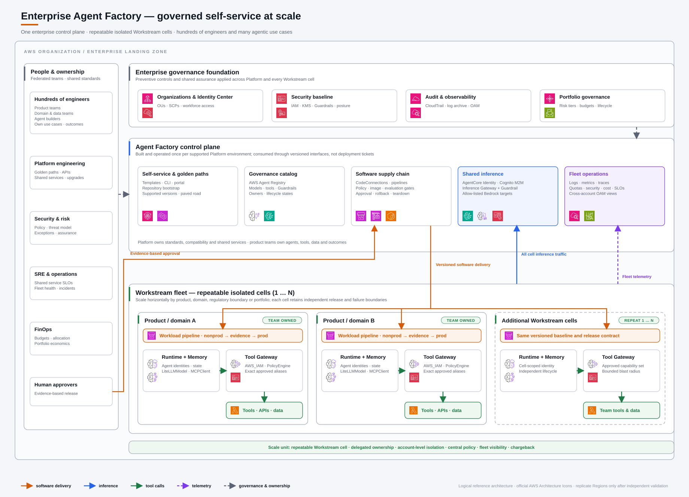
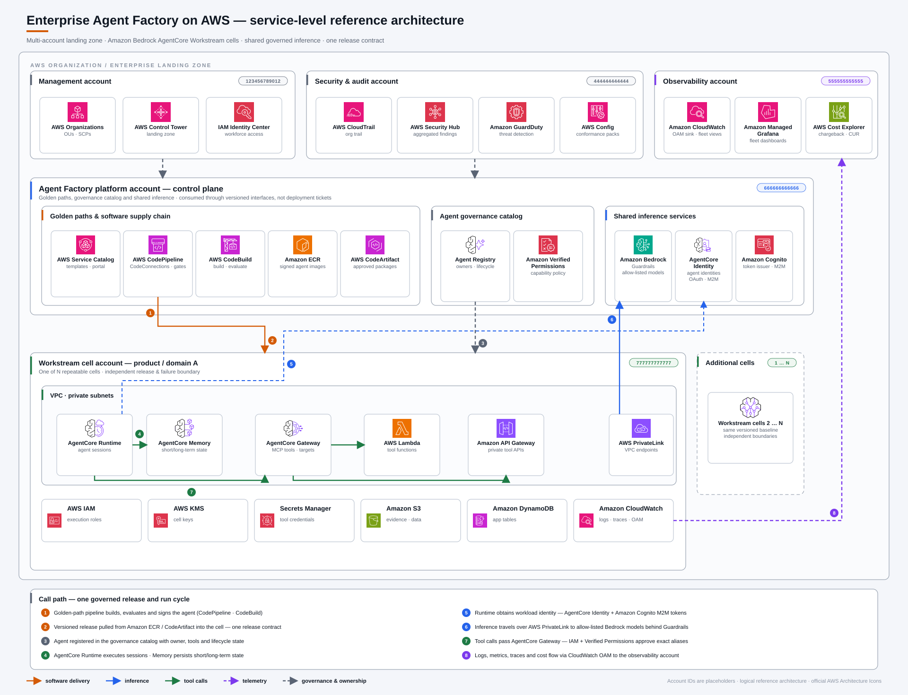

# Enterprise Agentic AI Platform Blueprint on AWS

[](#)
[](https://aws.amazon.com/cdk/)
[](#15-known-limitations-and-support-envelope)
[](LICENSE)

An enterprise Agent Factory reference architecture for organizations where hundreds of engineers across many product teams need to build, govern, release, and operate agentic use cases. This repository provides a concrete AWS implementation centered on Amazon Bedrock AgentCore, while the architecture itself is expressed as capability contracts that can be implemented with suitable customer-selected technologies.

This is not a single-agent deployment example. It separates an **enterprise control plane**, operated as an internal platform product, from **repeatable workstream cells** where delivery teams own their agents, tools, data, and production outcomes. Central teams define paved roads, policy, approved models and tools, evidence requirements, and fleet visibility; engineering teams consume those capabilities through versioned interfaces and pipelines without waiting for the platform team to deploy every application.

This blueprint is the governed platform foundation in [AWS Samples — Sample AI Agent Factory](https://github.com/aws-samples/sample-ai-agent-factory).

> **Status:** Sample and reference content published under MIT-0. It is not an AWS service. It deploys real, billable AWS resources. Review the architecture, IAM policies, quotas, data handling, operating model, and costs before using it with production or regulated workloads.
>
> **Architecture versus implementation:** Labels such as LLM Gateway, Tool Gateway, agent runtime, memory, identity, registry, policy engine, delivery pipeline, and observability describe architectural capabilities. AgentCore Gateway inference targets, LiteLLM, AgentCore Runtime, AgentCore Memory, AgentCore Identity, AWS Agent Registry, CodePipeline, and CloudWatch are implementation choices. Customers can select alternatives that fit their standards, but each replacement must preserve the stated security, identity, tenancy, lifecycle, and evidence contracts. The live support envelope applies only to the exact reference implementation that was tested.

[](assets/enterprise-agent-factory-concept.svg)

_Figure 1 — Enterprise operating model and governed flow. AWS labels illustrate this repository's reference choices; the capability boundaries are the architecture. [Open the editable Draw.io source](assets/enterprise-agent-factory-concept.drawio)._

---

## Table of Contents

1. [Overview](#1-overview)
2. [Enterprise architecture](#2-enterprise-architecture)
3. [Deviations and key design decisions](#3-deviations-and-key-design-decisions)
4. [AWS services used](#4-aws-services-used)
5. [Prerequisites](#5-prerequisites)
6. [Deployment](#6-deployment)
7. [Golden paths for engineering teams](#7-golden-paths-for-engineering-teams)
8. [Cost](#8-cost)
9. [Fleet operations](#9-fleet-operations)
10. [Security](#10-security)
11. [Choice architecture](#11-choice-architecture)
12. [Compliance](#12-compliance)
13. [Multi-account scaling model](#13-multi-account-scaling-model)
14. [Architecture decision record](#14-architecture-decision-record)
15. [Known limitations and support envelope](#15-known-limitations-and-support-envelope)
16. [Cleanup](#16-cleanup)
17. [Contributors and license](#17-contributors-and-license)

---

## 1. Overview

At enterprise scale, the difficult problem is not creating the first agent. It is enabling many teams to create agents without producing hundreds of inconsistent identity models, tool integrations, prompt controls, deployment paths, observability conventions, and security exceptions.

The blueprint treats the Agent Factory as a product with four planes:

1. **Developer experience plane** — versioned agent templates, CLI and repository workflows, approved extension points, and self-service onboarding.
2. **Platform control plane** — Registry governance, model and Guardrail policy, shared inference, release orchestration, and reusable account baselines.
3. **Workstream execution plane** — isolated cells containing team-owned Runtime, Memory, Tool Gateway, tools, and application data.
4. **Assurance and operations plane** — organization policy, evidence gates, fleet telemetry, audit, incident response, quota management, and chargeback.

The unit of scale is a **workstream cell**, not a manually configured agent. A cell can represent a product, business domain, regulated boundary, or portfolio team. It is created from the same baseline and connected to the same platform contracts, then operated independently to contain blast radius and deployment cadence.

### 1.1 What the platform solves at enterprise scale

| Enterprise pressure                                      | Platform mechanism                                                                    | Outcome for hundreds of engineers                                                     |
| -------------------------------------------------------- | ------------------------------------------------------------------------------------- | ------------------------------------------------------------------------------------- |
| Every team invents its own agent stack                   | Versioned golden-path templates and one Workload pipeline contract                    | Teams start from supported patterns instead of assembling infrastructure from scratch |
| A central platform team becomes a ticket queue           | Self-service onboarding and delegated Workstream ownership                            | Product teams ship independently inside pre-approved boundaries                       |
| Models, prompts, and tools proliferate without ownership | Platform model allow-list, Bedrock Guardrails, AWS Agent Registry, and exact aliases  | Every production dependency has an owner, policy, and review state                    |
| Shared services create organization-wide blast radius    | Environment isolation plus repeatable Workstream cells                                | Failures and rollbacks are contained to a bounded cell or platform environment        |
| Security review happens after implementation             | Policy, adversarial, mutation, image, and deployed-runtime gates in the delivery path | Controls are tested before production rather than documented afterward                |
| Operations cannot see across accounts                    | CloudWatch OAM links, common dimensions, and centralized audit                        | Platform SREs can operate the fleet without owning application code                   |
| Spend cannot be assigned to products                     | Five-tag contract, application budgets, quotas, and CUR reconciliation                | FinOps can allocate shared and team-owned costs consistently                          |
| Regional support is assumed rather than proven           | Region-specific availability, policy, rollback, observability, and teardown gates     | Adoption claims remain bounded to evidence                                            |

### 1.2 How an engineer ships an agent

1. **Discover a paved road.** The engineer selects a task, chatbot, supervisor/worker, LangGraph, or CrewAI template maintained by the platform team.
2. **Create in a team-owned repository.** The template supplies the approved Gateway clients, prompt and tool extension points, evaluation corpus, and metadata contract.
3. **Select governed capabilities.** Models come from the Platform allow-list. Tools come from approved AWS Agent Registry records. Guardrail profiles come from the supported catalog.
4. **Open a pull request.** Source review, static checks, manifest hashing, image scanning, policy validation, and evaluation run before deployment.
5. **Deploy to the Workstream cell.** The Workload pipeline creates stable roles, completes the Platform permission handoff, and deploys nonproduction Runtime, Memory, and Tool Gateway resources.
6. **Prove behavior.** The deployed Runtime is exercised with authorized and adversarial twins. Quality, tool success, refusal, latency, cost, rollback, and telemetry gates fail closed.
7. **Approve production.** A human reviews evidence rather than a generic “pipeline succeeded” signal.
8. **Operate with the fleet.** The team owns its application SLOs and data; the platform team owns shared service health and common controls; Management receives centralized telemetry and audit.

The Platform team is not in the application deployment loop. It owns the contracts that make independent deployment safe.

### 1.3 Enterprise operating model

| Persona                  | Owns                                                                                                        | Does not own                                                                 |
| ------------------------ | ----------------------------------------------------------------------------------------------------------- | ---------------------------------------------------------------------------- |
| Platform engineering     | Golden paths, shared inference, Registry integration, pipelines, account baselines, compatibility lifecycle | Product requirements, application data, or day-to-day agent behavior         |
| Product and domain teams | Agent code, prompts, tools, evaluation cases, application SLOs, data classification                         | Platform model admission, shared Guardrail baselines, or organization policy |
| Security and risk        | Policy requirements, threat model, exception process, adversarial acceptance criteria                       | Manual deployment of every agent                                             |
| Platform SRE             | Shared Gateway health, fleet telemetry, quotas, rollback tooling, platform incident response                | Business correctness of each product agent                                   |
| FinOps                   | Allocation taxonomy, shared-cost policy, budgets, portfolio reporting                                       | Individual prompt design or model behavior                                   |
| Human approvers          | Risk-based production decisions using deployed evidence                                                     | Re-running technical checks by hand                                          |

---

## 2. Enterprise architecture

The architecture is layered so organizational scale does not weaken ownership or controls. Shared policy and services remain centralized; mutable application state and execution remain inside repeatable Workstream cells.

### Two complementary architecture views

Figure 1 is the **operating-model view**: people, ownership, shared capability planes, repeatable cells, and governed flows. Figure 2 is the **AWS reference-implementation view**: the concrete services deployed by this repository and the numbered release/run cycle used by its live evidence.

[](assets/enterprise-agent-factory-aws-services.svg)

_Figure 2 — AWS service-level reference implementation. Account IDs are documentation placeholders. [Open the editable Draw.io source](assets/enterprise-agent-factory-aws-services.drawio)._

### Capability contracts and replaceable implementations

The architecture standardizes **what each component must do**, not one product for every customer. The repository supplies one integrated implementation so that the contracts can be deployed and tested end to end.

| Architectural capability               | Reference implementation in this repository                                                                                                       | Contract a replacement must preserve                                                                                                                                                |
| -------------------------------------- | ------------------------------------------------------------------------------------------------------------------------------------------------- | ----------------------------------------------------------------------------------------------------------------------------------------------------------------------------------- |
| LLM Gateway                            | AgentCore Gateway with inference targets; `LiteLLMModel` is the current agent client. A LiteLLM gateway is an alternative implementation pattern. | Central, non-bypassable authentication, tenant context, model routing and allow-listing, Guardrail/policy enforcement, quotas or traffic controls, usage attribution, and telemetry |
| Tool / MCP Gateway                     | AgentCore Gateway with `AWS_IAM`, MCP targets, and PolicyEngine integration                                                                       | Authenticated MCP discovery/invocation, exact approved targets, least-privilege execution identity, tenant propagation, policy enforcement, audit, and failure isolation            |
| Agent runtime                          | AgentCore Runtime                                                                                                                                 | Immutable deployable revision, workload identity, isolation, health, scaling, logs, safe update, rollback, and invocation contract                                                  |
| Agent memory                           | AgentCore Memory with actor-scoped events and customer-managed KMS keys                                                                           | Tenant and actor isolation, encryption, retention, deletion, access policy, and auditable reads/writes                                                                              |
| Workload identity and token brokerage  | AgentCore Identity plus Cognito M2M                                                                                                               | Short-lived credentials, audience and issuer validation, tenant binding, rotation, revocation, no secret exposure, and traceable identity exchange                                  |
| Governance catalog / registry          | AWS Agent Registry and approved governance records                                                                                                | Ownership, lifecycle state, immutable descriptor identity, approval separation, versioning, discovery, and prevention of unapproved use                                             |
| Policy decision and enforcement        | AgentCore PolicyEngine, IAM/SCP controls, and the retained Lambda Cedar wrapper                                                                   | Fail-closed authorization, explicit subject/resource/action context, policy versioning, decision telemetry, positive/negative tests, and rollback                                   |
| Software delivery                      | GitHub, CodeConnections, CodePipeline, CodeBuild, ECR, and CodeArtifact                                                                           | Reviewed immutable source, reproducible build, provenance, image/package scanning, nonproduction proof, approval, production promotion, rollback, and retirement                    |
| Observability                          | CloudWatch, CloudWatch Logs, X-Ray, Transaction Search when enabled, and OAM                                                                      | Correlated logs/metrics/traces, cell and fleet views, access separation, retention, alarms, request attribution, and restoration of temporary settings                              |
| Secrets and encryption                 | Secrets Manager and KMS                                                                                                                           | No plaintext output, scoped retrieval, rotation, encryption at rest/in transit, separation of duties, and deletion lifecycle                                                        |
| Landing zone and preventive governance | Organizations, Control Tower where adopted, Identity Center, IAM, SCPs, Security Hub, GuardDuty, and Config                                       | Account isolation, workforce access, preventive/detective controls, audit, exception handling, and delegated administration                                                         |
| Cost governance                        | Allocation tags, Budgets, Cost Explorer, and CUR                                                                                                  | Application/agent/tenant/environment attribution, shared-cost policy, budgets, anomaly response, and portfolio reporting                                                            |

A substitute is **not** automatically a drop-in configuration change. It can require new adapters, IaC, runbooks, threat-model updates, and migration logic. The substitute becomes supported only after the same positive/adversarial, mutation, load, rollback, observability, and teardown obligations pass for that implementation and Region.

### 2.1 Logical topology and cardinality

| Layer                       | Typical cardinality                                      | Purpose                                                                                                               |
| --------------------------- | -------------------------------------------------------- | --------------------------------------------------------------------------------------------------------------------- |
| Enterprise landing zone     | One per AWS Organization or regulated boundary           | Identity Center, Organizations controls, audit, log archive, central observability, security posture, and cost policy |
| Agent Factory control plane | One per supported Region and environment class           | Golden paths, Registry governance, pipelines, Guardrails, shared inference, fleet operations                          |
| Workstream cell             | Many—usually per product/domain and environment boundary | Team-owned Runtime, Memory, Tool Gateway, tools, data, and application release cadence                                |
| Agent workload              | Many per cell, subject to quotas and isolation design    | One governed agentic use case with explicit ownership and cost metadata                                               |

The Management, Platform, and Workstream names describe **account roles**, not a permanently fixed three-account estate. An enterprise can have one Management foundation, multiple validated Platform environments, and tens or hundreds of Workstream account pairs.

> **Scale boundary:** The design scales organizationally through repeatable cells and versioned contracts. The live support envelope in §15 proves one bounded Ireland topology; it is not a benchmark of hundreds of simultaneous developers, agents, or requests. Capacity and organizational rollout require independent quota, concurrency, load, soak, and operating-model validation.

### 2.2 Agent Factory control plane

The Platform account is operated as an internal product and exposes five versioned capability surfaces:

| Capability surface    | Platform responsibility                                                                                       | Team-facing contract                                                                                                  |
| --------------------- | ------------------------------------------------------------------------------------------------------------- | --------------------------------------------------------------------------------------------------------------------- |
| Developer enablement  | Curate templates, examples, CLI workflows, metadata schema, and upgrade guidance                              | A paved-road repository that can be instantiated without custom infrastructure design                                 |
| Governance catalog    | Manage approved models, Guardrail profiles, tool records, ownership, and lifecycle states                     | Stable identifiers and descriptors resolved during synthesis                                                          |
| Software supply chain | Run source, build, image, policy, evaluation, approval, rollback, and teardown controls                       | One predictable promotion path from pull request to production                                                        |
| Shared inference      | Operate the selected LLM Gateway, workload identity exchange, safety/policy interception, and model admission | Stable governed inference contract; this repository maps it to AgentCore Gateway inference targets and `LiteLLMModel` |
| Fleet operations      | Aggregate logs, metrics, traces, security signals, quotas, and cost dimensions                                | Common telemetry and support interfaces without taking application ownership                                          |

Platform capabilities are consumed through code, descriptors, and pipeline interfaces—not bespoke tickets or administrator sessions.

### 2.3 Repeatable Workstream cell

Each Workstream cell is an isolated application execution boundary containing:

- a team-owned source repository and Workload pipeline instance;
- stable IAM roles created before cross-account grants;
- nonproduction and production AgentCore Runtime and Memory resources;
- an `AWS_IAM` AgentCore Tool Gateway;
- Registry-approved targets and exact Platform Lambda aliases;
- team-owned tools and application data;
- local alarms, budgets, KMS keys, tags, and retention policy;
- an OAM source link into the enterprise observability plane.

A cell can deploy, roll back, or fail without requiring another product team to coordinate its release. Platform changes are versioned and evaluated against representative cells before broad rollout.

### 2.4 Four governed flows

#### Software delivery flow

```text
Engineer → pull request → source/build/synth → policy and image gates
         → stable roles → permission handoff → nonproduction
         → deployed-runtime evaluation → human approval → production
```

No direct developer deployment path writes into a Workstream account.

#### Inference flow

The architectural requirement is a governed **LLM Gateway** between agent workloads and model providers. The current AWS reference flow is:

1. The generated agent runs in AgentCore Runtime.
2. `LiteLLMModel` obtains a short-lived token through AgentCore Identity and Cognito M2M.
3. The agent calls the AgentCore Gateway inference endpoint through the LLM Gateway contract.
4. A request interceptor applies the stage Bedrock Guardrail to every untrusted turn.
5. The Gateway role invokes only an allow-listed Bedrock model target.

`LiteLLMModel` is a client adapter; it is not itself the deployed LLM Gateway. Customers can use AgentCore Gateway inference targets, a LiteLLM gateway, or another suitable managed or self-managed gateway. The selected implementation must prevent bypass and preserve identity, model policy, safety enforcement, traffic controls, usage attribution, audit, and failure behavior. Direct model-provider access is architecture-compatible only when those gateway obligations are implemented elsewhere and proven—it cannot silently remove them.

#### Tool flow

The architectural requirement is a governed **Tool / MCP Gateway** between agents and enterprise actions. The current AWS reference flow is:

1. The generated agent uses `MCPClient` with AWS SigV4.
2. AgentCore Gateway authenticates the Runtime role with `AWS_IAM`.
3. Gateway targets are derived from approved AWS Agent Registry governance records.
4. The Gateway service role invokes only subscribed Platform Lambda aliases.
5. AgentCore PolicyEngine can enforce per-tool policy; the Lambda Cedar wrapper remains rollback and defense in depth.

Customers can use another MCP Gateway, registry, or policy engine when it preserves authenticated discovery/invocation, exact target admission, least privilege, tenant propagation, policy decisions, audit, and failure isolation. Generated-agent code must not bypass the selected Tool Gateway to call privileged tools directly.

#### Telemetry and assurance flow

- Every cell emits common logs, metrics, traces, deployment evidence, and allocation dimensions.
- OAM links make Platform and Workstream telemetry queryable from Management.
- CloudTrail and retained audit data provide independent control-plane corroboration.
- Security, SRE, and FinOps views aggregate the fleet while preserving account ownership.

### 2.5 Permission handoff and retirement

The two-phase handoff prevents a pipeline from deploying a Gateway target before its stable principal exists:

1. The Workload pipeline creates stable Workstream roles and pauses at `GatewayPermissionReady`.
2. The Platform pipeline grants each environment's exact aliases to its exact Tool Gateway service-role ARN.
3. The live alias policies are verified.
4. The Workload pipeline resumes and deploys application resources.

Retirement reverses the order: Platform grants are removed before Workstream roles. This is an enterprise lifecycle rule, not a one-time installation detail.

### 2.6 Trust, resilience, and blast-radius boundaries

| Boundary                     | Primary controls                                                    | Blast-radius intent                                                              |
| ---------------------------- | ------------------------------------------------------------------- | -------------------------------------------------------------------------------- |
| GitHub to pipeline           | CodeConnections, explicit source branch, review, immutable revision | One repository change cannot silently source another branch                      |
| Platform deployment          | Scoped bootstrap trust and execution policies                       | Platform mutations remain inside the intended account and Region                 |
| Workstream deployment        | Pipeline-only writes and exact account/Region context               | Product teams cannot bypass common gates                                         |
| Runtime to Tool Gateway      | AWS_IAM, SigV4, exact Runtime role                                  | Compromise remains inside the cell's approved tool surface                       |
| Runtime to Inference Gateway | AgentCore Identity, Cognito M2M, CUSTOM_JWT                         | Shared inference receives short-lived, environment-bound identity                |
| Gateway to tools             | Exact aliases and exact service-role principals                     | One cell cannot invoke another cell's unapproved tools                           |
| Gateway to model             | Model allow-list, mandatory Guardrail, account quotas               | Model and safety policy remain centrally governed                                |
| Memory                       | Actor-scoped namespace, exact Memory ARN, customer-managed KMS key  | Session and tenant data remain cell scoped                                       |
| Observability                | OAM source links and scoped sink policy                             | Central operators can read fleet signals without receiving workload write access |

Resilience principles:

- isolate nonproduction and production;
- replicate Platform environments only after independent regional validation;
- use Workstream cells to contain application failures and release cadence;
- evaluate the deployed Runtime before promotion;
- continuously sample serving revisions during updates and rollbacks;
- treat native Gateway rate limits as approximate, fail-open traffic shaping;
- use IAM, SCPs, Guardrails, and account quotas as hard boundaries;
- keep Transaction Search opt-in because it changes account-wide behavior and incurs cost.

---

## 3. Deviations and key design decisions

### 3.1 D-01 — LLM Gateway implementation choice

The architecture requires an LLM Gateway capability; it does not require one gateway product for every customer. The earlier repository path used a self-managed LiteLLM gateway. The current live-validated AWS reference uses AgentCore Gateway inference targets and keeps `LiteLLMModel` as the OpenAI-compatible agent client.

- **Architectural invariant:** model traffic crosses a centrally governed, non-bypassable boundary with workload identity, tenant context, model admission, safety policy, traffic controls, attribution, and telemetry.
- **Current repository implementation:** AgentCore Identity and Cognito M2M, AgentCore Gateway inference targets, a mandatory Guardrail interceptor, allow-listed Bedrock targets, account quotas, and pipeline evaluation.
- **Valid customer alternatives:** LiteLLM or another managed/self-managed LLM Gateway can be appropriate for multi-provider routing, virtual keys, gateway-specific policy, or existing enterprise standards.
- **Migration obligation:** replacing the gateway can change authentication, streaming, tool-call encoding, rate limits, attribution, availability, and failure behavior; adapters and runbooks must be explicit.
- **Evidence boundary:** this repository's Ireland results prove the AgentCore reference implementation only. An alternative must rerun the full contract matrix before inheriting a support claim.

### 3.2 D-02 — infrastructure authored in AWS CDK

Infrastructure is authored in TypeScript AWS CDK, with Python and shell utilities where those ecosystems are the natural fit, and synthesized to CloudFormation.

The synthesized artifacts—not plausible-looking source—are the review boundary. The build validates rendered IAM policies, resource policies, SCPs, stack dependencies, and cdk-nag reports. Construct moves and logical-ID changes can replace resources, so refactors require an explicit CloudFormation diff.

Terraform was not selected because a second state model and review workflow would split one control surface. Customers standardized on Terraform can port the design, but must preserve the same effective policy and adversarial evidence contracts.

### 3.3 D-03 — centralized governance with workstream execution

Shared governance and inference services live in Platform; agent execution, Memory, and the Tool Gateway live in Workstream.

- **Why:** central model, tool, and Guardrail governance without giving Platform ownership of product execution.
- **Availability trade-off:** each environment's central Inference Gateway is shared. Isolate environments, use managed service resilience, and gate Gateway changes through deployed-runtime evaluation.
- **Organizational trade-off:** Platform consistency can become a bottleneck if capabilities require tickets. Versioned self-service interfaces and delegated Workstream ownership are therefore part of the architecture.
- **Tenancy:** identities, Registry records, aliases, Memory actors, application tags, and environment context remain explicit at every boundary.
- **Cost attribution:** application tags and supported inference attribution records stay outside the agent's ability to rewrite.

---

## 4. AWS services used

The following services form this repository's deployable and live-tested AWS reference implementation. They are not a universal mandatory product list; substitutions follow the capability contracts in §2 and reset the affected evidence boundary until independently validated.

| Capability                   | AWS services                                                                               |
| ---------------------------- | ------------------------------------------------------------------------------------------ |
| Agent runtime and governance | Amazon Bedrock AgentCore Runtime, Gateway, Identity, Memory, Policy, Registry, Evaluations |
| Models and safety            | Amazon Bedrock, Bedrock Guardrails, Bedrock application inference profiles                 |
| Identity and authorization   | AWS IAM, AWS STS, Amazon Cognito, IAM Identity Center, Cedar policy controls               |
| Organization governance      | AWS Organizations, AWS Control Tower where adopted, service control policies               |
| Delivery                     | AWS CodePipeline, AWS CodeBuild, AWS CodeConnections, AWS CloudFormation, AWS CDK          |
| Networking                   | Amazon VPC, VPC endpoints, security groups                                                 |
| Tool execution               | AWS Lambda                                                                                 |
| Data and encryption          | AWS KMS, Amazon S3, Amazon DynamoDB, AWS Secrets Manager, Amazon ECR                       |
| Observability                | Amazon CloudWatch, CloudWatch Logs, OAM, AWS X-Ray and Transaction Search when enabled     |
| Security posture             | AWS CloudTrail, AWS Config, Security Hub, GuardDuty, Inspector                             |
| Cost governance              | AWS Budgets, Cost and Usage Reports, allocation tags                                       |

Not every optional construct is part of the Ireland support envelope. See [§15](#15-known-limitations-and-support-envelope).

---

## 5. Prerequisites

Technical prerequisites:

- Node.js 20 or later.
- Python 3.12 or later.
- AWS CLI v2.
- AWS CDK v2.
- An AWS Organizations landing zone or equivalent account-governance model.
- At least Management, Platform, and Workstream account roles; an enterprise rollout typically adds many Workstream accounts and can separate environments.
- AWS Organizations or an explicit trusted-account set for the OAM sink policy.
- A GitHub organization, repository strategy, and AWS CodeConnections connection.
- Access to the selected Bedrock model in the target Region.
- Administrator access for initial bootstrap only. Pipeline deployments use generated scoped execution policies.
- Capacity and quotas for AgentCore, Bedrock, Lambda, CodeBuild, VPC, CloudWatch Logs, OAM, KMS, and Cognito.

Organizational prerequisites:

- a Platform product owner and service ownership model;
- a workstream/account-vending process;
- model, tool, Guardrail, and data-classification governance;
- production approval and security-exception policy;
- platform and application SLO ownership;
- FinOps allocation and shared-cost policy;
- an onboarding and upgrade path for delivery teams.

The currently validated reference Region is `eu-west-1` (Ireland). A different Region is a new validation target, not a configuration-only substitution.

---

## 6. Deployment

An enterprise rollout should start with one representative Workstream cell, prove the complete lifecycle, then onboard additional cells from the same versioned baseline. Do not create many accounts before rollback, observability, support ownership, and teardown are proven.

### 6.1 One-time setup

```bash
git clone https://github.com/aws-samples/sample-ai-agent-factory.git
cd sample-ai-agent-factory/enterprise-agentic-ai-platform-blueprint
npm ci
npm run build
npm test
npm run lint
npm run scrub
```

Set all three Region variables for CDK commands. The CDK child process can derive its Region from the SDK session, so setting only `CDK_DEFAULT_REGION` is insufficient.

```bash
export AWS_REGION=eu-west-1
export AWS_DEFAULT_REGION="$AWS_REGION"
export CDK_DEFAULT_REGION="$AWS_REGION"
```

### 6.2 Configuration

The CDK application reads `agenticai/*` context values. Keep real account IDs, secret ARNs, tokens, generated Registry context, and environment inventory outside source control.

Core Platform context:

- `agenticai/githubRepo`
- `agenticai/githubBranch`
- `agenticai/githubConnectionArn`
- `agenticai/organizationId`
- `agenticai/auditAccountId`
- `agenticai/logArchiveAccountId`
- `agenticai/platformNonprodAccountId`
- `agenticai/platformProdAccountId`
- `agenticai/workloadAccountIds`
- `agenticai/inferenceModelRateLimits`
- `agenticai/auditOamSinkArn`

Core Workload context:

- `agenticai/tenantId`
- `agenticai/agentId`
- `agenticai/applicationId`
- `agenticai/costCentre`
- `agenticai/workloadNonprodAccountId`
- `agenticai/workloadProdAccountId`
- `agenticai/workloadNonprodAvailabilityZones`
- `agenticai/workloadProdAvailabilityZones`
- `agenticai/enableGaRegistryConsumer=true`
- `agenticai/gaRegistryExpectedToolIds`
- `agenticai/gaRegistryNonprodContextFile`
- `agenticai/gaRegistryProdContextFile`
- `agenticai/workstreamGatewayRegion`
- `agenticai/enablePipelineRuntimeMemory=true`
- `agenticai/agentImageVariant=generated-agent`
- `agenticai/generatedAgentInference`

Pin `agenticai/githubBranch` when deploying an unmerged branch. If omitted, the pipeline can silently source the repository's default branch instead of the revision under review.

### 6.3 Bootstrap with scoped policies

Generate one CloudFormation execution policy per account and Region:

```bash
python3 pipelines/bootstrap/render-cfn-execution-policy.py platform \
  --account-id <PLATFORM_ACCOUNT> \
  --region eu-west-1 \
  --target-account-id <PLATFORM_ACCOUNT> \
  --target-account-id <WORKSTREAM_ACCOUNT> \
  --target-account-id <MANAGEMENT_ACCOUNT> \
  --connection-arn <CODECONNECTIONS_ARN> \
  > platform-policy.json

python3 pipelines/bootstrap/render-cfn-execution-policy.py workstream \
  --account-id <WORKSTREAM_ACCOUNT> \
  --region eu-west-1 \
  > workstream-policy.json

python3 pipelines/bootstrap/render-cfn-execution-policy.py management \
  --account-id <MANAGEMENT_ACCOUNT> \
  --region eu-west-1 \
  > management-policy.json
```

Validate every generated identity policy:

```bash
aws accessanalyzer validate-policy \
  --region eu-west-1 \
  --policy-type IDENTITY_POLICY \
  --policy-document file://platform-policy.json
```

Create each document under the same local managed-policy name, then bootstrap the accounts:

```bash
export CFN_EXECUTION_POLICY_NAME=AgenticAICdkExecutionPolicyEuWest1
bash pipelines/bootstrap/bootstrap-cross-account.sh
```

Do not use `AdministratorAccess` as the CloudFormation execution policy. Validate effective allow and deny decisions with IAM simulation after propagation.

### 6.4 Deploy the Platform control plane

Create or update `AgenticAI-PlatformPipelineStack` with Gateway invoke permissions disabled:

```text
agenticai/enableGaGatewayInvokePermissions=false
```

Run the Platform pipeline. It creates environment Registries, governance records, tool aliases, Guardrails, Inference Gateways, and Management resources.

Review Registry descriptors before approval:

```bash
python3 scripts/live-agent-registry-spike/approve_pipeline_registry.py verify ...
python3 scripts/live-agent-registry-spike/approve_pipeline_registry.py apply ...
```

The utility verifies every record before submitting or approving any record.

### 6.5 Onboard a Workstream cell

Resolve one non-secret Registry context file per environment:

```bash
python3 pipelines/resolve_ga_registry_context.py \
  --account-id <PLATFORM_ACCOUNT> \
  --region eu-west-1 \
  --environment nonprod \
  --application-id <APPLICATION_ID> \
  --agent-id <AGENT_ID> \
  --tenant-id <TENANT_ID> \
  --cost-centre <COST_CENTRE> \
  --expected-tool-id tool-echo \
  --expected-tool-id tool-ping \
  --source-revision "$(git rev-parse HEAD)" \
  --output <NONPROD_CONTEXT_FILE>
```

Repeat for production. The resolver is read-only and fails if ownership tags, record state, descriptor digests, or target ARNs differ.

Deploy only the Workload pipeline root. It creates stable Workstream roles, creates the account-and-Region OAM link, and pauses at `GatewayPermissionReady`.

Read the nonproduction and production `GatewayServiceRoleArn` outputs. Update the Platform pipeline root with:

```text
agenticai/enableGaGatewayInvokePermissions=true
agenticai/gaGatewayServiceRoleArns=[<NONPROD_ROLE_ARN>,<PROD_ROLE_ARN>]
```

Run the Platform pipeline and verify each Lambda alias policy names its matching role ARN. Only then approve `GatewayPermissionReady`.

The Workload pipeline deploys nonproduction, invokes the deployed Runtime through the evaluation gate, and pauses before production. Review evaluation and adversarial evidence before approving production.

For the next cell, automate these same inputs through your account-vending and repository-bootstrap process. Do not fork the control model.

### 6.6 Validation

Local gates:

```bash
npm run build
npm test
npm run lint
npm run scrub

python3 -m pytest tests/adversarial/unit -q
python3 -m pytest scripts/test_final_teardown.py scripts/test_residue_inventory.py -q
```

For infrastructure changes, synthesize the exact account and Region topology with `npx cdk synth --strict`, review the generated templates, and require clean cdk-nag reports.

A behavior-changing revision is complete only after:

1. reviewed pipeline deployment;
2. an authorized positive call;
3. an unauthorized adversarial twin with an exact denial;
4. a mutation proving the test fails when the control is removed;
5. rollback and re-run to green;
6. centralized logs, metrics, and traces where claimed;
7. dependency-ordered teardown and direct resource inventory.

Live mode fails closed. Missing credentials, probes, resources, or expected denials are errors—not passing skips.

### 6.7 Common issues

| Symptom                                             | Likely cause                                                     | Corrective action                                                                                                             |
| --------------------------------------------------- | ---------------------------------------------------------------- | ----------------------------------------------------------------------------------------------------------------------------- |
| Pipeline sources old code                           | `agenticai/githubBranch` omitted                                 | Pin the intended branch and verify the Source revision before promotion.                                                      |
| CDK deploys to an unexpected Region                 | Only one Region environment variable set                         | Set `AWS_REGION`, `AWS_DEFAULT_REGION`, and `CDK_DEFAULT_REGION`; inspect synthesized environments.                           |
| OAM `CreateLink` is denied                          | Sink policy or execution policy lacks the exact source-link path | Keep Organizations and explicit-account trust in separate statements; grant OAM lifecycle and required `*:Link` dependencies. |
| OAM stack is `ROLLBACK_COMPLETE`                    | First create failed before a resource survived                   | Verify the stack is empty, delete only that exact stack, and let the reviewed pipeline recreate it.                           |
| Tool target creation is denied                      | Alias grants do not name the exact stable Gateway role           | Re-run the two-phase permission handoff and verify live alias policies.                                                       |
| Runtime returns a configuration error               | Generated-agent environment is incomplete                        | Populate the full tenant, agent, environment, Guardrail, model, and Gateway URL contract.                                     |
| Teardown stalls on Registry deletion                | AgentCore Registry deletion is asynchronous                      | Retry conflicts while records settle, then poll Registry absence before handling its KMS key.                                 |
| CloudFormation delete is denied after an IAM update | New policy version has not propagated                            | Wait and verify effective permission with IAM simulation before retrying.                                                     |

---

## 7. Golden paths for engineering teams

The blueprints under `blueprints/` are starting points for **versioned enterprise golden paths**, not disconnected demos. A Platform team should publish supported versions, compatibility windows, migration guidance, and end-of-life dates, then make repository creation self-service through its developer portal or internal scaffolding system.

| Golden path                 | Framework | Best fit                             | Enterprise contract                                            |
| --------------------------- | --------- | ------------------------------------ | -------------------------------------------------------------- |
| `agenticai-task-agent`      | Strands   | Deterministic business task          | Max-iteration guard, baseline Guardrail, optional durable HITL |
| `agenticai-chatbot-agent`   | Strands   | Customer or employee conversation    | Streaming, conversation memory, human handoff                  |
| `agenticai-multi-agent`     | Strands   | Supervisor and bounded workers       | Separate identities, explicit delegation, bounded fan-out      |
| `agenticai-langgraph-agent` | LangGraph | State-machine or graph orchestration | Same Gateway and governance boundaries through an adapter      |
| `agenticai-crewai-agent`    | CrewAI    | Role-oriented crew orchestration     | Same approved-tool and Guardrail contracts through an adapter  |

A production template should provide:

- repository metadata and ownership;
- supported model and Guardrail selection;
- `LiteLLMModel` and `MCPClient` wiring;
- prompt and tool extension points;
- evaluation and adversarial case structure;
- manifest and image provenance;
- deployment pipeline registration;
- dashboards, alarms, budgets, and on-call metadata;
- upgrade and retirement instructions.

Delivery teams customize agent logic, prompts, tools, evaluation cases, data access, and application SLOs. They consume an approved implementation profile and do not bypass the selected LLM Gateway or Tool Gateway contracts, governance approval, least-privilege roles, or pipeline path. Platform engineering can publish additional implementation profiles when each one has an owner, compatibility contract, migration path, and independent evidence.

The checked-in task and chatbot prompt assets use `.txt` so this blueprint keeps one canonical Markdown document. Generated projects can choose their own documentation and prompt extensions.

### Platform product metrics

At scale, platform success is measured by outcomes, not resource count:

- median time from approved use case to first nonproduction deployment;
- percentage of agents on a supported golden-path version;
- pipeline lead time and rollback success;
- policy and image gate failure rates;
- model, tool, and Guardrail reuse;
- support tickets per onboarded team;
- fleet SLO and incident trends;
- unallocated spend and tag coverage;
- time to retire a Workstream cell with zero residual resources.

---

## 8. Cost

The enterprise cost model has two layers:

1. **Shared Platform cost** — Inference Gateways, pipelines, Registry governance, security services, central observability, and platform operations.
2. **Workstream cost** — Runtime, Memory, Tool Gateway, tools, data, logs, builds, and model consumption attributable to an application or portfolio.

Costs depend on model traffic, Runtime duration, retention, VPC endpoints, build frequency, security services, and optional account-wide observability. Whole-account Cost Explorer totals are not blueprint attribution when accounts host unrelated workloads.

Recommended controls:

- allocation tags on every supported application resource;
- per-application and portfolio budgets;
- account-level Bedrock quotas;
- model routing by quality and latency need;
- bounded log, image, and build retention;
- monthly CUR reconciliation by cost centre, application, agent, tenant, and environment;
- an explicit policy for allocating shared Platform cost;
- approval before enabling Transaction Search.

Native Gateway rate limits are approximate traffic shaping. Do not use them as a billing ceiling or authorization control.

---

## 9. Fleet operations

Enterprise operation has two scopes: **cell operations**, owned by product teams, and **fleet operations**, owned by Platform SRE. Central visibility must not become central write access.

### 9.1 Release and fleet lifecycle

- Every production change flows through the reviewed pipeline.
- Nonproduction deploys and is invoked before production approval.
- Evaluation covers regression, quality, tool success, refusal, latency, and cost.
- Runtime changes require continuity sampling through update, rollback, and restore.
- A failing or missing evaluation blocks promotion.
- Golden-path versions have support and retirement windows.
- Platform changes are canaried against representative cells before fleet rollout.
- Direct Workstream deployment is outside the supported operating model.

### 9.2 Observability

The Platform pipeline root and every distinct Workstream account-and-Region create one OAM source link to the Management sink. A same-account nonproduction/production topology shares one link to avoid cardinality conflicts.

Fleet telemetry should support slicing by `application-id`, `agent-id`, `tenant-id`, `cost-centre`, `environment`, account, Region, golden-path version, model, tool, and deployment revision.

OAM links share Logs, Metrics, and Traces. Verify central visibility by owning account; link presence alone does not prove Management can query the data.

Gateway application logs require a CloudWatch Logs delivery. Gateway spans require Transaction Search and a `TRACES` delivery. Transaction Search changes account-wide behavior and incurs cost, so it is opt-in. Allow for regional propagation, correlate admitted and throttled requests, and restore every temporary source, destination, delivery, resource policy, log group, and account setting.

### 9.3 Incident ownership

| Signal                           | Primary owner       | First moves                                                                                                   |
| -------------------------------- | ------------------- | ------------------------------------------------------------------------------------------------------------- |
| One agent regresses              | Product team        | Compare revision and evaluation evidence, stop promotion, roll back the cell                                  |
| Shared inference degrades        | Platform SRE        | Isolate environment and target, inspect quotas and Gateway telemetry, communicate fleet impact                |
| Guardrail intervention spike     | Product + Security  | Correlate traces, classify attack/content/PII, add adversarial regression, change policy through review       |
| Tool-call loop                   | Product team        | Identify repeated qualified tool, stop affected workflow, fix termination signals                             |
| Cross-cell authorization anomaly | Security + Platform | Contain the principal, read effective policy and CloudTrail, verify exact aliases and Registry records        |
| Missing centralized telemetry    | Platform SRE        | Verify OAM and deliveries, check regional propagation, preserve workload operation while restoring visibility |
| Unallocated spend                | FinOps + owner      | Find missing tags or shared-cost mapping, cap through quotas/budgets rather than authorization changes        |

### 9.4 Review cadence

Recommended cadence:

- platform service and architecture review quarterly;
- cost, capacity, and quota review monthly;
- dependency, image, and SBOM review monthly;
- IAM/SCP drift and Access Analyzer review quarterly;
- Guardrail and adversarial corpus review for every behavior change;
- representative-cell rollback and failure injection quarterly;
- teardown rehearsal before widening a Region or portfolio support envelope.

---

## 10. Security

### 10.1 Control summary

- Scoped CDK execution policies generated per account and Region.
- Organizations SCPs for model, Region, Guardrail, Registry, Gateway, and deployment boundaries.
- Mandatory Bedrock Guardrail request interceptor on the Inference Gateway.
- Model allow-list on the Gateway execution role.
- Cognito M2M and AgentCore Identity short-lived credentials.
- `AWS_IAM` authentication for the Workstream Tool Gateway.
- Registry-approved tool descriptors and exact Lambda alias ARNs.
- Exact Workstream role principals on Platform alias policies.
- Actor-scoped AgentCore Memory and customer-managed KMS keys.
- Digest-bound ECR image scanning that blocks Critical or High findings.
- Human approval after deployed-runtime evaluation.
- Five allocation tags: `application-id`, `agent-id`, `tenant-id`, `cost-centre`, and `environment`.
- OAM links for centralized Logs, Metrics, and Traces.

### 10.2 Threat and evidence model

The design addresses STRIDE, the OWASP Top 10 for LLM Applications, and agent-specific risks such as prompt injection, excessive agency, insecure tools, cross-tenant memory access, supply-chain tampering, policy bypass, and unsafe rollback.

A denied request is evidence only when it proves the intended control:

- authentication failures do not prove authorization;
- missing resources do not prove policy denial;
- validation errors do not prove enforcement;
- timeouts and 5xx responses do not prove denial;
- every negative test requires an authorized positive twin in the same run;
- denial evidence names the exact error code and status and is independently correlated;
- a mutation removes the control and demonstrates that the adversarial test then fails.

The adversarial harness under `tests/adversarial/` validates the evidence schema, twin ledger, sanitization, and domain catalog offline. Live probes fail closed when requested evidence is unavailable. Evidence must not contain account IDs, credentials, tokens, prompts, or sensitive response content.

### 10.3 Shared responsibility

- **AWS** operates managed services under the AWS Shared Responsibility Model.
- **Platform engineering** owns the blueprint, shared services, interfaces, upgrades, and control evidence.
- **Product teams** own application code, tools, prompts, evaluation corpora, data classification, and application incidents.
- **Security and compliance** own requirements, exceptions, risk acceptance, and independent assurance.
- **Platform SRE** owns shared service reliability and fleet operations.
- **FinOps** owns allocation policy, shared-cost treatment, and portfolio reporting.

Report security issues privately through the [AWS vulnerability reporting process](https://aws.amazon.com/security/vulnerability-reporting/), not a public GitHub issue.

---

## 11. Choice architecture

The reference defaults below are integrated choices, not universal mandates. A customer-selected alternative is architecture-compatible only when it implements the capability contract, has a named owner and lifecycle, and passes the affected validation matrix.

| Decision                     | Reference default                                                   | Supported alternative or obligation                                                                                                                           |
| ---------------------------- | ------------------------------------------------------------------- | ------------------------------------------------------------------------------------------------------------------------------------------------------------- |
| Architecture profile         | AgentCore-centered AWS reference                                    | Publish each approved profile as a versioned bundle of gateway, identity, runtime, policy, telemetry, and delivery contracts                                  |
| Organizational unit          | Workstream cell per product/domain boundary                         | Define ownership, data boundary, environment model, implementation profile, and retirement contract before vending accounts                                   |
| LLM Gateway                  | AgentCore Gateway inference targets with `LiteLLMModel` client      | LiteLLM or another suitable gateway; preserve non-bypassable identity, routing, safety, model policy, traffic control, attribution, and telemetry             |
| Tool / MCP Gateway           | AgentCore Gateway with AWS_IAM and PolicyEngine                     | Another suitable MCP gateway; preserve authenticated discovery/invocation, exact target admission, tenant context, least privilege, policy, and audit         |
| Agent runtime                | AgentCore Runtime                                                   | Another managed runtime, container platform, or compute service; preserve identity, isolation, health, scaling, immutable deployment, logs, and rollback      |
| Agent memory                 | AgentCore Memory                                                    | Another state or memory service; preserve actor/tenant isolation, encryption, retention, access control, audit, and deletion                                  |
| Identity and token brokerage | AgentCore Identity plus Cognito M2M                                 | Enterprise IdP/token broker with equivalent issuer, audience, tenancy, short-lived credentials, rotation, revocation, and traceability                        |
| Governance catalog           | AWS Agent Registry                                                  | Another governed catalog with ownership, approval separation, immutable descriptors, versioning, lifecycle, discovery, and admission enforcement              |
| Policy enforcement           | AgentCore PolicyEngine, IAM/SCPs, retained Cedar wrapper            | Another PDP/PEP combination; preserve fail-closed decisions, context, versioning, telemetry, positive/negative tests, and rollback                            |
| Software delivery            | GitHub, CodeConnections, CodePipeline, CodeBuild, ECR, CodeArtifact | Another enterprise delivery stack; preserve immutable reviewed source, provenance, scanning, nonproduction proof, approval, promotion, rollback, and teardown |
| Observability                | CloudWatch, X-Ray, Transaction Search when enabled, and OAM         | Another telemetry stack; preserve correlated logs/metrics/traces, cell/fleet views, alarms, access separation, attribution, and retention                     |
| Platform instance            | One validated Ireland environment                                   | Additional Region or regulatory boundary requires an independently operated and validated Platform instance                                                   |
| Account separation           | Management, Platform, Workstream roles                              | Nonproduction and production may use separate accounts; same-account profiles deduplicate singleton resources                                                 |
| Guardrail / safety policy    | Stage Bedrock Guardrail baseline                                    | Another safety enforcement layer requires pre-model enforcement, versioning, failure behavior, telemetry, and positive/adversarial proof                      |
| Models                       | Platform allow-list                                                 | Adding a provider or model requires availability, policy, residency, quality, cost, attribution, and denial validation                                        |
| Rate limiting                | Native Gateway profile                                              | Treat as fail-open shaping; use IAM/policy and provider quotas for hard boundaries                                                                            |
| Transaction Search           | Off                                                                 | Enable deliberately, account for cost, and verify restoration if temporary                                                                                    |
| Evaluation thresholds        | Platform defaults                                                   | Teams can tighten; weakening requires explicit risk acceptance                                                                                                |

A choice that changes a trust boundary, ownership model, protocol, or failure behavior requires a documented decision, migration plan, and independent evidence. It is not supported merely because the replacement exposes a similar API.

---

## 12. Compliance

This blueprint provides implementation hooks and evidence surfaces; it does not provide certification or an authorization to operate.

- **AWS Well-Architected:** platform automation and runbooks support Operational Excellence; explicit identities, policies, encryption, and Guardrails support Security; cells and rollback support Reliability; evaluation and model choice support Performance Efficiency; allocation tags and budgets support Cost Optimization; managed services and right-sized model choice support Sustainability.
- **NIST SP 800-53 Rev. 5:** IAM, SCPs, Registry governance, encryption, logging, deployment controls, and evidence map principally to AC, AU, CM, IA, SC, SI, SR, and PT families. Customers build their own authoritative control matrix.
- **EU AI Act:** optional constructs support risk assessment, technical documentation, human oversight, evaluation, and retained governance artifacts. Customers determine risk classification, retention, legal basis, and whether immutable storage is appropriate.
- **Data protection:** customers classify prompts, responses, Memory events, tool payloads, and logs; configure retention; and avoid storing personal or regulated data without an approved design.

Generated compliance artifacts can use Markdown as an output format in customer-owned storage; that runtime output is separate from this repository's single-document source layout.

---

## 13. Multi-account scaling model

A common enterprise landing-zone shape is:

```text
AWS Organization
├── Security / Management
│   ├── Audit and security tooling
│   └── Log archive and CloudWatch OAM sink
├── Agent Platform
│   ├── Platform nonproduction
│   └── Platform production
└── Agent Workstreams
    ├── Product or domain A: nonproduction + production
    ├── Product or domain B: nonproduction + production
    ├── Product or domain C: nonproduction + production
    └── ...repeat from the same governed cell baseline
```

This is a logical model. Existing landing zones can map these roles differently if they preserve the trust, evidence, isolation, and ownership contracts.

### 13.1 Management foundation

- Owns organization policy, audit, security posture, and central observability.
- Applies preventive controls to Platform and Workstream organizational units.
- Receives cross-account telemetry without receiving workload mutation rights.
- Defines the allocation, retention, and exception policies used by every cell.
- Keeps Organizations and explicit-account OAM trust in separate policy statements.

### 13.2 Platform environments

- Own Registry governance, Guardrails, Inference Gateways, tool aliases, golden paths, and pipelines.
- Separate nonproduction and production shared-service failure domains where required.
- Grant exact aliases to exact Workstream Gateway roles.
- Publish supported interface and template versions to teams.
- Cannot invoke serving Workstream Runtimes unless an explicit reviewed path is added.

### 13.3 Workstream fleet

- Each cell has a named product owner, technical owner, cost centre, data classification, on-call, and retirement date or lifecycle state.
- Cells consume Platform capabilities but own their deployment cadence and application outcome.
- A team receives no direct infrastructure mutation path; GitHub and the Workload pipeline are the control surface.
- A cell cannot mutate Registry governance, Platform aliases, or another cell's Runtime, Memory, tools, or data.
- OAM and common tags make cells fleet-operable without collapsing account isolation.

### 13.4 Onboarding factory

A scalable onboarding workflow should automate:

1. use-case intake, risk tier, owner, and data classification;
2. product/domain and environment-boundary selection;
3. account vending and baseline enrollment;
4. scoped bootstrap policy generation and validation;
5. repository creation from a supported golden path;
6. Registry subscriptions and descriptor approval;
7. Workload pipeline registration and permission handoff;
8. nonproduction evaluation, adversarial tests, and human approval;
9. dashboards, budgets, on-call metadata, and support registration;
10. periodic upgrade and eventual zero-residual retirement.

The first cell proves the process. Subsequent cells should require configuration and ownership decisions—not new platform architecture.

---

## 14. Architecture decision record

The load-bearing decisions are consolidated here so this README remains the single Markdown source of truth:

1. **The Agent Factory is an enterprise platform product.** Golden paths, service ownership, compatibility, upgrades, and support are architecture, not optional process.
2. **The workstream cell is the unit of organizational scale and blast-radius isolation.** Do not scale by granting more teams access to one shared mutable workload account.
3. **AWS CDK and CloudFormation are the infrastructure implementation.** Review synthesized artifacts and effective policies, not only source intent.
4. **A governed LLM Gateway capability is required; one gateway product is not.** The reference uses AgentCore Gateway inference targets and `LiteLLMModel`; LiteLLM or another suitable gateway can implement the same contract after independent validation.
5. **Inference and tools remain separate capability and policy boundaries.** The reference uses AgentCore Identity and Cognito M2M/CUSTOM_JWT for inference and AWS_IAM/SigV4 for tools; alternatives must preserve equivalent separation and identity context.
6. **Platform governs; Workstream executes.** Platform owns shared controls, approved implementation profiles, and interfaces; teams own application runtime state and outcomes.
7. **A governed catalog is the tool source of truth.** The reference uses AWS Agent Registry; any replacement must preserve approved state, ownership, immutable descriptor identity, lifecycle, and admission enforcement.
8. **Workstream mutation is pipeline only.** There is no fast-track direct deployment path.
9. **Permissions are handed off and retired in dependency order.** Stable roles precede grants; grants disappear before role deletion.
10. **Memory namespaces are static at synth except for runtime actor scope.** Dynamic tenant or agent namespace substitution is not permitted.
11. **Rate limiting is not authorization.** It is approximate, fail-open shaping with fail-closed compensating controls.
12. **Every behavior claim is evidence bounded.** Region, revision, identity, positive twin, denial, rollback, observability, and teardown belong to the claim.
13. **Transaction Search is opt-in.** It is account-wide and billable.
14. **The Lambda Cedar wrapper remains a rollback control.** Native PolicyEngine adoption does not silently delete it.

Reopen a decision when a proposed change alters a trust boundary, ownership model, shared-service failure domain, provider, Region, or compensating control.

---

## 15. Known limitations and support envelope

### Live-validated reference envelope

The complete **AWS reference implementation shipped by this repository** is validated in `eu-west-1` (Ireland):

- Platform and Workload pipelines through production.
- AWS Agent Registry record resolution and governance.
- Generated agents using `LiteLLMModel` and `MCPClient`.
- AgentCore Identity, Runtime, Memory, Inference Gateway, and Tool Gateway.
- Benign and adversarial Guardrail calls with exact admitted and blocked outcomes.
- Exact HTTP 429 behavior for an unallocated model.
- Direct cross-account Runtime denial.
- Runtime update cancellation, rollback, and re-run while sampled sessions remained available.
- Evaluation gates for regression, quality, tool success, refusal, latency, and cost.
- Management queries across linked Platform and Workstream logs and metrics.
- Gateway application-log and OTEL span correlation after regional propagation.
- Dependency-ordered teardown and direct zero-residual inventories across all three account roles.

### Outside the current envelope

- Any substituted LLM Gateway, Tool Gateway, runtime, memory, identity, registry, policy, delivery, observability, or safety implementation until its full contract matrix passes.
- A demonstrated rollout to hundreds of engineers or a measured fleet-capacity benchmark.
- Any Region other than `eu-west-1` until independently validated.
- Legacy direct-Bedrock evaluation, online-evaluation, ECS LiteLLM, and direct circuit-breaker paths that rely on cross-Region profiles.
- VPC Lattice private endpoints.
- Transaction Search enabled by default.
- Native Gateway rate limiting as a hard quota or authorization control.
- Automatic retirement of the Lambda Cedar wrapper.
- A compliance certification, availability SLA, or guarantee that future AWS changes preserve behavior.

Before enterprise-wide adoption, validate account-vending throughput, repository automation, support staffing, quotas, concurrency, rate limits, load, soak, shared-service failure modes, cell isolation, portfolio cost allocation, upgrade waves, and incident communication using your expected fleet shape.

A Region is supportable only after independent service-availability, model and residency, IAM/SCP, availability-zone, strict synth, positive/adversarial, rollback, observability, and teardown gates pass there. Do not extrapolate from Ireland.

---

## 16. Cleanup

A single Workstream cell should be independently retireable. Removing the shared Platform or Management layers is a separate enterprise decision performed only after all cells and OAM links are gone.

Always retire Platform alias grants before deleting Workstream roles:

1. Set `agenticai/enableGaGatewayInvokePermissions=false` in Platform configuration.
2. Run the Platform pipeline through production.
3. Verify all current and stale alias policies no longer name a Workstream role principal.

Then use the fail-closed teardown in this order.

### 16.1 Workstream cell

```bash
python3 scripts/final_teardown.py \
  --account-role workstream \
  --expected-account <WORKSTREAM_ACCOUNT> \
  --region eu-west-1

# After reviewing the exact dry-run plan:
python3 scripts/final_teardown.py \
  --account-role workstream \
  --expected-account <WORKSTREAM_ACCOUNT> \
  --region eu-west-1 \
  --apply
```

### 16.2 Platform

Run only when the relevant Workstream cells and grants are gone:

```bash
python3 scripts/final_teardown.py \
  --account-role platform \
  --expected-account <PLATFORM_ACCOUNT> \
  --region eu-west-1

python3 scripts/final_teardown.py \
  --account-role platform \
  --expected-account <PLATFORM_ACCOUNT> \
  --region eu-west-1 \
  --apply
```

### 16.3 Management and Governance

Run only after every source link is absent:

```bash
python3 scripts/final_teardown.py \
  --account-role management \
  --expected-account <MANAGEMENT_ACCOUNT> \
  --region eu-west-1

python3 scripts/final_teardown.py \
  --account-role management \
  --expected-account <MANAGEMENT_ACCOUNT> \
  --region eu-west-1 \
  --apply
```

### 16.4 Independent inventory

Measure each account directly after teardown:

```bash
python3 scripts/residue_inventory.py \
  --expected-account <ACCOUNT_ID> \
  --region eu-west-1 \
  --global
```

Zero CloudFormation stacks is not sufficient. Inventory Runtime, Memory, Gateways, Registry records, Registries, Cognito pools, IAM roles and policies, log groups, ECR images, secrets, buckets, and alias-less KMS keys.

Expected terminal state is zero live project resources. Customer-managed keys can remain in AWS's seven-day pending-deletion window. Object Lock can intentionally make objects undeletable until retention expires; review the plan before deploying an optional retention control.

`CDKToolkit` stacks and scoped bootstrap policies can remain for future cells. Remove them only as a separate account-retirement decision.

---

## 17. Contributors and license

Issues and pull requests are welcome. See the repository-level [contribution guidelines](https://github.com/aws-samples/sample-ai-agent-factory/blob/main/CONTRIBUTING.md) and [code of conduct](https://github.com/aws-samples/sample-ai-agent-factory/blob/main/CODE_OF_CONDUCT.md).

This project is distributed under the MIT-0 License. See [LICENSE](LICENSE).

Report security issues through the [AWS vulnerability reporting process](https://aws.amazon.com/security/vulnerability-reporting/), not a public issue.

---

Copyright Amazon.com, Inc. or its affiliates. All Rights Reserved.
SPDX-License-Identifier: MIT-0
