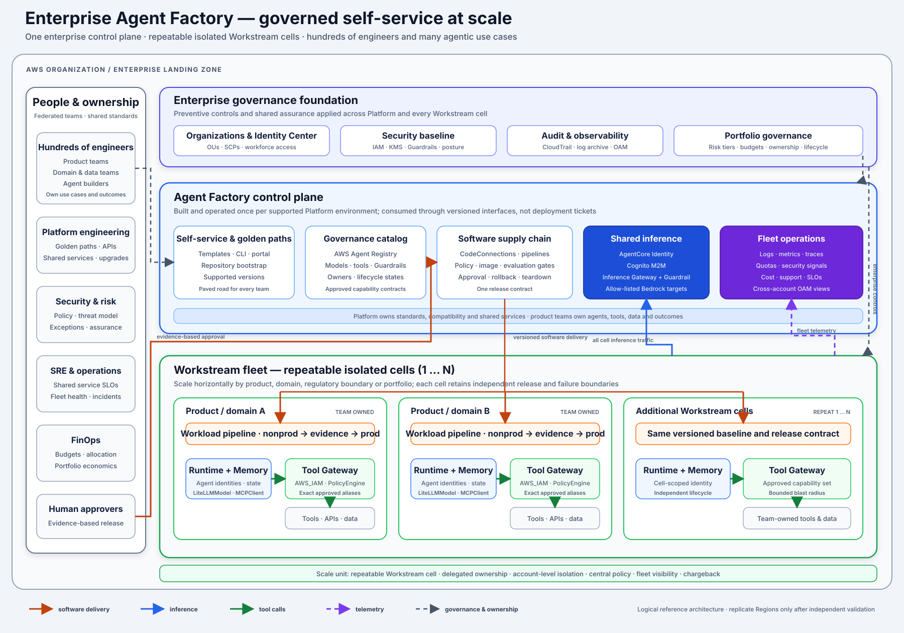

# Enterprise Agentic AI Platform Blueprint on AWS

[](#)
[](https://aws.amazon.com/cdk/)
[](#15-known-limitations-and-support-envelope)
[](LICENSE)

A multi-account AWS CDK reference architecture for building, governing, and promoting generative-AI agents on Amazon Bedrock AgentCore. It combines a central inference boundary, workstream-owned tool execution, AWS Agent Registry governance, tenant isolation, Bedrock Guardrails, deployment evaluation gates, centralized observability, and dependency-ordered cleanup.

This blueprint is the governed platform foundation in [AWS Samples — Sample AI Agent Factory](https://github.com/aws-samples/sample-ai-agent-factory). Platform teams deploy the shared controls once; delivery teams use the approved agent templates and Workload pipeline to ship agents without receiving a direct infrastructure write path.

> **Status:** Sample and reference content published under MIT-0. It is not an AWS service, an AppSec-reviewed product, or a compliance attestation. It deploys real, billable AWS resources. Review the architecture, IAM policies, data handling, quotas, and costs for your organization before using it with production or regulated workloads.



---

## Table of Contents

1. [Overview](#1-overview)
2. [Architecture](#2-architecture)
3. [Deviations and key design decisions](#3-deviations-and-key-design-decisions)
4. [AWS services used](#4-aws-services-used)
5. [Prerequisites](#5-prerequisites)
6. [Deployment](#6-deployment)
7. [Running the guidance](#7-running-the-guidance)
8. [Cost](#8-cost)
9. [Operations](#9-operations)
10. [Security](#10-security)
11. [Choice architecture](#11-choice-architecture)
12. [Compliance](#12-compliance)
13. [Multi-account topology](#13-multi-account-topology)
14. [Architecture decision record](#14-architecture-decision-record)
15. [Known limitations and support envelope](#15-known-limitations-and-support-envelope)
16. [Cleanup](#16-cleanup)
17. [Contributors and license](#17-contributors-and-license)

---

## 1. Overview

Enterprise agent platforms need the controls expected of any distributed system—identity, network boundaries, audit, tenancy, cost attribution, deployment safety, and rollback—plus agent-specific controls for model selection, prompts, tools, memory, evaluation, and excessive agency.

The supported reference path has one architecture:

- **Management and Governance** centralizes organization policy, audit, log archive, and the CloudWatch Observability Access Manager (OAM) sink.
- **Platform** owns AWS Agent Registry records, tool aliases, Bedrock Guardrails, the shared AgentCore Inference Gateway, Cognito machine-to-machine authentication, and both deployment pipelines.
- **Workstream** owns AgentCore Runtime, Memory, the AgentCore Tool Gateway, application roles, and agent execution.

Generated agents have exactly two outbound application paths:

1. `LiteLLMModel` obtains a short-lived token through AgentCore Identity and Cognito M2M, then calls the Platform Inference Gateway's OpenAI-compatible endpoint.
2. `MCPClient` signs requests with AWS SigV4 and calls the Workstream Tool Gateway, which exposes only tools approved in AWS Agent Registry.

Generated-agent code does not invoke Bedrock or Lambda directly.

### 1.1 Day in the life — how a developer ships an agent

1. **Platform onboarding.** The platform team configures the Management, Platform, and Workstream account roles, bootstraps each account with a scoped CloudFormation execution policy, and deploys the Platform pipeline.
2. **Tool governance.** A platform owner publishes a tool descriptor to AWS Agent Registry. A separate governance step reviews and approves the record.
3. **Agent authoring.** A delivery team starts from a template under `blueprints/`, edits agent code, tools, prompt text, and evaluation cases, and opens a pull request.
4. **Registry resolution.** The pipeline resolves approved records into environment-specific, non-secret context files and verifies ownership tags, descriptor digests, and target aliases.
5. **Permission handoff.** The Workload pipeline creates stable Workstream roles and pauses. The Platform pipeline grants exact Lambda aliases to the matching Tool Gateway roles. The Workload pipeline resumes only after the live policies are verified.
6. **Promotion.** Nonproduction deploys first. The pipeline invokes the deployed Runtime, evaluates quality, safety, tool use, latency, and cost, and requires human approval before production.
7. **Operations.** Logs, metrics, and traces are linked to Management through OAM. Changes use the same pipeline, rollback, and evidence path.
8. **Retirement.** Platform grants are removed before Workstream roles. Teardown then proceeds Workstream → Platform → Management and ends with an independent resource inventory.

### 1.2 How this fits with the other samples

| Sample                                                                                                                                              | Primary question                                  | Relationship                                                                                                                                            |
| --------------------------------------------------------------------------------------------------------------------------------------------------- | ------------------------------------------------- | ------------------------------------------------------------------------------------------------------------------------------------------------------- |
| [Workshop: Building an Agentic AI Platform](https://github.com/aws-samples/sample-ai-agent-factory/tree/main/workshop-building-agentic-ai-platform) | How do I learn the building blocks?               | Guided, single-account learning path. Start there for a hands-on introduction.                                                                          |
| [Agentic AI Self Service](https://github.com/aws-samples/sample-ai-agent-factory/tree/main/Agentic-ai-self-service)                                 | How do teams author agents quickly?               | Builder experience that can sit above a governed foundation like this blueprint.                                                                        |
| [Enterprise MCP Governance Gateway](https://github.com/aws-samples/sample-ai-agent-factory/tree/main/enterprise-mcp-governance-gateway)             | How do I authorize individual tool calls?         | Deeper reference for PolicyEngine and connector authorization. This blueprint adds the surrounding account, registry, pipeline, and lifecycle controls. |
| This blueprint                                                                                                                                      | How do I govern agents across accounts and teams? | Multi-account platform foundation, two-Gateway request path, release gates, observability, and teardown.                                                |

---

## 2. Architecture

### 2.1 Account topology

| Account role              | Responsibilities                                                                                                          | Principal deployment boundary                           |
| ------------------------- | ------------------------------------------------------------------------------------------------------------------------- | ------------------------------------------------------- |
| Management and Governance | AWS Organizations controls, audit and log archive, CloudWatch OAM sink                                                    | Management stacks only                                  |
| Platform                  | AWS Agent Registry, shared Inference Gateway, Guardrails, Cognito M2M, tool aliases, Platform and Workload pipeline roots | Platform-owned resources and exact cross-account grants |
| Workstream                | AgentCore Runtime, Memory, Tool Gateway, per-agent roles, application execution                                           | Workload pipeline only                                  |

Nonproduction and production can use separate accounts. A compact validation topology may place both environments in one account; the CDK application deduplicates account-and-Region singleton resources such as OAM links.

### 2.2 Inference request path

1. The generated agent runs in AgentCore Runtime.
2. `LiteLLMModel` requests an AgentCore Identity token.
3. AgentCore Identity exchanges the workload identity for the environment's Cognito M2M token.
4. The agent calls the Platform Inference Gateway's `/inference/v1` endpoint.
5. A request interceptor applies the stage Bedrock Guardrail to every untrusted turn.
6. The Gateway target invokes only a model allowed by the Gateway execution role.
7. Application logs and traces carry correlation identifiers into the observability path.

The deployed component named `LiteLLMModel` is a client adapter. The supported path does **not** deploy or operate a self-managed LiteLLM proxy.

### 2.3 Tool request path

1. The generated agent uses `MCPClient` with AWS SigV4.
2. The Workstream Tool Gateway authenticates the Runtime role with `AWS_IAM`.
3. Gateway targets are derived from approved AWS Agent Registry governance records.
4. The Gateway service role can invoke only the subscribed Platform Lambda aliases.
5. Native AgentCore PolicyEngine can enforce per-tool policies.
6. The Lambda Cedar wrapper remains as rollback and defense in depth.

The generated agent never receives a direct Lambda invocation path.

### 2.4 Deployment and governance path

```text
GitHub pull request
        │
        ▼
Source → Synth → stable Workstream roles + OAM link
        │
        ▼
GatewayPermissionReady ── exact Platform alias grants
        │
        ▼
Nonproduction Gateway / Runtime / Memory
        │
        ▼
Deployed-runtime evaluation + adversarial evidence
        │
        ▼
Human approval
        │
        ▼
Production Gateway / Runtime / Memory
```

The Platform pipeline owns Registry records, tool aliases, Guardrails, Inference Gateways, and exact resource-based permissions. The Workload pipeline owns Workstream changes. There is no supported direct-deployment shortcut into a Workstream account.

The permission handoff is intentionally two phase:

1. The Workload pipeline creates stable roles and pauses.
2. The Platform pipeline grants each environment's aliases to its exact role ARN.
3. The Workload pipeline resumes only after live alias policies are verified.
4. Teardown reverses the order: grants retire before Workstream roles.

### 2.5 Trust, data, and resilience boundaries

| Boundary                          | Primary controls                                                              |
| --------------------------------- | ----------------------------------------------------------------------------- |
| GitHub to pipeline                | CodeConnections, explicit source branch, self-mutating CDK pipeline           |
| Platform to Workstream deployment | CDK bootstrap trust, scoped execution policies, exact account and Region      |
| Runtime to Tool Gateway           | AWS_IAM, SigV4, exact Runtime role, approved tool targets                     |
| Runtime to Inference Gateway      | AgentCore Identity, Cognito M2M, CUSTOM_JWT, mandatory Guardrail interceptor  |
| Gateway to tools                  | Exact Lambda alias ARNs and exact Gateway service-role principal              |
| Gateway to model                  | `bedrock-mantle:Model` allow-list, stage Guardrail, account quotas            |
| Memory                            | Actor-scoped namespace, exact Memory ARN, customer-managed KMS key            |
| Observability                     | OAM source links and Organizations-scoped or explicit-account sink statements |

Additional boundaries:

- Cognito client secrets remain in Secrets Manager and are not emitted as CloudFormation outputs.
- Registry context files contain no secret, but they are environment-specific deployment inputs and should not be committed.
- Every taggable application resource carries `application-id`, `agent-id`, `tenant-id`, `cost-centre`, and `environment`.
- Workstream Runtime and Memory are environment isolated.
- An interrupted Runtime update must roll back to the prior image while the serving Runtime remains invocable.
- Native Gateway rate limits are approximate and fail open. IAM, SCPs, Guardrails, and account quotas remain the hard boundaries.

---

## 3. Deviations and key design decisions

### 3.1 D-01 — managed Gateway inference supersedes a self-managed proxy

The original blueprint placed a self-managed LiteLLM proxy in the inference path. The supported architecture removes that deployed service and uses an AgentCore Inference Gateway instead.

- **Kept:** `LiteLLMModel` in generated agent code as the OpenAI-compatible client adapter.
- **Removed from the supported path:** proxy fleet, proxy master secret, proxy scaling and patching surface, and a duplicate model-routing control plane.
- **Replacement controls:** Cognito M2M and AgentCore Identity, Gateway target model allow-listing, mandatory Guardrail interception, native traffic shaping, account quotas, and pipeline evaluation.
- **Accepted limitation:** native Gateway rate limiting is traffic management, not authorization, and fails open. IAM and policy controls must still fail closed when rate limiting is absent or cannot evaluate.

### 3.2 D-02 — infrastructure authored in AWS CDK

Infrastructure is authored in TypeScript AWS CDK, with Python and shell utilities where those ecosystems are the natural fit, and synthesized to CloudFormation.

The synthesized artifacts—not plausible-looking source—are the review boundary. The build validates rendered IAM policies, resource policies, SCPs, stack dependencies, and cdk-nag reports. Construct moves and logical-ID changes can replace resources, so refactors require an explicit CloudFormation diff.

Terraform was not selected because a second state model and review workflow would split one control surface. Customers standardized on Terraform can port the design, but must preserve the same effective policy and adversarial evidence contracts.

### 3.3 D-03 — centralized governance with workstream execution

Shared governance and inference services live in Platform; agent execution, Memory, and the Tool Gateway live in Workstream.

- **Why:** centralized model and Guardrail governance without giving Platform a direct application execution path.
- **Availability trade-off:** each environment's central Inference Gateway is shared. Isolate environments, use managed service resilience, and gate Gateway changes through deployed-runtime evaluation.
- **Tenancy:** identities, Registry records, tool aliases, Memory actors, application tags, and environment context stay explicit at every boundary.
- **Tool ownership:** Platform owns approved aliases; Workstream owns the service role that can invoke only its subscribed aliases.
- **Cost attribution:** application tags and supported inference attribution records remain outside the agent's ability to rewrite.

---

## 4. AWS services used

| Capability                   | AWS services                                                                               |
| ---------------------------- | ------------------------------------------------------------------------------------------ |
| Agent runtime and governance | Amazon Bedrock AgentCore Runtime, Gateway, Identity, Memory, Policy, Registry, Evaluations |
| Models and safety            | Amazon Bedrock, Bedrock Guardrails, Bedrock application inference profiles                 |
| Identity and authorization   | AWS IAM, AWS STS, Amazon Cognito, IAM Identity Center, Cedar policy controls               |
| Organization governance      | AWS Organizations, AWS Control Tower where adopted, service control policies               |
| Delivery                     | AWS CodePipeline, AWS CodeBuild, AWS CodeConnections, AWS CloudFormation, AWS CDK          |
| Networking                   | Amazon VPC, VPC endpoints, security groups                                                 |
| Tool execution               | AWS Lambda                                                                                 |
| Data and encryption          | AWS KMS, Amazon S3, Amazon DynamoDB, AWS Secrets Manager, Amazon ECR                       |
| Observability                | Amazon CloudWatch, CloudWatch Logs, OAM, AWS X-Ray and Transaction Search when enabled     |
| Security posture             | AWS CloudTrail, AWS Config, Security Hub, GuardDuty, Inspector                             |
| Cost governance              | AWS Budgets, Cost and Usage Reports, allocation tags                                       |

Not every optional construct is part of the Ireland support envelope. See [§15](#15-known-limitations-and-support-envelope).

---

## 5. Prerequisites

- Node.js 20 or later.
- Python 3.12 or later.
- AWS CLI v2.
- AWS CDK v2.
- Three AWS accounts, or equivalent isolated account roles, for Management, Platform, and Workstream.
- AWS Organizations or an explicit trusted-account set for the OAM sink policy.
- A GitHub repository and AWS CodeConnections connection.
- Access to the selected Bedrock model in the target Region.
- Administrator access for initial bootstrap only. Pipeline deployments use generated scoped execution policies.
- Capacity and quotas for AgentCore, Bedrock, Lambda, CodeBuild, VPC, CloudWatch Logs, OAM, KMS, and Cognito.

The currently validated reference Region is `eu-west-1` (Ireland). A different Region is a new validation target, not a configuration-only substitution.

---

## 6. Deployment

### 6.1 One-time setup

```bash
git clone https://github.com/aws-samples/sample-ai-agent-factory.git
cd sample-ai-agent-factory/enterprise-agentic-ai-platform-blueprint
npm ci
npm run build
npm test
npm run lint
npm run scrub
```

Set all three Region variables for CDK commands. The CDK child process can derive its Region from the SDK session, so setting only `CDK_DEFAULT_REGION` is insufficient.

```bash
export AWS_REGION=eu-west-1
export AWS_DEFAULT_REGION="$AWS_REGION"
export CDK_DEFAULT_REGION="$AWS_REGION"
```

### 6.2 Configuration

The CDK application reads `agenticai/*` context values. Keep real account IDs, secret ARNs, tokens, generated Registry context, and environment inventory outside source control.

Core Platform context:

- `agenticai/githubRepo`
- `agenticai/githubBranch`
- `agenticai/githubConnectionArn`
- `agenticai/organizationId`
- `agenticai/auditAccountId`
- `agenticai/logArchiveAccountId`
- `agenticai/platformNonprodAccountId`
- `agenticai/platformProdAccountId`
- `agenticai/workloadAccountIds`
- `agenticai/inferenceModelRateLimits`
- `agenticai/auditOamSinkArn`

Core Workload context:

- `agenticai/tenantId`
- `agenticai/agentId`
- `agenticai/applicationId`
- `agenticai/costCentre`
- `agenticai/workloadNonprodAccountId`
- `agenticai/workloadProdAccountId`
- `agenticai/workloadNonprodAvailabilityZones`
- `agenticai/workloadProdAvailabilityZones`
- `agenticai/enableGaRegistryConsumer=true`
- `agenticai/gaRegistryExpectedToolIds`
- `agenticai/gaRegistryNonprodContextFile`
- `agenticai/gaRegistryProdContextFile`
- `agenticai/workstreamGatewayRegion`
- `agenticai/enablePipelineRuntimeMemory=true`
- `agenticai/agentImageVariant=generated-agent`
- `agenticai/generatedAgentInference`

Pin `agenticai/githubBranch` when deploying an unmerged branch. If omitted, the pipeline can silently source the repository's default branch instead of the revision under review.

### 6.3 Bootstrap with scoped policies

Generate one CloudFormation execution policy per account and Region:

```bash
python3 pipelines/bootstrap/render-cfn-execution-policy.py platform \
  --account-id <PLATFORM_ACCOUNT> \
  --region eu-west-1 \
  --target-account-id <PLATFORM_ACCOUNT> \
  --target-account-id <WORKSTREAM_ACCOUNT> \
  --target-account-id <MANAGEMENT_ACCOUNT> \
  --connection-arn <CODECONNECTIONS_ARN> \
  > platform-policy.json

python3 pipelines/bootstrap/render-cfn-execution-policy.py workstream \
  --account-id <WORKSTREAM_ACCOUNT> \
  --region eu-west-1 \
  > workstream-policy.json

python3 pipelines/bootstrap/render-cfn-execution-policy.py management \
  --account-id <MANAGEMENT_ACCOUNT> \
  --region eu-west-1 \
  > management-policy.json
```

Validate every generated identity policy:

```bash
aws accessanalyzer validate-policy \
  --region eu-west-1 \
  --policy-type IDENTITY_POLICY \
  --policy-document file://platform-policy.json
```

Create each document under the same local managed-policy name, then bootstrap the accounts:

```bash
export CFN_EXECUTION_POLICY_NAME=AgenticAICdkExecutionPolicyEuWest1
bash pipelines/bootstrap/bootstrap-cross-account.sh
```

Do not use `AdministratorAccess` as the CloudFormation execution policy. Validate effective allow and deny decisions with IAM simulation after policy propagation.

### 6.4 Deploy the Platform producer

Create or update `AgenticAI-PlatformPipelineStack` with Gateway invoke permissions disabled:

```text
agenticai/enableGaGatewayInvokePermissions=false
```

Run the Platform pipeline. It creates the environment Registries, governance records, tool aliases, Guardrails, Inference Gateways, and Management resources.

Do not approve Registry records merely because deployment succeeded. Review their descriptors and use the ownership-checking utility:

```bash
python3 scripts/live-agent-registry-spike/approve_pipeline_registry.py verify ...
python3 scripts/live-agent-registry-spike/approve_pipeline_registry.py apply ...
```

The utility verifies every record before submitting or approving any record.

### 6.5 Deploy the Workload pipeline

Resolve one non-secret Registry context file per environment:

```bash
python3 pipelines/resolve_ga_registry_context.py \
  --account-id <PLATFORM_ACCOUNT> \
  --region eu-west-1 \
  --environment nonprod \
  --application-id <APPLICATION_ID> \
  --agent-id <AGENT_ID> \
  --tenant-id <TENANT_ID> \
  --cost-centre <COST_CENTRE> \
  --expected-tool-id tool-echo \
  --expected-tool-id tool-ping \
  --source-revision "$(git rev-parse HEAD)" \
  --output <NONPROD_CONTEXT_FILE>
```

Repeat for production. The resolver is read-only and fails if ownership tags, record state, descriptor digests, or target ARNs differ.

Deploy only the Workload pipeline root. The pipeline creates stable Workstream roles, creates the account-and-Region OAM link, and pauses at `GatewayPermissionReady`.

Read the nonproduction and production `GatewayServiceRoleArn` outputs. Update the Platform pipeline root with:

```text
agenticai/enableGaGatewayInvokePermissions=true
agenticai/gaGatewayServiceRoleArns=[<NONPROD_ROLE_ARN>,<PROD_ROLE_ARN>]
```

Run the Platform pipeline and verify each Lambda alias policy names its matching role ARN. Only then approve `GatewayPermissionReady`.

The Workload pipeline deploys nonproduction, invokes the deployed Runtime through the evaluation gate, and pauses before production. Review evaluation and adversarial evidence before approving production.

### 6.6 Validation

Local gates:

```bash
npm run build
npm test
npm run lint
npm run scrub

python3 -m pytest tests/adversarial/unit -q
python3 -m pytest scripts/test_final_teardown.py scripts/test_residue_inventory.py -q
```

For infrastructure changes, synthesize the exact account and Region topology with `npx cdk synth --strict`, review the generated templates, and require clean cdk-nag reports.

A behavior-changing revision is complete only after:

1. reviewed pipeline deployment;
2. an authorized positive call;
3. an unauthorized adversarial twin with an exact denial;
4. a mutation proving the test fails when the control is removed;
5. rollback and re-run to green;
6. centralized logs, metrics, and traces where claimed;
7. dependency-ordered teardown and direct resource inventory.

Live mode fails closed. Missing credentials, probes, resources, or expected denials are errors—not passing skips.

### 6.7 Common issues

| Symptom                                             | Likely cause                                                                    | Corrective action                                                                                                                                        |
| --------------------------------------------------- | ------------------------------------------------------------------------------- | -------------------------------------------------------------------------------------------------------------------------------------------------------- |
| Pipeline sources old code                           | `agenticai/githubBranch` omitted                                                | Pin the intended branch and verify the Source revision before promotion.                                                                                 |
| CDK deploys to an unexpected Region                 | Only one Region environment variable set                                        | Set `AWS_REGION`, `AWS_DEFAULT_REGION`, and `CDK_DEFAULT_REGION`; inspect the synthesized environments.                                                  |
| OAM `CreateLink` is denied                          | Sink policy or CloudFormation execution policy lacks the exact source-link path | Validate both sides. Keep Organizations and explicit-account trust in separate sink statements. Grant OAM lifecycle plus required `*:Link` dependencies. |
| OAM stack is `ROLLBACK_COMPLETE`                    | First create failed before any resource survived                                | Verify the stack is empty, delete only that exact failed stack, and let the reviewed pipeline recreate it.                                               |
| Tool target creation is denied                      | Alias grants do not name the exact stable Gateway service role                  | Re-run the two-phase permission handoff and verify all alias policies live.                                                                              |
| Runtime returns a configuration error               | Generated-agent environment is incomplete                                       | Populate the full tenant, agent, environment, Guardrail, model, and Gateway URL contract.                                                                |
| Teardown stalls on Registry deletion                | AgentCore Registry deletion is asynchronous                                     | Retry conflicts while records settle, then poll the Registry to absence before handling its KMS key.                                                     |
| CloudFormation delete is denied after an IAM update | New policy version has not propagated                                           | Wait and verify the effective permission with IAM simulation before retrying.                                                                            |

---

## 7. Running the guidance

Reference agents live under `blueprints/`:

| Blueprint                   | Framework | Pattern                      | Key behavior                                                              |
| --------------------------- | --------- | ---------------------------- | ------------------------------------------------------------------------- |
| `agenticai-task-agent`      | Strands   | Deterministic task execution | Max-iteration guard, baseline Guardrail, optional durable HITL escalation |
| `agenticai-chatbot-agent`   | Strands   | Customer-facing conversation | Streaming first, conversation memory, in-process human handoff            |
| `agenticai-multi-agent`     | Strands   | Supervisor and workers       | Separate agent identities and bounded worker dispatch                     |
| `agenticai-langgraph-agent` | LangGraph | Graph orchestration          | Same MCP and inference boundaries through the framework adapter           |
| `agenticai-crewai-agent`    | CrewAI    | Crew orchestration           | Same approved-tool and Guardrail invariants through the framework adapter |

Delivery teams customize:

- prompt content under each blueprint's `prompts/` directory;
- per-agent tools;
- regression and refusal cases under `eval/`;
- model selection from the Platform allow-list;
- bounded iteration, streaming, and human-escalation behavior.

The checked-in task and chatbot prompt assets use `.txt` so this blueprint keeps one canonical Markdown document. Generated projects may choose their own documentation and prompt extensions.

The framework is not the security boundary. Every adapter must still use the Platform Inference Gateway for model traffic and the Workstream Tool Gateway for tool traffic.

---

## 8. Cost

Costs depend on model traffic, Runtime duration, log retention, VPC endpoints, build frequency, centralized security services, and optional account-wide observability features. Do not infer blueprint cost from whole-account Cost Explorer totals when an account hosts unrelated workloads.

Recommended controls:

- allocation tags on every supported application resource;
- per-application AWS Budgets;
- account-level Bedrock quotas;
- model routing by quality and latency need;
- bounded CloudWatch retention;
- exact image and build retention policies;
- monthly Cost and Usage Report reconciliation;
- explicit approval before enabling Transaction Search.

Native Gateway rate limits are approximate traffic shaping. Do not use them as a billing ceiling or authorization control.

---

## 9. Operations

### 9.1 Release workflow

- Every production change flows through the reviewed pipeline.
- Nonproduction deploys and is invoked before production approval.
- Evaluation covers regression, quality, tool success, refusal behavior, first-token latency, and per-prompt cost.
- Runtime changes require continuity sampling through update, rollback, and restore.
- A failing or missing evaluation blocks promotion.
- Direct Workstream deployment is outside the supported operating model.

### 9.2 Observability

The Platform pipeline root and every distinct Workstream account-and-Region create one OAM source link to the Management sink. A same-account nonproduction/production topology shares one link to avoid OAM cardinality conflicts.

OAM links share Logs, Metrics, and Traces. Verify central visibility by owning account; the presence of a link alone does not prove Management can query the shared data.

Gateway application logs require a CloudWatch Logs delivery. Gateway spans require Transaction Search and a `TRACES` delivery. Transaction Search changes account-wide behavior and incurs cost, so it is opt-in. Allow for regional delivery propagation, correlate an admitted request and an exact-throttled request, and restore every temporary source, destination, delivery, resource policy, log group, and Transaction Search setting.

### 9.3 Incident first moves

| Signal                              | First moves                                                                                                                                                    |
| ----------------------------------- | -------------------------------------------------------------------------------------------------------------------------------------------------------------- |
| Guardrail intervention spike        | Correlate Gateway and application traces, classify prompt attack/content/PII, add an adversarial regression, and tighten policy only through review.           |
| Tool-call loop                      | Identify the repeated qualified tool, stop the affected workflow safely, and fix termination signals rather than only raising iteration limits.                |
| Bedrock or Gateway throttling       | Separate managed rate-limit 429s from service quota throttling, shed noncritical load, inspect quotas, and retain authorization checks.                        |
| Tool target outage                  | Isolate the target, verify circuit and fallback behavior, and avoid broadening the Gateway role.                                                               |
| Runtime deployment regression       | Keep sampling the serving revision, cancel only at the intended stack boundary, verify rollback completion, then re-run the reviewed revision.                 |
| Cross-account authorization failure | Read the live caller and effective policy, validate trust and resource policy independently, and do not infer delete permissions from prior create success.    |
| Missing centralized spans           | Verify Transaction Search state and delivery status, allow bounded propagation, and run a second independent execution before declaring a regional limitation. |

### 9.4 Change reviews

Recommended cadence:

- architecture and Well-Architected review quarterly;
- cost and quota review monthly;
- dependency, image, and SBOM review monthly;
- IAM/SCP drift and Access Analyzer review quarterly;
- Guardrail and adversarial corpus review for every behavior change;
- rollback, failure injection, and teardown rehearsal before widening a support envelope.

---

## 10. Security

### 10.1 Control summary

- Scoped CDK execution policies generated per account and Region.
- Organizations SCPs for model, Region, Guardrail, Registry, Gateway, and deployment boundaries.
- Mandatory Bedrock Guardrail request interceptor on the Inference Gateway.
- Model allow-list on the Gateway execution role.
- Cognito M2M and AgentCore Identity short-lived credentials.
- `AWS_IAM` authentication for the Workstream Tool Gateway.
- Registry-approved tool descriptors and exact Lambda alias ARNs.
- Exact Workstream role principals on Platform alias policies.
- Actor-scoped AgentCore Memory and customer-managed KMS keys.
- Digest-bound ECR image scanning that blocks Critical or High findings.
- Human approval after deployed-runtime evaluation.
- Five allocation tags: `application-id`, `agent-id`, `tenant-id`, `cost-centre`, and `environment`.
- OAM links for centralized Logs, Metrics, and Traces.

### 10.2 Threat and evidence model

The design addresses STRIDE, the OWASP Top 10 for LLM Applications, and agent-specific risks such as prompt injection, excessive agency, insecure tools, cross-tenant memory access, supply-chain tampering, policy bypass, and unsafe rollback.

A denied request is evidence only when it proves the intended control:

- authentication failures do not prove authorization;
- missing resources do not prove policy denial;
- validation errors do not prove enforcement;
- timeouts and 5xx responses do not prove denial;
- every negative test requires an authorized positive twin in the same run;
- denial evidence names the exact error code and status and is independently correlated;
- a mutation removes the control and demonstrates that the adversarial test then fails.

The adversarial harness under `tests/adversarial/` validates the evidence schema, twin ledger, sanitization, and domain catalog offline. Live probes are separate and fail closed when requested evidence is unavailable. Evidence must not contain account IDs, credentials, tokens, prompts, or sensitive response content.

### 10.3 Shared responsibility

- **AWS** operates the managed services under the AWS Shared Responsibility Model.
- **Platform team** owns this blueprint, Platform and Management stacks, organization policies, Guardrails, Registry governance, shared Gateways, pipelines, and control evidence.
- **Delivery team** owns application code, tools, prompts, evaluation corpora, data classification, and privacy requirements.
- **Customer security and compliance teams** validate the deployed configuration against the organization's threat model and regulatory obligations.

Report security issues privately through the [AWS vulnerability reporting process](https://aws.amazon.com/security/vulnerability-reporting/), not a public GitHub issue.

---

## 11. Choice architecture

Supported choices are explicit configuration, not hidden forks:

| Decision              | Reference default                      | Supported override or obligation                                                                               |
| --------------------- | -------------------------------------- | -------------------------------------------------------------------------------------------------------------- |
| Region                | `eu-west-1`                            | A new Region requires the complete validation matrix in §15.                                                   |
| Account separation    | Management, Platform, Workstream       | Nonproduction and production may use separate accounts; same-account profiles deduplicate singleton resources. |
| Identity              | Cognito M2M through AgentCore Identity | A different issuer requires equivalent token, audience, tenancy, rotation, and adversarial proof.              |
| Agent framework       | Strands reference agents               | LangGraph and CrewAI adapters must preserve both Gateway boundaries.                                           |
| Guardrail             | Stage baseline                         | Changes require Platform review and positive/adversarial evidence.                                             |
| Models                | Platform allow-list                    | Adding a model requires availability, policy, data-residency, quality, cost, and denial validation.            |
| Tool set              | Approved Registry records              | Every target must resolve to an exact approved alias and exact service-role grant.                             |
| Rate limiting         | Native Gateway profile                 | Treat as fail-open traffic shaping; use IAM/SCP and quotas for hard boundaries.                                |
| Transaction Search    | Off                                    | Enable deliberately for trace delivery, account for cost, and verify restoration if temporary.                 |
| Lambda Cedar wrapper  | Retained                               | Native PolicyEngine can enforce primary policy; wrapper retirement requires a separate reviewed migration.     |
| Evaluation thresholds | Pipeline defaults                      | Tighten per workload; weakening requires an explicit risk decision.                                            |

A choice that changes a security or topology invariant requires a documented design decision and its own tests. It is not a supported toggle merely because CDK can express it.

---

## 12. Compliance

This blueprint provides implementation hooks and evidence surfaces; it does not provide certification or an authorization to operate.

- **AWS Well-Architected:** pipeline automation and runbooks support Operational Excellence; explicit identities, policies, encryption, and Guardrails support Security; rollback and environment isolation support Reliability; evaluation and model choice support Performance Efficiency; allocation tags and budgets support Cost Optimization; managed services and right-sized model choice support Sustainability.
- **NIST SP 800-53 Rev. 5:** IAM, SCPs, Registry governance, encryption, logging, deployment controls, and evidence map principally to AC, AU, CM, IA, SC, SI, SR, and PT families. Customers must build their own authoritative control matrix.
- **EU AI Act:** optional constructs support risk assessment, technical documentation, human oversight, evaluation, and retained governance artifacts. Customers determine risk classification, retention, legal basis, and whether optional immutable storage is appropriate.
- **Data protection:** customers classify prompts, responses, Memory events, tool payloads, and logs; configure retention; and avoid storing personal or regulated data without an approved design.

Generated compliance artifacts can use Markdown as an output format in customer-owned storage; that runtime output is separate from this repository's single-document source layout.

---

## 13. Multi-account topology

### Management and Governance

- Owns organization policy and central observability.
- The OAM sink policy can trust an AWS Organization and explicit standalone accounts simultaneously, but those paths are separate statements. Do not attach `PrincipalOrgID` to the explicit-account path.
- Does not receive a Workstream write path.

### Platform

- Owns Registry governance, Guardrails, Inference Gateways, tool aliases, and pipelines.
- Grants exact aliases to exact Workstream Gateway service roles.
- Cannot invoke the serving Workstream Runtime unless an explicit reviewed path is added; the reference cross-account denial remains part of the adversarial contract.

### Workstream

- Owns Runtime, Memory, Tool Gateway, and application execution.
- Receives no direct developer infrastructure mutation path. Emission flows through GitHub and the Workload pipeline.
- Cannot mutate Registry governance or Platform aliases.

### Adding a workload

1. Allocate nonproduction and production account roles.
2. Bootstrap each target with the generated Region-scoped execution policy.
3. Add the Workstream accounts to Platform configuration and OAM trust.
4. Publish and approve required Registry tool records.
5. Resolve non-secret Registry context for both environments.
6. Create the Workload pipeline root.
7. Complete the two-phase alias permission handoff.
8. Run nonproduction evaluation and adversarial cases before production approval.
9. Rehearse grant retirement and dependency-ordered teardown.

---

## 14. Architecture decision record

The load-bearing decisions are consolidated here so this README remains the single Markdown source of truth:

1. **AWS CDK and CloudFormation are the infrastructure implementation.** Review synthesized artifacts and effective policies, not only source intent.
2. **AgentCore Inference Gateway is the supported inference boundary.** No self-managed LiteLLM proxy runs in the supported request path; `LiteLLMModel` remains the client adapter.
3. **Inference and tools use separate Gateways and separate authentication models.** Inference uses AgentCore Identity and Cognito M2M/CUSTOM_JWT; tools use AWS_IAM and SigV4.
4. **Platform governs; Workstream executes.** Platform owns approved models, Guardrails, Registry records, aliases, and deployment roots. Workstream owns application runtime state.
5. **AWS Agent Registry is the tool source of truth.** A tool is not deployable merely because code references it; its approved record, descriptor digest, ownership, and alias must resolve.
6. **Workstream mutation is pipeline only.** There is no fast-track direct deployment path.
7. **Permissions are handed off and retired in dependency order.** Stable roles precede grants; grants disappear before role deletion.
8. **Memory namespaces are static at synth except for runtime actor scope.** Dynamic tenant or agent namespace substitution is not permitted.
9. **Rate limiting is not authorization.** It is approximate, fail-open traffic shaping and requires fail-closed compensating controls.
10. **Every behavior claim is evidence bounded.** Region, revision, identity, positive twin, exact denial, rollback, observability, and teardown all belong to the claim.
11. **Transaction Search is opt-in.** It is account-wide and billable.
12. **The Lambda Cedar wrapper remains a rollback control.** Native PolicyEngine adoption does not silently delete it.

Reopen a decision when a proposed change alters a trust boundary, removes a compensating control, adds a provider, changes account ownership, or widens the support envelope.

---

## 15. Known limitations and support envelope

### Live-validated reference envelope

The complete reference flow is validated in `eu-west-1` (Ireland):

- Platform and Workload pipelines through production.
- AWS Agent Registry record resolution and governance.
- Generated agents using `LiteLLMModel` and `MCPClient`.
- AgentCore Identity, Runtime, Memory, Inference Gateway, and Tool Gateway.
- Benign and adversarial Guardrail calls with exact admitted and blocked outcomes.
- Exact HTTP 429 behavior for an unallocated model.
- Direct cross-account Runtime denial.
- Runtime update cancellation, rollback to the prior version, and re-run to green while sampled sessions remained available.
- Evaluation gates for regression, quality, tool success, refusal behavior, first-token latency, and per-prompt cost.
- Management queries across linked Platform and Workstream logs and metrics.
- Gateway application-log and OTEL span correlation for admitted and throttled requests after regional delivery propagation.
- Dependency-ordered teardown and direct zero-residual inventories across all three account roles.

### Outside the current envelope

- Any Region other than `eu-west-1` until independently validated.
- Legacy direct-Bedrock evaluation, online-evaluation, ECS LiteLLM, and direct circuit-breaker paths that rely on cross-Region inference profiles.
- VPC Lattice private endpoints.
- Transaction Search enabled by default.
- Native Gateway rate limiting as a hard quota or authorization control.
- Automatic retirement of the Lambda Cedar wrapper.
- A compliance certification, availability SLA, or guarantee that future AWS service changes preserve behavior.

A Region is supportable only after independent service-availability, model and data-residency, IAM/SCP, availability-zone, strict synth, positive/adversarial, rollback, observability, and teardown gates pass there. Do not extrapolate from Ireland.

---

## 16. Cleanup

Always retire Platform alias grants before deleting Workstream roles:

1. Set `agenticai/enableGaGatewayInvokePermissions=false` in the Platform pipeline configuration.
2. Run the Platform pipeline through production.
3. Verify all current and stale alias policies no longer name a Workstream role principal.

Then use the fail-closed teardown in this order.

### 16.1 Workstream

```bash
python3 scripts/final_teardown.py \
  --account-role workstream \
  --expected-account <WORKSTREAM_ACCOUNT> \
  --region eu-west-1

# After reviewing the exact dry-run plan:
python3 scripts/final_teardown.py \
  --account-role workstream \
  --expected-account <WORKSTREAM_ACCOUNT> \
  --region eu-west-1 \
  --apply
```

### 16.2 Platform

```bash
python3 scripts/final_teardown.py \
  --account-role platform \
  --expected-account <PLATFORM_ACCOUNT> \
  --region eu-west-1

python3 scripts/final_teardown.py \
  --account-role platform \
  --expected-account <PLATFORM_ACCOUNT> \
  --region eu-west-1 \
  --apply
```

### 16.3 Management and Governance

Run only after every source link is absent:

```bash
python3 scripts/final_teardown.py \
  --account-role management \
  --expected-account <MANAGEMENT_ACCOUNT> \
  --region eu-west-1

python3 scripts/final_teardown.py \
  --account-role management \
  --expected-account <MANAGEMENT_ACCOUNT> \
  --region eu-west-1 \
  --apply
```

### 16.4 Independent inventory

Measure each account directly after teardown:

```bash
python3 scripts/residue_inventory.py \
  --expected-account <ACCOUNT_ID> \
  --region eu-west-1 \
  --global
```

Zero CloudFormation stacks is not sufficient. Inventory Runtime, Memory, Gateways, Registry records, Registries, Cognito pools, IAM roles and policies, log groups, ECR images, secrets, buckets, and alias-less KMS keys.

Expected terminal state is zero live project resources. Customer-managed keys can remain in AWS's seven-day pending-deletion window. Object Lock can intentionally make objects undeletable until retention expires; review the plan before deploying an optional retention control.

`CDKToolkit` stacks and scoped bootstrap policies can remain for future deployments. Remove them only as a separate, explicit account-retirement decision.

---

## 17. Contributors and license

Issues and pull requests are welcome. See the repository-level [contribution guidelines](https://github.com/aws-samples/sample-ai-agent-factory/blob/main/CONTRIBUTING.md) and [code of conduct](https://github.com/aws-samples/sample-ai-agent-factory/blob/main/CODE_OF_CONDUCT.md).

This project is distributed under the MIT-0 License. See [LICENSE](LICENSE).

Report security issues through the [AWS vulnerability reporting process](https://aws.amazon.com/security/vulnerability-reporting/), not a public issue.

---

Copyright Amazon.com, Inc. or its affiliates. All Rights Reserved.
SPDX-License-Identifier: MIT-0
