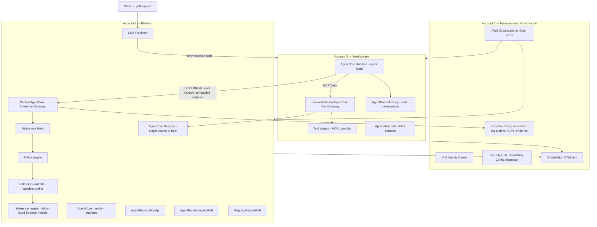

# RFC-0001 — Target-state architecture: consolidated governance and environment-isolated AgentCore execution

- **Status:** Accepted target state; implementation in progress. The central inference boundary and
  pipeline-owned R2 Registry/Tool Gateway slice are live-verified in `us-west-2`; Runtime, Memory,
  pipeline-owned PolicyEngine, organization-SCP, EMEA, load/chaos/upgrade, and OTEL correlation
  gates remain open.
- **Date:** 2026-09-18
- **Supersedes (conceptually):** the two mutually-exclusive deployment patterns described in
  [`README.md`](../../README.md) §1 and §3 — the distributed pattern (D-01) and the
  centralised-platform pattern (D-03 v3).
- **Related ADRs:** [ADR-0002](../adr/ADR-0002-cdk-not-terraform.md) (IaC in CDK),
  [ADR-0016](../adr/ADR-0016-agentcore-gateway-inference-supersedes-litellm-proxy.md)
  (AgentCore Gateway inference targets supersede the self-managed LiteLLM proxy).
- **Reader contract:** every statement in this document is tagged **Verified**,
  **Documentation-verified**, **Planned**, or **Unverified**. See
  [§1.2](#12-verified-documentation-verified-planned-and-unverified). Nothing here may be read as an
  attestation.

---

## 1. Purpose and reading rules

### 1.1 Purpose

This RFC defines the single supported target architecture for this blueprint. Today the repository
ships two alternative topologies plus a self-managed LiteLLM proxy in the inference path. That is
three architectures for a customer to choose between, and the choice is made before the customer
understands the consequences. The target state is **one** topology, **one** deployment path, and a
**consolidated governance account** plus **environment-isolated Platform and Workstream accounts**.

The target state changes four things:

1. **Two topologies converge into one.** Shared control plane in a Platform account,
   workstream-owned execution in a Workstream account. See [§3](#3-d-01-and-d-03-as-historical-inputs).
2. **Inference moves onto Amazon Bedrock AgentCore Gateway inference targets.** The self-managed
   LiteLLM proxy leaves the golden path. `LiteLLMModel` stays as the generated-agent client adapter,
   pointed at the Gateway's OpenAI-compatible endpoint. See
   [ADR-0016](../adr/ADR-0016-agentcore-gateway-inference-supersedes-litellm-proxy.md).
3. **Governance responsibilities consolidate into one account, and environments stay account-isolated.**
   Management, security tooling, and log archive fold into a single Management/Governance account.
   Production and non-production do **not** share a Platform or Workstream account. See
   [§4](#4-account-model-production-baseline-and-the-non-production-profile).
4. **Rate limiting becomes a named, dimensioned control with explicit fail-open compensations.**
   See [§7](#7-rate-limiting-dimensions-profiles-and-fail-open-compensating-controls).

### 1.2 Verified, Documentation-verified, Planned, and Unverified

| Tag | Meaning |
|---|---|
| **Verified** | Exercised against live AWS with exact-commit evidence recorded in the repository; applies only to the bounded envelope named by that evidence. |
| **Documentation-verified** | Confirmed against official AWS or library documentation, but not yet exercised against live AWS in this blueprint. A live spike or fault-injection remains a release gate. |
| **Planned** | A design intent in this RFC. Design is settled; implementation may be scaffolded but is not deployed. |
| **Unverified** | An assumption this RFC makes that has not been confirmed against documentation, live AWS, or a spike. |

Sources are linked inline where a claim is **Documentation-verified**; the full list is in
[§17](#17-sources).

Two dependencies are load-bearing for the whole RFC. U-1 is now live-verified for the basic
endpoint/client contract; U-2 is live-verified for ordinary allow/throttle behavior but remains open
for the full precedence, telemetry, and fail-open matrix:

- **U-1 (Verified for the basic live contract; extended checks remain).** A real pipeline-owned
  AgentCore Gateway inference target passed Cognito M2M, 49-model discovery, and Strands
  `LiteLLMModel` streaming and non-streaming completion in `us-west-2`. This closes the endpoint,
  authentication, discovery, and client-adapter compatibility claims. A model-mediated tool call,
  JWT refresh under expiry, and usage-token reconciliation were not part of that run and remain
  release gates. See
  [`../../evidence/live/2026-09-19-platform-pipeline-deployment.md`](../../evidence/live/2026-09-19-platform-pipeline-deployment.md).
- **U-2 (Verified for ordinary allow/throttle; extended checks remain).** AWS's 2026-08-06
  AgentCore Gateway rate-limiting article documents the dimensions and ordering in
  [§7.2](#72-rate-limit-dimensions-documentation-verified). An isolated `us-west-2` run proved an
  authorized HTTP 200 twin and exact HTTP 429 under a zero-rate provider-qualified model rule; the
  pipeline-owned production limit separately reached `ACTIVE` without being destructively mutated.
  Precedence across multiple dimensions, Policy behavior when customer limits are absent,
  fail-open behavior, token reconciliation, and missing-decision alarming remain release gates.
  OTEL rate-limit span correlation is a reproduced blocker. No AgentCore-specific managed-outage
  injection hook is currently documented; the test plan must not fabricate one. See
  [`../../evidence/live/2026-09-18-agentcore-gateway-spike.md`](../../evidence/live/2026-09-18-agentcore-gateway-spike.md)
  and [§17](#17-sources).

**The bounded U-1 and U-2 claims above are now closed by live evidence.** The named extended
checks still block their broader claims; neither partial result is a whole-platform readiness
attestation.

---

## 2. Target topology at a glance

The diagram shows **one environment**: a consolidated Management/Governance account governing an
environment-isolated Platform account and Workstream account. Production and non-production are
separate account sets under the same organization; see
[§4](#4-account-model-production-baseline-and-the-non-production-profile).



**Text equivalent of the diagram.** One environment, three account roles. The
Management/Governance account is shared across all environments and owns the organization, the OUs,
the service control policies, Identity Center, the security services, the organization CloudTrail,
the model-invocation-log archive, the Cost and Usage Report, immutable compliance evidence, and the
CloudWatch OAM sink. It governs the other accounts but runs no agent workload. The Platform account
shown is one environment's Platform account — production has its own, non-production has its own —
and owns the AgentCore Registry, one central AgentCore Inference Gateway with inference targets
pointing at allow-listed Bedrock models, native rate limits, the platform AgentCore Identity, the
policy engine, the baseline Bedrock Guardrail, the CDK pipelines, and exactly three cross-boundary
control-plane surfaces. The Workstream account shown is likewise one environment's Workstream
account and owns AgentCore Runtime and the agent code, one per-workstream AgentCore Tool Gateway with
its tool targets, AgentCore Memory, and application data. Agent inference traffic leaves the
Workstream account to the central Inference Gateway using `LiteLLMModel` against the Gateway's
OpenAI-compatible endpoint, and is evaluated by rate limits, then policy, then guardrails, before
reaching a Bedrock model. Agent tool traffic stays inside the Workstream account, using `MCPClient`
against the per-workstream Tool Gateway, whose subscriptions are validated against the Registry in
the Platform account. The only way to mutate the Workstream account is a GitHub pull request that
drives the workload pipeline. Telemetry from both the Platform and Workstream accounts flows to the
OAM sink in Management/Governance, and inference records flow to the log archive there.

---

## 3. D-01 and D-03 as historical inputs

D-01 and D-03 are not two options in the target state. They are two **prior explorations** whose
useful properties are merged into one topology. They stay in the repository history and in
[`CHANGELOG.md`](../../CHANGELOG.md) as the record of how the design arrived here.

| Historical input | What it got right, and is kept | What it got wrong, and is dropped |
|---|---|---|
| **D-01 — distributed** (`apps/workload-account/`) | Per-account blast-radius containment; per-account VPC with PrivateLink-only egress and no IGW/NAT; the guardrail triple-gate; the model allow-list as a single source of truth flowing into multiple enforcement surfaces; per-account audit and cost boundary. | A self-managed LiteLLM deployment per workload account as the inference path. That is a per-account operational burden, a per-account patching surface, and a per-account availability risk, for a capability the managed Gateway is intended to provide. |
| **D-03 v3 — centralised platform** (`apps/platform-account/`) | Central governance of tool access; the AgentCore Registry as the tool source of truth with synth-time subscription validation; the per-workstream Tool Gateway deployed *into* the workstream account, which removes the cross-account Runtime-to-Gateway hop; platform-owned per-tenant Application Inference Profiles for cost attribution; three-layer enforcement at synth, deploy, and runtime. | Seven accounts. Cross-account `AssumeRole` into Bedrock as the inference path, with `ExternalId` and session-name conditions doing work that a Gateway identity boundary should do. Cedar evaluated inside each tool Lambda as a stand-in for a policy engine. |
| **D-02 — IaC in CDK** | The decision itself. | Its placement. D-02 was recorded beside two topology choices, which invited customers to read "CDK versus Terraform" as a deployment-pattern choice. It is an implementation-technology decision and now lives in [ADR-0002](../adr/ADR-0002-cdk-not-terraform.md). |

**Convergence rule (Planned).** The target topology takes D-03's central control plane and
Registry-as-truth, takes D-01's containment and network posture for the Workstream account, keeps
D-03's decision to place the Tool Gateway in the Workstream account, and replaces both accounts'
inference paths with the central Inference Gateway. There is no supported configuration flag that
restores either historical pattern.

---

## 4. Account model: production baseline and the non-production profile

The target state fixes **which responsibilities live in which account role**, then applies that role
model twice: once as the production baseline, once as a leaner non-production / live-validation
profile. Two decisions must not be confused:

- **Governance consolidation (accepted).** Management, security tooling, and log archive fold into
  **one** Management/Governance account. This is a deliberate, accepted simplification with
  compensating controls — see [§4.3](#43-governance-consolidation-accepted-with-compensating-controls).
- **Environment account isolation (baseline).** Production and non-production do **not** share a
  Platform account or a Workstream account. Each environment gets its own. This is the production
  baseline, not an open question.

### 4.1 Account role responsibilities

| Role | Owns | Runs agent workload |
|---|---|---|
| **Management / Governance** (one, shared across environments) | Organizations, OUs, service control policies, IAM Identity Center and all permission sets, Security Hub, GuardDuty, AWS Config aggregation, Inspector, organization CloudTrail, Bedrock model-invocation-log archive, Cost and Usage Report, immutable compliance evidence, CloudWatch OAM sink | No |
| **Platform** (one per environment) | AgentCore Registry, central AgentCore Inference Gateway and its inference targets, native rate-limit configuration, platform AgentCore Identity, policy engine, Bedrock Guardrail profiles and the `GuardrailAdminRole`, WAF web ACL for the Gateway, CDK pipelines, the three sanctioned surfaces | No |
| **Workstream** (one per workstream per environment) | AgentCore Runtime and agent images, per-workstream AgentCore Tool Gateway and tool targets, AgentCore Memory, application data, RAG sources, per-agent dashboards and alarms | Yes |

### 4.2 Production baseline versus the non-production profile

| | **Production baseline (Planned)** | **Non-production / live-validation profile (Planned)** |
|---|---|---|
| Management / Governance | One consolidated account | The **same** consolidated account |
| Platform | Dedicated production Platform account | A Platform **test** account |
| Workstream | Dedicated production Workstream account per workstream | A Workstream account that doubles as the **SCP sandbox** |
| Minimum account count | Management/Governance + prod Platform + prod Workstream, plus a non-prod Platform and non-prod Workstream = 5 distinct accounts for one workstream across two environments | 3 accounts: Management/Governance, Platform test, Workstream / SCP sandbox |
| Purpose | The supported way to run agents for real | Live-validation of the topology, SCP soak, and the U-1/U-2 release-gate spikes — **not** a production posture |

**The supplied three-account environment is the non-production profile.** The accounts provided for
this revamp — one Management/Governance, one Platform test, one Workstream / SCP sandbox — are the
non-production / live-validation profile in the right-hand column. They are sufficient to soak SCPs,
to run the inference compatibility spike (U-1) and the rate-limiter fault-injection (U-2), and to
exercise the adversarial matrix against real services.

**Three accounts cannot prove production account isolation.** With production and non-production
sharing neither a Platform nor a Workstream account in the baseline, any isolation property that
depends on a *cross-account* boundary between environments — that a non-production principal cannot
reach a production Gateway, Registry, Memory, or evidence store — is **out of scope** for the
three-account profile and can only be demonstrated in the five-account baseline. The three-account
profile can prove *within-environment* boundaries (SCP denials, IAM trust, tenant isolation,
deployment boundary) against live services; it cannot prove *between-environment* isolation, because
the accounts that would enforce it do not exist in that profile.

### 4.3 Governance consolidation, accepted with compensating controls

Folding log archive and security administration into the Management/Governance account weakens the
separation of duties a dedicated log-archive account provides: compromise of that account also
reaches the control plane and evidence-store configuration. This is **accepted** for this blueprint,
with these compensating controls (Planned):

- Run no agent, Gateway, Runtime, Memory, build, or application workload in the account.
- Use separate least-privilege roles for organization administration, security administration,
  evidence writing, compliance reading, and billing reading; no routine human role combines them.
- Reserve root access for MFA-protected break glass, alert on its use, and prohibit access keys.
- Put retained evidence in a dedicated, versioned bucket with S3 Object Lock COMPLIANCE retention;
  within an active retention period even the account root cannot overwrite or delete locked object
  versions.
- Separate writer and reader permissions in KMS key and bucket policies. Service writers cannot read
  evidence; routine readers cannot alter retention, trail, bucket, or key configuration.
- Monitor CloudTrail, AWS Config, Security Hub, GuardDuty, Object Lock, bucket-policy, and KMS-policy
  changes, with notifications delivered outside the compromised role's control where possible.
- Exclude Management/Governance stacks and retained evidence from ordinary workload teardown.

**SCP limitation.** Service control policies do not restrict principals in the AWS Organizations
management account. SCPs protect the Platform and Workstream member accounts, but they are **not** a
compensating control for this consolidation. Management-account protection relies on its identity
and resource policies, MFA-protected break glass, immutable object retention, monitoring, and the
absence of workloads. The remaining concentration risk is real: an attacker controlling the
management account can stop future telemetry and change governance configuration even though
already-locked evidence remains immutable. Customers whose assurance model requires independent
custody should split Log Archive/Security Tooling into separate member accounts; that is a hardened
extension, not this blueprint's default.

Customers under a formal regime that mandates a standalone log-archive account should split
Management/Governance into governance plus log-archive; the role model above supports that split
without any other change, because log-archive is already an enumerated responsibility rather than a
co-mingled one. That split is a supported variation, not a prerequisite.

---

## 5. Central Inference Gateway versus per-workstream Tool Gateway

Two Gateways, two different reasons to exist. Conflating them is the mistake this section exists to
prevent.

| | **Central Inference Gateway** | **Per-workstream Tool Gateway** |
|---|---|---|
| Lives in | Platform account | Workstream account |
| Cardinality | Exactly one per environment | One per workstream, per environment |
| Carries | Model inference traffic | Tool and MCP traffic |
| Targets | Inference targets bound to allow-listed Bedrock models | MCP targets and Lambda tool targets |
| Client in generated agent code | `LiteLLMModel` against the OpenAI-compatible endpoint | `MCPClient` |
| Why central | Model allow-list, guardrail attachment, rate limiting, cost attribution, and invocation logging are org-wide invariants. Centralising them makes them non-bypassable and gives one upgrade point. | — |
| Why per-workstream | — | Tool calls are workstream data-plane traffic. Keeping the Gateway local avoids a cross-account hop on the hot path, keeps tool latency and failure domains inside the workstream, and lets the workstream own its tool targets. Governance is retained at synth via the Registry, at deploy via SCP, and at runtime via a service role scoped to exactly the subscribed target ARNs. |
| Blast radius if unavailable | All agents in all workstreams lose inference. Mitigated by multi-AZ, per-environment isolation, and a pipeline gate on Gateway changes. This is a real and accepted single point of failure. | One workstream loses tools. |

**Governance of the per-workstream Tool Gateway (R2 pipeline/live-verified in `us-west-2`).** The
three layers below passed the bounded Registry and Gateway-only envelope recorded in
[`../../evidence/live/2026-09-21-pipeline-ga-agent-registry-r2.md`](../../evidence/live/2026-09-21-pipeline-ga-agent-registry-r2.md):

1. **Synth.** Developers commit stable tool IDs. The named Workload synth role assumes each
   environment's `RegistryReaderRole`, resolves versioned SSM pointers, requires complete
   `APPROVED` GA governance records, and writes exact target ARNs, MCP schemas, and Cedar into the
   assembly. A deploy-time validator re-reads each record and requires both the same descriptor
   SHA-256 and an explicit match between the live governance target ARN and the Gateway target.
2. **Deploy.** Stable Gateway, validator, and GatewayAdmin roles are created in a prerequisite
   pipeline stage, which outputs the two exact environment-qualified Gateway role ARNs. The
   pipeline pauses while the Platform pipeline validates those ARNs from
   `agenticai/gaGatewayServiceRoleArns` and grants each tool alias only to its matching environment
   principal. No Platform-side tenant/agent configuration is used to infer a principal. SCP-09
   denies Gateway mutation from every principal except environment-qualified, pipeline-created
   GatewayAdmin roles in configured Workstream accounts.
3. **Runtime.** The Gateway service role lists exactly the N subscribed target ARNs, and a service
   control policy denies invocation of any non-catalogued target.

### 5.1 The one thing that must not regress

`LiteLLMModel` remains the model client in generated agent code, and `MCPClient` remains the tool
client. Direct `bedrock-runtime` calls and direct `lambda:Invoke` calls from agent code are contract
violations. What changes is the *endpoint* `LiteLLMModel` points at: an AgentCore Gateway inference
target, not a self-managed LiteLLM proxy. Agent source code should be unchanged by this migration
apart from the base URL and the credential source. The basic endpoint/client compatibility is
**Verified (U-1)** for streaming and non-streaming completion; model-mediated tool calls, JWT refresh
under expiry, and usage-token reconciliation remain release gates. See [§17](#17-sources).

---

## 6. Identity, Policy, Guardrails, WAF

Four controls, one ordered request path. The order matters because [§7](#7-rate-limiting-dimensions-profiles-and-fail-open-compensating-controls)
depends on it.

**Inference request path (Planned).**

```
Agent on AgentCore Runtime
  -> LiteLLMModel, OpenAI-compatible call
  -> WAF web ACL            : network- and request-shape defence, IP and rate-based rules
  -> AgentCore Identity     : authenticate the caller, resolve tenant and agent identity
  -> Native rate limits     : traffic management, evaluated BEFORE policy, FAILS OPEN
  -> Policy engine          : authorization decision, FAILS CLOSED
  -> Bedrock Guardrail      : content and prompt-attack screening, mandatory on every call
  -> Inference target       : allow-listed Bedrock model, per-tenant inference profile
  -> Invocation log         : record to the archive in Management/Governance
```

| Control | Placement | Fails | Role |
|---|---|---|---|
| **WAF** | In front of the central Inference Gateway, Platform account | Closed | Request-shape and volumetric defence. Rate-based rules are the backstop for the fail-open gap in §7.4. |
| **AgentCore Identity** | Platform account | Closed | Authentication and identity resolution. Tenant and agent identity are established here and carried forward; they are never taken from a client-supplied header. |
| **Policy engine** | Platform account, inference path; Workstream account, tool path | Closed | **The authorization decision.** Rate limiting is not authorization. Every entitlement statement — which tenant may reach which model, which principal may reach which tool — is decided here. |
| **Bedrock Guardrails** | Attached to every inference call | Closed | Content filters, prompt-attack detection, PII handling. The baseline profile is mandatory; a call without a guardrail identifier is denied by service control policy, by an IAM identity-policy deny, and by the inference target configuration. |

**Guardrail segregation of duties (Planned, carried from the current Verified design).** A single
`GuardrailAdminRole` in the Platform account is the only principal permitted to mutate guardrails; a
service control policy denies guardrail mutation from every other principal in the organization.

---

## 7. Rate limiting: dimensions, profiles, and fail-open compensating controls

### 7.1 What rate limiting is, and is not

Native Gateway rate limiting is **traffic management**. It protects shared capacity, enforces
fairness between tenants, and caps runaway cost. It is **not** an authorization control. Two
properties make this non-negotiable — both **Documentation-verified (U-2)** against AWS's 2026-08-06
rate-limiting article ([§17](#17-sources)), with live fault-injection as a release gate:

1. It is evaluated **before** the policy engine. A request that a rate limit permits has not been
   authorized.
2. It **fails open**. If the rate-limiting subsystem cannot render a decision, the request proceeds.

A design that uses a rate limit as the only thing standing between a principal and a model is
therefore unauthenticated-adjacent and must be treated as a defect.

### 7.2 Rate-limit dimensions (Documentation-verified)

The dimensions, their independent **AND** combination, the precedence of customer limits before
service quotas, tokens-per-minute reconciliation, connections-per-second, and the catch-all
necessity below are all confirmed by AWS's 2026-08-06 AgentCore Gateway rate-limiting article
([§17](#17-sources)).

| Control scope | AgentCore Gateway dimension key | Planned value and use |
|---|---|---|
| **Tenant** | `$.context.jwt.tenant_id` | Stable scalar claim minted by the trusted identity provider; aggregate tenant ceiling. |
| **Agent (M2M)** | `$.context.jwt.azp` | Authorized-party/client claim identifying the calling agent when it uses client credentials. |
| **End user (OBO)** | `$.context.jwt.sub` | Original user identity preserved by on-behalf-of token exchange; per-user fairness. |
| **Entitlement tier** | `$.context.jwt.tier` | Stable bounded scalar such as `basic`, `advanced`, or `beta`; avoid unbounded claims and array-valued groups where possible. |
| **IAM caller** | `$.context.iam.principal` or `$.context.iam.sourceIdentity` | IAM-authenticated caller or propagated source identity when JWT authentication is not used. |
| **Inference model** | `qualifiedModelId` | Per-model request, token, and connection protection. |
| **Gateway target** | `targetName` | Protect an inference, MCP, agent, or HTTP target's downstream capacity. |
| **MCP tool** | `toolName` | Protect an individual exposed tool; this is not a generic HTTP-operation dimension. |

`application-id` and `environment` remain mandatory resource tags and evidence fields. They become
rate-limit dimensions only if the trusted identity system also mints bounded scalar JWT claims for
them. The production baseline primarily isolates environments with separate accounts and Gateways,
not with a caller-controlled environment claim.

A wildcard `*` is an **entry value**, not another dimension key. Every rate-limit configuration must
include appropriate wildcard entries; otherwise unmatched values bypass that customer-defined
limit and fall through to service quotas. With multiple keys, wildcards may appear only in trailing
positions, and subsequent values must also be wildcards. Separate rate-limit configurations are
evaluated independently with AND semantics; within matching configurations, Gateway evaluates more
specific and tighter limits first and short-circuits on denial.

Three metric families apply: requests per second or minute (RPS/RPM), tokens per minute (TPM) for
inference targets, and connections per second (CPS) for open concurrent connections. TPM reserves an
estimate before dispatch and reconciles actual input plus output usage from the provider response.
CPS holds capacity for the lifetime of a streaming request. Request limits alone do not bound token
cost or long-lived connection pressure, so inference profiles normally combine all three.

### 7.3 Rate-limit profiles (Planned)

| Profile | Applies to | Intent |
|---|---|---|
| `baseline-nonprod` | Every non-production tenant and agent combination | Low request and token ceilings. Sized so that the entire non-production estate cannot consume production capacity. |
| `baseline-prod` | Production tenant and agent combinations with an approved budget | Sized from the agent's declared throughput in its registration request, not from a global default. |
| `burst-approved` | Named combinations with platform sign-off | Higher ceiling, shorter window, explicit expiry date. |
| `catch-all` | Any combination not matched above | Deliberately low. A new agent that skipped registration is throttled hard rather than served silently. |
| `blocked` | Combinations that must never carry traffic — a retired agent, a suspended tenant, a de-listed model | **Zero rate.** A zero-rate limit is a traffic control that behaves like a block, and because rate limiting fails open it must be paired with a policy-engine forbid and, for retirement, with credential revocation. It is never the only control. |

### 7.4 Fail-open compensating controls (Planned)

Because §7.1 property 2 means an absent rate-limit decision permits the request, authorization,
authentication, downstream quotas, and incident controls must remain effective without the limiter.
Catch-all and zero-rate entries still matter for normal evaluation, but they do **not** survive a
rate-limiter outage and are labelled accordingly.

| # | Compensating control | What it covers |
|---|---|---|
| C-1 | **Policy engine forbid, fail-closed** | Authorization is unaffected by a rate-limiting outage. Any request the policy engine does not permit is denied regardless of traffic state. |
| C-2 | **Authentication, fail-closed** | An unauthenticated request never reaches the rate limiter's decision at all. |
| C-3 | **Bedrock Guardrails on every call** | Content and prompt-attack screening is independent of traffic state. |
| C-4 | **WAF rate-based rules** | A separate volumetric control in front of the Gateway. Its limits are coarser and must not be treated as a substitute for tenant/model fairness. |
| C-5 | **Catch-all low-limit entries** | Prevents unmatched values from bypassing customer limits during normal rate-limit operation. It provides no protection when the limiter itself fails open. |
| C-6 | **Zero-rate entries paired with Policy forbids** | Zero-rate entries avoid consuming authorized buckets during normal operation; the paired Policy forbid is the control that survives fail-open behavior. |
| C-7 | **Bedrock service quotas plus Application Inference Profiles** | Service quotas provide the downstream account/model ceiling. Inference Profiles provide attribution and visibility; they do not themselves impose a hard quota. |
| C-8 | **Budget alarms and anomaly detection on `application-id`** | Detects a sustained fail-open period economically even if no technical control fires. |
| C-9 | **Kill switch** | An operator path to revoke a tenant, agent, or principal within minutes, independent of the Gateway configuration path. |
| C-10 | **Alarm on missing rate-limit decision telemetry** | Application logs emit OTEL decision attributes during normal evaluation. Absence detection must page an operator and must itself be live-tested; no undocumented limiter-health API is assumed. |

**Verification obligation.** Each of C-1 through C-10 needs an adversarial test with an authorized
positive twin ([§12](#12-adversarial-verification-gates)). C-10 additionally needs a failure-injection
test that simulates rate-limiter unavailability and asserts that the alarm fires and that C-1
through C-3 still deny.

---

## 8. The deployment boundary: pull request only

**Rule (Planned).** Every mutation of a Workstream account travels through a GitHub pull request
into the workload pipeline. There is no fast path, no break-glass deploy, and no environment in
which a human or an agent deploys directly. This holds for non-production exactly as it holds for
production.

```
Developer branch
  -> GitHub pull request           : review, contract tests, manifest parity check
  -> Workload pipeline: Source
  -> Synth                          : stage-aware; resolves approved GA records
  -> RegistryRoles                  : outputs exact roles in both Workstream environments
  -> GatewayPermissionReady         : waits for exact Platform alias permissions
  -> Deploy non-production
  -> GA path: live MCP proof -> ProdGatewayApproval -> Deploy production Gateway
  -> Legacy/full-agent path: Evaluation gate -> Manual approval -> Canary + soak -> Deploy production
```

**Enforcement (Planned), four layers:**

1. **SCP.** Deny CloudFormation and AgentCore mutation in the Workstream account from every
   principal except the pipeline's deployment role.
2. **IAM.** The pipeline deployment role is the only principal with a trust path to the
   CloudFormation execution role; developer roles have no mutation permissions on agent resources.
3. **Identity Center permission sets.** Developer permission sets are read, observe, and invoke —
   never deploy. A separate approver permission set can approve a pipeline stage but cannot deploy.
4. **Contract test.** A test asserts that no permission set, role, or policy in the synthesized
   template grants a mutation path that bypasses the pipeline. This test is the one that catches
   drift, because layers 1 through 3 are configuration and configuration regresses.

**Break-glass (Planned).** Break-glass is an organization-level action taken in the
Management/Governance account, logged to the organization trail, and alarmed — not a deployment
shortcut in the Workstream account. Recovering from a bad deploy is a rollback through the pipeline
or a kill-switch revocation, never a manual `cdk deploy`.

---

## 9. The three sanctioned surfaces

Exactly three cross-boundary control-plane surfaces may exist between the Platform account and
anything else. Any fourth write path is a contract violation and must fail a contract test.

| Surface | Direction | Purpose | Permitted operations |
|---|---|---|---|
| **`AgentRegistrationApi`** | Workstream and builder to Platform | Register or update an agent's declared identity, models, tool subscriptions, throughput, and budget. The single intake point for agent metadata. | Create and update the caller's own agent records only. No cross-tenant read, no Registry-wide mutation. |
| **`AgentBuilderInspectRole`** | Builder to Platform and Workstream | Read-only inspection so a builder experience can show a customer the real state of their agents. | Describe and list only. No mutation of any kind. |
| **`RegistryReaderRole`** | Workload pipeline synth and Workstream validator to Platform | Resolve versioned Registry pointers at synth and revalidate record status/digest at deploy. | Exact SSM parameter reads plus `GetRegistry`/`GetRegistryRecord`/discovery reads; no mutation. |

**Invariants (Planned).** One of the three is a write path and it is narrow and validated. The other
two are read-only. None of them can deploy infrastructure — deployment is §8's pipeline, and no
sanctioned surface may be a way around it. Each surface is authenticated by AgentCore Identity,
authorized by the policy engine, rate-limited, and logged to the organization trail.

---

## 10. The exact tag contract

Every emitted resource carries exactly these five tags. Not four, not six, and not variant
spellings.

| Tag key | Value | Purpose |
|---|---|---|
| `application-id` | Application identifier | Budget, cost report, and anomaly-detection grouping unit |
| `agent-id` | Agent identifier | Per-agent attribution, rate-limit dimension, lifecycle unit |
| `tenant-id` | Workstream or tenant identifier | Isolation, fairness, chargeback |
| `cost-centre` | Cost centre code | Chargeback rollup. Note the British spelling — `cost-center` is a different tag and a defect. |
| `environment` | Stage name | Records the environment on every resource. Environments are already account-isolated (§4.2); the tag adds per-resource attribution and lets cost and observability roll up by environment |

**Enforcement (Planned).** A synth-time validator walks the construct tree and fails the build on
any taggable resource missing any of the five, or carrying a near-miss spelling. Enforcement at
synth is chosen over a tag policy because it fails in the pull request rather than at deploy. A tag
policy in the Management/Governance account is retained as the second layer for resources created
outside CDK.

---

## 11. Static namespaces and manifest parity

### 11.1 Memory namespaces are static at synth time

**Rule (Planned, carried from the current Verified design).** AgentCore Memory namespace templates
are fixed when the stack is synthesized. Only `actorId` is derived at runtime, alongside the
strategy and session identifiers the service itself supplies. No namespace component is ever taken
from a request payload, a header, or a model output.

This is what makes tenant isolation a property of the template rather than of request handling. A
runtime-computed namespace would move isolation into application code, where a prompt injection
could reach it. The confused-deputy path into Memory is closed with `aws:SourceAccount` and
`aws:SourceArn` conditions.

### 11.2 Manifest parity is byte-identical

**Rule.** Any component that produces an agent manifest must produce output byte-identical to
`buildAgentManifest()` in
[`packages/evaluation-gates/src/agent-manifest.ts`](../../packages/evaluation-gates/src/agent-manifest.ts).
Semantic equivalence is insufficient, because the manifest is hashed and the hash gates alias
promotion.

The existing implementation fixes the serialization contract, and the target state does not change
it: `manifestVersion` is `1`; the hashed object contains `manifestVersion`, `agentId`, `tenantId`,
`gitSha`, `promptHashes`, `toolPermissions`, `configHash`, and `thresholdsHash` in that key order;
`toolPermissions` is sorted; `promptHashes` keys are sorted; the digest is SHA-256 over
`JSON.stringify` of that object; and `emittedAt` and `manifestSha` are outside the hashed object.
Key order, sort order, and the absence of whitespace are all part of the contract.

**Enforcement (Planned).** A cross-repository contract test runs on every pull request in both the
blueprint and any consumer that emits manifests, comparing a produced manifest byte-for-byte against
a fixture generated by `buildAgentManifest()` with an injected fixed clock. A change to the
serialization requires a `manifestVersion` increment and a migration note — never a silent edit.

---

## 12. Adversarial verification gates

### 12.1 The rule that makes the suite meaningful

A negative test passes **only** when the denial arrives for the expected reason. The following are
explicitly **not** evidence of a control working, and a test that accepts any of them is itself a
defect:

- a generic non-zero exit code;
- any 5xx response;
- a resource that does not exist;
- a parameter-validation or schema error;
- a timeout or a connection failure;
- an expired or malformed credential.

Each of these can occur while the control under test is entirely absent.

### 12.2 Positive twin requirement

Every expected denial has an **authorized positive twin** that differs in exactly one attribute — the
one the control keys on — and that must succeed. Without the twin, a test proves only that something
is broken, not that the control is discriminating.

### 12.3 Mutation requirement

For each control, a deliberately vulnerable fixture with the control removed must make the
adversarial suite **fail**. A suite that stays green against a vulnerable fixture is measuring
nothing. This is the gate that catches tests asserting on the wrong thing.

### 12.4 Coverage matrix (Planned)

| # | Boundary or control | Adversarial case | Expected denial reason | Positive twin |
|---|---|---|---|---|
| A-1 | Service control policies | Mutate a guarded resource from a non-exempt principal | Explicit organization-policy denial in the error and in CloudTrail | The exempt platform role succeeds |
| A-2 | IAM and STS | Assume a platform role from an unauthorized principal, wrong external id, wrong session name | Trust-policy denial naming the failed condition | Correct principal and conditions succeed |
| A-3 | Inference authorization | Request a non-allow-listed model; request another tenant's inference profile | Policy-engine forbid, not a throttle and not a 5xx | Allow-listed model for the caller's own tenant succeeds |
| A-4 | Guardrail mandate | Inference call with no guardrail identifier | Guardrail-required denial at all three enforcement points | Same call with the baseline guardrail succeeds |
| A-5 | Tool authorization | Call a tool not in the agent's subscriptions; call a non-`APPROVED` record | Policy forbid at runtime, synth failure at build | A subscribed `APPROVED` tool succeeds |
| A-6 | Registry integrity | Write to the Registry from a workstream principal | Denial on the Registry resource policy | The platform pipeline write succeeds |
| A-7 | Memory isolation | Read another tenant's namespace; inject a namespace component via payload | Namespace-scoped denial; injected value has no effect on the resolved namespace | Own-namespace read succeeds |
| A-8 | Deployment boundary | Deploy to the Workstream account from a developer permission set, bypassing the pull request | SCP and IAM denial naming the missing pipeline role | The pipeline deploys the same change successfully |
| A-9 | Manifest tampering | Promote an alias whose manifest hash does not match the gated manifest | Hash-mismatch rejection before promotion | Matching manifest promotes |
| A-10 | Rate abuse | Exceed a profiled limit; send traffic on an unprofiled combination; send traffic on a `blocked` combination | Throttle for the first two; **policy forbid** for the third, because a zero rate alone is not sufficient | Traffic under the limit succeeds |
| A-11 | Rate-limiter failure injection | Make the rate limiter unable to decide | Request proceeds — fail-open confirmed — **and** the health alarm fires **and** C-1 through C-3 still deny an unauthorized request | Authorized request still succeeds during the same window |
| A-12 | Rollback and canary | Fail a canary and assert automatic rollback; fail an evaluation gate and assert no promotion | Rollback completes; promotion blocked with the gate's reason | A passing canary promotes |
| A-13 | Teardown | Run teardown and enumerate residuals | Zero unexpected residuals; every retained resource explicitly reported | Retained-by-design resources are present and named |
| A-14 | Tag contract | Synth a resource missing one of the five tags, and one with `cost-center` | Synth-time validator failure naming the resource and the tag | All five correctly-spelled tags synth clean |
| A-15 | Sanctioned surfaces | Attempt a fourth cross-boundary write path; attempt mutation through the two read-only surfaces | Contract-test failure at build; authorization denial at runtime | The three sanctioned surfaces work within their scopes |

### 12.5 Evidence

Each case records the request, the identity used, the raw denial including the error code and the
CloudTrail event id, the positive twin's result, the commit SHA, and the manifest SHA. Evidence is
sanitized — no account identifiers beyond what is already public in the repository, no credentials,
and never any content from a credentials file. Static tests, mocks, synth, and cdk-nag are necessary
and insufficient; only this matrix against live AWS closes a control.

---

## 13. Customer lifecycle

Eight phases. Each names its owner and its exit condition.

| Phase | Owner | Actions | Exit condition |
|---|---|---|---|
| **L-1 Preflight** | Customer platform team | Read-only verification of accounts, roles, regions, Bedrock model access, and AgentCore capability availability — including the U-1 and U-2 release-gate spikes from [§1.2](#12-verified-documentation-verified-planned-and-unverified) | Capability report shows every required feature available in the target region |
| **L-2 Governance bootstrap** | Platform team, Management/Governance account | Organization, OUs, Identity Center, security services, organization trail, evidence bucket. Service control policies soaked in the sandbox OU **before** attachment | Sandbox denial tests pass; SCPs attached; no workload account exists yet |
| **L-3 Platform build** | Platform team, Platform account | Registry, central Inference Gateway, inference targets, rate-limit profiles, Identity, policy engine, guardrail profiles, WAF, pipelines, the three sanctioned surfaces | Inference compatibility spike passes against the real Gateway endpoint; positive and adversarial matrices pass for the inference boundary |
| **L-4 Workstream onboarding** | Platform team | Provision the Workstream account, attach it to its OU, bootstrap trust to the Platform account, emit the workstream's permission sets and `RegistryReaderRole` grant, instantiate the workload pipeline | Developers can read, observe, and invoke — and cannot deploy. Proven by case A-8 |
| **L-5 Agent onboarding** | Workstream developer | Register the agent through `AgentRegistrationApi`; subscribe tools from the Registry; build against `LiteLLMModel` and `MCPClient`; open a pull request | Pipeline runs Source, Synth, Deploy non-production, Evaluation gate, Manual approval, Canary, Production. Manifest emitted and hash recorded |
| **L-6 Steady-state operation** | Shared | Observe through the OAM sink; track cost against the five tags; tune rate-limit profiles as declared throughput changes; run the adversarial suite on a schedule, not only at release | Alarms, budgets, and the scheduled adversarial suite are green, and a fail-open event would page someone |
| **L-7 Change and re-verification** | Workstream developer, platform team for shared resources | Every change re-enters at L-5. A change to a shared Gateway, a rate-limit profile, or a service control policy re-runs the affected adversarial cases | No shared-resource change ships without its adversarial cases re-run |
| **L-8 Retirement** | Platform team with the workstream | Set the agent's combination to the `blocked` profile **and** add a policy forbid **and** revoke credentials; drain traffic; run teardown; enumerate residuals; preserve evidence; close the account through Organizations | Case A-13 passes; retained resources are explicitly listed and justified; compliance evidence remains in Management/Governance after the account is closed |

**Retirement is the phase most often left undesigned.** A zero rate alone does not retire an agent,
because rate limiting fails open. L-8 requires the policy forbid and the credential revocation.

---

## 14. Unresolved decisions and open risks

Ordered by how much downstream work each one blocks. Governance consolidation (was D-A) and
production environment account separation (was D-B) are **no longer open**: consolidation is accepted
with the compensating controls in [§4.3](#43-governance-consolidation-accepted-with-compensating-controls),
and per-environment account isolation is the production baseline in
[§4.2](#42-production-baseline-versus-the-non-production-profile).

| # | Decision or risk | Status | Blocks |
|---|---|---|---|
| **U-1** | AgentCore Gateway inference targets expose an OpenAI-compatible endpoint that `LiteLLMModel` can drive | **Partially verified** (§1.2, §17): Cognito M2M, discovery, streaming, and non-streaming completion passed in `us-west-2`. **Open:** model-mediated tool call, JWT refresh, and usage reconciliation | The extended live-AWS claim for [ADR-0016](../adr/ADR-0016-agentcore-gateway-inference-supersedes-litellm-proxy.md) and cases A-3, A-4 |
| **U-2** | Native rate limiting has the §7.2 dimensions, evaluates before Policy, and fails open | **Partially verified** against documentation and live AWS: authorized HTTP 200 and exact zero-rate HTTP 429 passed. **Open:** precedence, catch-all, Policy independence with customer limits absent, token reconciliation, fail-open behavior, and missing-telemetry alarming. No managed-outage injection hook is documented | The extended enforcement and observability claims for §7, and cases A-10, A-11 |
| **D-C** | Migration path from the current multi-account, two-pattern repository to the consolidated-governance, environment-isolated baseline | **Open — migration work.** Not yet designed. Stateful resource identities — Memory, Registry, buckets, keys — cannot be moved casually. See [§15](#15-cdk-migration-and-replacement-hazards) | All implementation rounds after local scaffolding |
| **D-D** | Whether Cedar evaluation moves from inside each tool Lambda to the policy engine now, or stays until pipeline parity is proven | **Open migration.** The current wrapper is Verified, and the isolated Gateway PolicyEngine contract passed in `us-west-2`; Workload pipeline integration, parity, rollback, and teardown remain open | §6 policy-engine claims, case A-5 |
| **D-E** | Whether the central Inference Gateway is one per environment or one per organization | **Open.** §5 says per environment, which contradicts nothing but has not been costed or load-reasoned | §5 cardinality, §7.3 `baseline-nonprod` sizing |
| **D-F** | Exact rate-limit numbers for each profile | **Open.** Cannot be chosen without measured throughput. No 24-hour cost or throughput baseline exists | §7.3 values, budget thresholds |
| **D-G** | Whether `AgentRegistrationApi` accepts throughput and budget declarations, or only identity and subscriptions | **Open.** §7.3 `baseline-prod` assumes declared throughput is available at registration | §9 surface scope, §7.3 sizing |
| **D-H** | Whether the self-managed LiteLLM proxy is deleted, moved to experimental, or retained as a documented alternative | **Open.** ADR-0016 supersedes it as the golden path but does not decide its fate in the repository | Package layout in a later round |
| **D-I** | Which single region is the verified target | **Open for the full matrix.** `us-west-2` is live-verified for central inference, Platform pipeline, isolated PolicyEngine, and R2 Registry/Tool Gateway; `us-east-1` retains earlier D-03 tool-Gateway proof. Neither has passed every release gate, and no EMEA region is complete | L-1 preflight, all remaining regional verification |

---

## 15. CDK migration and replacement hazards

Collapsing accounts, renaming stacks, and moving constructs are all **replacement** risks, not
refactors. Before any construct moves, record the current logical ids, physical names, cross-stack
exports, retained resources, and Object Lock state.

| Hazard | Consequence | Mitigation |
|---|---|---|
| Renaming a construct or moving a stack | New logical id, so CloudFormation **replaces** the resource. For Memory, Registry, buckets, and keys this is data loss | Record logical ids first. Use explicit logical-id overrides or a staged migration. Never combine a move with a property change in one change set |
| Cross-stack export removal | A stack that consumes an export cannot be updated while the export is in use; removing it breaks the consumer | Stage it: add the new reference, deploy, remove the old export, deploy |
| Retained resources | Stacks destroy cleanly while buckets and keys remain, so a "clean" teardown silently leaves cost and data | Teardown must enumerate and report every retained resource. Case A-13 asserts this |
| Object Lock | COMPLIANCE mode cannot be shortened or removed, and the bucket cannot be deleted until every retention expires. An accidental COMPLIANCE bucket in a test is permanent | Keep COMPLIANCE off in every test environment. Only the Management/Governance evidence bucket uses it, deliberately |
| KMS key deletion windows | Keys enter pending-deletion, so a re-deploy inside the window fails on an unusable key | Treat key deletion as irreversible for the window. Do not reuse aliases during it |
| Policy minimization | Source-level IAM intent and the synthesized policy can differ, so a source diff can look safe while the effective policy changed | Diff the **synthesized** template, not the source. This is the artifact adversarial tests key on |
| Account collapse | Resources in the accounts being folded away are not movable by CDK. This is a re-deploy plus data migration, not a stack update | Design D-C explicitly, with a data-migration plan per stateful resource, before touching any stack |

---

## 16. Round-1 exit criteria for this document

- [x] Every component maps to exactly one account role and one owner — §4, §5.
- [x] Both Gateways are distinguished by purpose, placement, cardinality, and client — §5.
- [x] The ordered control path is stated and each control's failure mode is named — §6.
- [x] Rate-limit dimensions, profiles, and ten fail-open compensating controls are named — §7.
- [x] The pull-request-only deployment boundary has four enforcement layers — §8.
- [x] Exactly three sanctioned surfaces, with permitted operations — §9.
- [x] The five tags are exact, with the British spelling called out — §10.
- [x] Static namespaces and byte-identical manifest parity are specified — §11.
- [x] Adversarial gates include the positive-twin rule, the mutation rule, and a 15-case matrix — §12.
- [x] The customer lifecycle runs bootstrap through retirement, with retirement's fail-open trap — §13.
- [x] D-01, D-02, and D-03 are framed as historical inputs to one converged topology — §3.
- [x] The account model states a five-account production baseline and a three-account non-production profile, and is explicit that three accounts cannot prove production isolation — §4.
- [x] Governance consolidation is accepted with compensating controls; environment account isolation is the baseline — §4.2, §4.3.
- [x] U-1 and U-2 are documentation-verified with live enforcement/compatibility gates retained, and sources are linked — §1.2, §14, §17.
- [x] Target direction accepted by the product owner on 2026-09-18; implementation and live verification remain gated.
- [ ] U-1 compatibility spike and U-2 live enforcement/observability matrix executed against the non-production profile. **Open — release gates.**

---

## 17. Sources

Official documentation supporting the **Documentation-verified** claims. Links are current as of
2026-09-18; AWS documentation URLs move, so the titles are given for re-discovery.

- Amazon Bedrock AgentCore Gateway — OpenAI-compatible inference endpoint (`/inference/v1`
  `chat/completions`, JWT as `api_key`, model discovery, connectors/providers):
  [Inference targets](https://docs.aws.amazon.com/bedrock-agentcore/latest/devguide/gateway-targets-inference.html).
- Amazon Bedrock AgentCore Gateway rate limiting (2026-08-06) — dimensions, independent AND
  semantics, customer limits before service quotas, rate limits before Policy, zero-rate blocked
  entries, catch-all necessity, fail-open, TPM reconciliation, connections-per-second, OpenTelemetry
  decision logging:
  [Configure rate limits for AI traffic on AgentCore Gateway](https://aws.amazon.com/blogs/machine-learning/configure-rate-limits-for-ai-traffic-on-agentcore-gateway/).
- Strands Agents — `LiteLLMModel` extends `OpenAIModel`, forwards `client_args` to
  `litellm.acompletion`, and streams by default:
  [LiteLLM model-provider guide](https://strandsagents.com/docs/user-guide/concepts/model-providers/litellm/index.md)
  and [`strands.models.litellm` API reference](https://strandsagents.com/docs/api/python/strands.models.litellm/index.md).

The live U-1 compatibility spike and U-2 enforcement/observability matrix remain release gates
([§1.2](#12-verified-documentation-verified-planned-and-unverified),
[§14](#14-unresolved-decisions-and-open-risks)); documentation support is not a substitute for
either. A managed rate-limiter outage is injected only through an AWS-supported mechanism; if none
exists, the evidence bundle labels fail-open as documentation-verified rather than live-injected.
