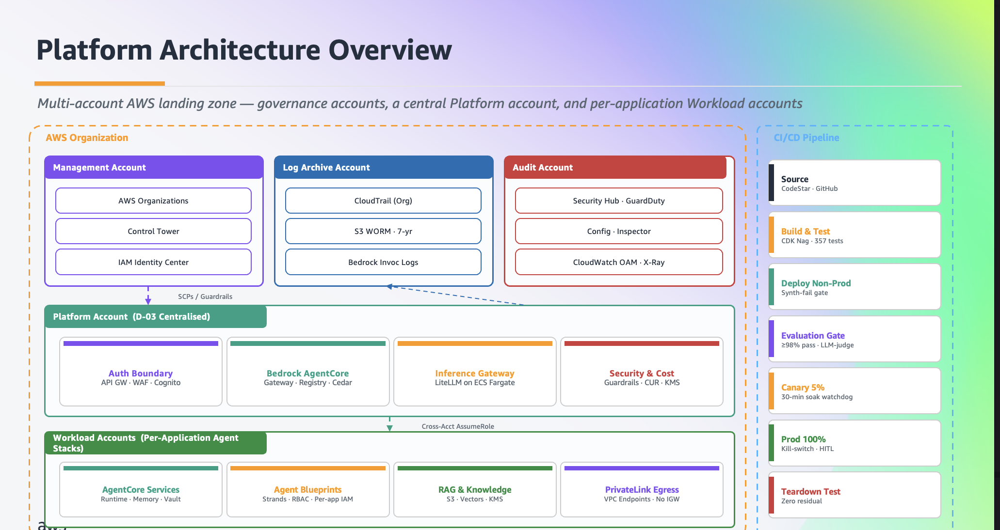

# Building an Enterprise Agentic AI Platform on Amazon Bedrock AgentCore

A hands-on AWS workshop for building an enterprise-style landing-zone pattern for agentic AI
workloads on Amazon Bedrock and Amazon Bedrock AgentCore. You assemble governed model access,
tool and agent registries, security controls, and observability — the foundation enterprises
need to move agents from proof-of-concept to production — using AWS-native services alongside
proven open-source components (LiteLLM, MCP Gateway & Registry, Strands Agents, and FAST).



## Why this workshop

Enterprises are moving beyond chatbots and proof-of-concept agents, but the jump to production
takes more than a better model — it takes a **platform**: governed, cost-attributed model access;
a registry to discover and reuse tools and agents; security guardrails and authorization; and
observability across the whole fleet.

Amazon Bedrock AgentCore provides the managed runtime, memory, gateway, identity, and
observability you would otherwise build yourself. This workshop shows how to compose AgentCore
with an **LLM Gateway** (governed model access), an **MCP Gateway & Registry** (tool and agent
discovery), and **Strands Agents** (the agents themselves) into a coherent enterprise foundation —
then deploy a real agent on top of it.

## What you'll build

The workshop follows two complementary personas — the **platform engineer** who provides governed
LLM and tool infrastructure (Modules 2, 3a, 3b), and the **AI/ML engineer** who builds agents on
top of it (Module 4):

- **Module 1 — The Vision:** why enterprises need a platform approach to agentic AI, not just
  individual agents (all tracks).
- **Module 2 — LLM Gateway:** deploy LiteLLM Proxy on ECS Fargate for governed, cost-attributed
  access to Amazon Bedrock models.
- **Module 3a — MCP Registry + Tools Gateway:** register tools in the MCP Gateway & Registry, then
  layer an AgentCore Tools Gateway on top for JWT auth, audit, and guardrails.
- **Module 3b — AgentCore Registry & Gateway:** AWS-native tool governance with Amazon Bedrock
  AgentCore, Cedar-based authorization, and EventBridge-driven approval workflows.
- **Module 4 — Build Your Agent:** deploy a full-stack travel agent using FAST (Fullstack
  AgentCore Solution Template) on Amazon Bedrock AgentCore, wired to the platform via either the
  MCP path or the AgentCore path.

### Choose your track

| Track | Best for | You do | Duration |
|-------|----------|--------|----------|
| **1 — Fast Path** | AI/ML engineers who want to build an agent | Jump straight to Module 4 — platform is pre-deployed | ~1.5–2 hrs |
| **2 — Build the Platform** | Platform engineers | Modules 1 → 2 → 3a → 3b (stops before the agent) | ~2–3 hrs |
| **3 — Full Journey** | Solutions architects, tech leads | Modules 1 → 2 → 3a → 3b → 4 end-to-end | ~3–4 hrs |

All tracks share **Module 1**, which ends with a track selector so you can pick the right path.

## Who it's for

A 300-level workshop for **Platform Engineers, AI/ML Engineers, and Solutions Architects**. It is
not an introduction to AWS or AI/ML — you should already have:

1. Basic familiarity with core AWS services (IAM, Lambda, CloudFormation, ECS Fargate, API
   Gateway, Cognito, CloudWatch).
2. Comfort with the command line and the AWS CLI.
3. Familiarity with Amazon Bedrock and how LLMs use tools (function/tool calling).

Each module opens with a short verification block so you can confirm the expected tools are
installed before you begin.

## Running the workshop

You can run this two ways. Both deploy the **same five CloudFormation stacks** (from
`contentspec.yaml`) and land you in the **same browser-based Code Editor IDE**, so every module
works identically.

- **At an AWS event** — Workshop Studio auto-provisions a pre-configured account; participants use
  the scoped `WSParticipantRole`. Nothing to deploy yourself.
- **Self-paced** — run it in your own AWS account with one deploy script.

### Prerequisites (self-paced)

- **AWS CLI v2** — configured for an account you own ([install](https://docs.aws.amazon.com/cli/latest/userguide/getting-started-install.html)).
- **[`yq`](https://github.com/mikefarah/yq)** — the deploy script reads `contentspec.yaml` with it.
- **Git** and a modern browser (Chrome/Firefox/Edge).
- **Region** — deploy into a **validated region**: `us-west-2` (default), `us-east-1`, or
  `eu-west-1`. The workshop has been built and tested against the Bedrock model and AgentCore
  availability in these regions; the deploy adapts model IDs and resources to your region
  automatically and a preflight check confirms the required capabilities before any stack is
  created. Model access must be granted per region. (Other regions are not supported — the
  Amazon Bedrock AgentCore Registry control plane is not yet generally available everywhere,
  which breaks Modules 3b and 4.)
- **Permissions** — attach the scoped deploy policies (explicit actions only, each regional
  statement restricted to the validated regions) in
  [`static/cfn/self-service-deploy-policy-{1..4}.json`](static/cfn/) — split across four files to
  stay under IAM's per-policy size limit. (`AdministratorAccess` also works if you'd rather not
  manage four policies.) We recommend a **dedicated account** you can tear down when finished.

> ⚠️ **Cost notice.** Provisioning creates real, billable AWS resources (Amazon DocumentDB,
> Aurora PostgreSQL, ECS Fargate, NAT Gateways, Application Load Balancers, CloudFront, Lambda,
> and Amazon Bedrock model invocations) in **your chosen region**. Tear everything down with
> `./deploy-cfn.sh destroy` when you finish to stop charges.

### Quick start (self-paced)

```bash
git clone https://github.com/awslabs/agentic-ai-platform.git
cd agentic-ai-platform/workshop-agentic-ai-platform-agentcore

# Set a supported region (default us-west-2; see Prerequisites above)
aws configure set region us-west-2   # or us-east-1, eu-west-1

# Deploy all 5 stacks (LLM Gateway, MCP Registry, Tools Gateway, AgentCore, Code Editor IDE)
./scripts/self-service-deploy.sh        # ~30-45 min; prints the IDE URL + password at the end

# Verify the environment is healthy (use the region you deployed into)
./scripts/self-test.sh -r "$(aws configure get region)"   # expect: 5 passed, 0 failed

```

Open the printed IDE URL, sign in with the generated `IdePassword`, and follow the workshop guide
starting at **Module 1**. The full self-paced walkthrough lives in
`content/introduction/getting-started/self-service.en.md`.

### Running the modules — CLI or notebook

The deploy above only stands up the infrastructure. The hands-on work happens **inside the
browser Code Editor IDE** (the URL the deploy printed), **not** on your laptop — that IDE comes
with Python, JupyterLab, Node.js, the AWS CDK, pre-configured AWS credentials, and the workshop
source code pre-installed under `/workshop`.

Most module sections offer **two equivalent paths — pick whichever you prefer; you do not need to
do both**, they reach the same result:

| Path | How to run it | Where the steps live |
|------|---------------|----------------------|
| **CLI walkthrough** | Open a terminal in the IDE (**Terminal → New Terminal**, `` Ctrl+` ``). Copy each command block from the workshop page and paste it into that terminal, in order. The shell already sits in `/workshop` with credentials and the right region. | The fenced `bash` blocks on each module page (the workshop guide). |
| **Notebook walkthrough** | In the IDE file explorer, open the notebook named on the page (under `/workshop/source/<module>/notebooks/`), select the **`workshop`** kernel (or **`workshop-fast`** for Module 4b), and run cells top-to-bottom (`Shift+Enter`, or **Run All**). | The `.ipynb` files referenced by each page. |

A few rules of thumb:

- **Run everything in the IDE terminal/notebooks**, not your local machine. The only commands you
  run **locally** are the three lifecycle ones above: `self-service-deploy.sh`, `self-test.sh`,
  and `deploy-cfn.sh destroy`.
- **Run steps in order within a module** — later blocks/cells reuse environment variables (and, in
  Module 3b, an assumed IAM persona) set by earlier ones. If you switch between the CLI and the
  notebook path mid-module, re-run that module's setup steps so the state is consistent.
- **Module ordering follows your track** (see the track table above). Track 1 jumps to Module 4
  against the pre-deployed platform; Tracks 2/3 go Module 2 → 3a → 3b (→ 4).
- Each page calls out when a step's outcome is an **expected** error (the governance "negative
  tests" in Module 3b deliberately show `AccessDenied`) — those are teaching moments, not failures.

The five stacks deploy in `contentspec.yaml` order — **LLM Gateway → MCP Registry → Tools Gateway
→ AgentCore → Code Editor** — and tear down in reverse (with a GuardDuty VPC-endpoint pre-cleanup
that otherwise blocks VPC deletion).

### Delete Everything

```bash
# When finished, tear everything down to stop charges
./deploy-cfn.sh destroy
```

## Repository structure

```
workshop-agentic-ai-platform-agentcore/   # inside the awslabs/agentic-ai-platform repository
├── content/                      # Workshop markdown (Workshop Studio builds from here)
│   ├── index.en.md               # Landing page
│   ├── introduction/             # Intro + getting-started (aws-event + self-service paths)
│   ├── module-1/                 # The Vision (all tracks)
│   ├── module-2/                 # LLM Gateway (tracks 2, 3)
│   ├── module-3a/                # MCP Registry + Tools Gateway (tracks 2, 3)
│   ├── module-3b/                # AgentCore Registry & Gateway (tracks 2, 3)
│   ├── module-4/                 # FAST agent — dual-path (MCP or AgentCore) (tracks 1, 3)
│   ├── summary/
│   └── cleanup/
├── source/                       # Module source code (pre-staged into /workshop in the IDE)
│   ├── module-2-llm-gateway/     # LLM Gateway scripts + notebooks
│   ├── module-3a-mcp-registry/   # MCP Registry scripts + notebooks
│   ├── module-3b-agentcore/      # AgentCore Registry + Gateway + Cedar notebooks
│   ├── module-4a-tools-gateway/  # Tools Gateway Lambdas + CDK
│   └── module-4b-fast/           # FAST agent notebooks (connects to the gateways)
├── static/
│   ├── cfn/
│   │   ├── llm-gateway/           # Stack 1 — LiteLLM Proxy on ECS (Module 2)
│   │   ├── registry/              # Stack 2 — MCP Gateway & Registry nested stacks (Module 3a)
│   │   ├── tools-gateway/         # Stack 3 — AgentCore Tools Gateway (Module 3a upper layer)
│   │   ├── agentcore/             # Stack 4 — AgentCore Registry & Gateway (Module 3b)
│   │   ├── code-editor.yaml       # Stack 5 — browser VS Code IDE on EC2 (all tracks)
│   │   ├── workshop-iam-policy-core.json     # ParticipantRole policy (bedrock, agentcore, secrets)
│   │   ├── workshop-iam-policy-infra.json    # ParticipantRole policy (ECS, EFS, ELB, etc.)
│   │   ├── workshop-iam-policy-network.json  # ParticipantRole policy (VPC/EC2 networking)
│   │   ├── self-service-deploy-policy-{1..4}.json  # Scoped deploy policies, restricted to validated regions (self-hosted)
│   │   └── self-service-scp.json  # Optional OU-level region-fence SCP (self-hosted hardening)
│   └── img/                       # Workshop images
├── scripts/
│   ├── self-service-deploy.sh     # Self-paced deploy wrapper (preflight + delegate to deploy-cfn.sh)
│   └── self-test.sh               # Post-deploy health check (5 stacks + endpoints)
├── deploy-cfn.sh                  # Deploy/destroy/cleanup engine for all stacks in contentspec.yaml
└── contentspec.yaml               # Workshop Studio config — drives stack deployment order
```

## Contributing

Contributions are welcome — bug reports, corrections, content improvements, and new features. See
[CONTRIBUTING.md](CONTRIBUTING.md) for the full guidelines and our
[Code of Conduct](CODE_OF_CONDUCT.md).

Content lives in `/content/` (Workshop Studio markdown), source code in `/source/`, and
infrastructure in `/static/cfn/`. Work on a short-lived branch and open a pull request:

```bash
git checkout -b feature/{scope-of-change}
# edit content / source / static, then:
git add . && git commit -m "feat: {brief description}"
git push -u origin feature/{scope-of-change}
```

### Content guidelines

- Index files: `index.en.md` (loads at folder root); named pages: `{name}.en.md`.
- Callouts use Workshop Studio directives — `::alert[…]{type="info|warning|error"}` — **not** Hugo
  `{}` shortcodes.
- Markdown → `/content/`, images → `/static/img/`, CloudFormation → `/static/cfn/`.
- Run `cfn-lint` on any changed template and the module unit tests (`pytest`) before pushing.

## Security

If you discover a potential security issue, please follow the AWS vulnerability reporting process
described in [CONTRIBUTING.md](CONTRIBUTING.md#security-issue-notifications) — do **not** open a
public GitHub issue.

## License

Licensed under MIT-0. See [LICENSE](LICENSE). Third-party components retain their own licenses —
see [THIRD_PARTY_LICENSES.md](THIRD_PARTY_LICENSES.md).
