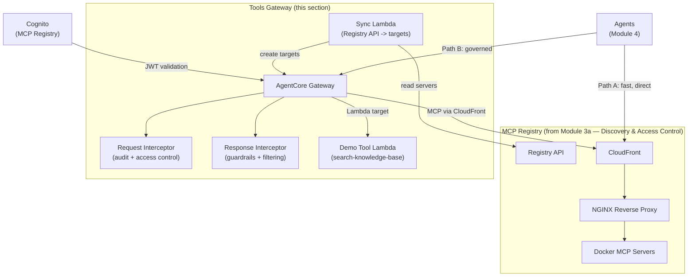

Add a governed tool access layer on top of the MCP Registry using Amazon Bedrock AgentCore Gateway. As the platform engineer, you will now add runtime governance — audit logging, guardrails, and access control — to every tool call.

## The Problem

- The MCP Registry provides an NGINX reverse proxy (Path A) -- fast but ungoverned
- Agents need Lambda-backed tools and external APIs that NGINX can't serve
- There is no audit trail, content screening, or group-based access control on tool calls
- Platform teams need to control which teams can access which tools

## The Solution: Dual-Path Architecture

| Path | Entry Point | Authentication | Audit | Guardrails | Tool Types |
|------|-------------|---------------|-------|------------|------------|
| **Path A (Direct)** | CloudFront/NGINX | Session cookie or static token | NGINX access logs only | None | Docker MCP servers |
| **Path B (Governed)** | AgentCore Gateway | Cognito JWT (CUSTOM\_JWT) | CloudWatch structured audit log | Bedrock Guardrails | Lambda functions, external APIs, Docker servers (via CloudFront) |

The Tools Gateway adds **Path B** -- the AgentCore Gateway -- as a thin integration layer. It reads tools from the MCP Registry and creates gateway targets, adding:

- **Group-based access control** -- Cognito groups determine which tools each team can see and call
- **Audit logging** -- Every `tools/call` and `tools/list` request logged to CloudWatch (with optional DynamoDB)
- **Bedrock Guardrails** -- Tool outputs screened for PII, harmful content before reaching agents
- **Lambda-native targets** -- Lambda functions invoked directly by the gateway (no HTTP proxy needed)
- **Semantic discovery** -- Find tools by description, not just name

## Architecture

### What the Tools Gateway Does NOT Duplicate

The Tools Gateway is intentionally thin:

- No DynamoDB tables for tool storage (tools live in the MCP Registry)
- No FastAPI API (the MCP Registry API is the control plane)
- No Streamlit UI (the MCP Registry UI handles registration and browsing)
- No approval workflows (tools are available once registered in the Registry)

## AWS Resources Created

| Resource | Service | Purpose |
|----------|---------|---------|
| `agentcore-gateway-sync` | Lambda | Reads MCP Registry API, creates gateway targets |
| `agentcore-gateway-request-interceptor` | Lambda | Audit logging + group-based access control |
| `agentcore-gateway-response-interceptor` | Lambda | Field sanitization + Bedrock Guardrails |
| `workshop-search-knowledge-base` | Lambda | Demo MCP tool (replaced by real KB in Module 4) |
| EventBridge Rule | EventBridge | Triggers sync every 5 minutes |
| `workshop-agentcore-gateway-role-<region>` | IAM Role | Assumed by gateway for tool dispatch |
| `gateway-admins` | Cognito Group | Full access to all tools |
| `gateway-developers` | Cognito Group | Access to tagged tool subsets only |

## Steps

Follow the notebooks in the sidebar:

1. [Two Paths to Tools](../tg-two-paths/) -- Understand the dual-path architecture
1. [Explore the Deployed Stack](../tg-explore-stack/) -- Verify the auto-provisioned stack and create the AgentCore Gateway
1. [Register New Tools](../tg-curate-tools/) -- Add Lambda and OpenAPI tools to the Registry
1. [Sync to Gateway](../tg-automated-sync/) -- Invoke the Sync Lambda to create gateway targets
1. [Test Both Paths](../tg-test-both-paths/) -- Compare Path A vs Path B side by side
1. [Bedrock Guardrails](../tg-guardrails/) -- Add content screening to Path B
1. [Register Gateway + Cleanup](../tg-register-cleanup/) -- Make the gateway discoverable, then tear down

## Source Code

::alert[The Tools Gateway source lives under `source/module-4a-tools-gateway/` because the `4a` prefix sorts it alphabetically before `module-4b-fast/` in the IDE file tree — matching the order in which you touch these components during the workshop. Despite the directory name, this code is taught here in **Module 3a** (the governance layer) and is consumed by Module 4's FAST agent.]{type="info"}

:::code{showCopyAction=false showLineNumbers=false language=text}
source/module-4a-tools-gateway/
├── handlers/               # Lambda handlers
│   ├── sync_lambda.py      # Registry -> Gateway target sync
│   ├── interceptors.py     # Request + Response interceptors
│   ├── demo_tool.py        # search-knowledge-base demo
│   ├── register_tools.py   # Helper: register Lambda/OpenAPI tools
│   └── register_gateway.py # Helper: register gateway in Registry
├── services/               # Shared service layer
│   ├── gateway_sync.py     # AgentCore Gateway target CRUD
│   └── registry_client.py  # M2M-authenticated Registry API client
├── cdk/                    # CDK reference (auto-provisioned via CloudFormation)
│   └── agentcore_gateway_stack.py
├── create_gateway.py       # Creates the AgentCore Gateway API resource
├── notebooks/              # Per-step Jupyter notebooks (01-07)
└── tests/                  # Unit and integration tests
:::
