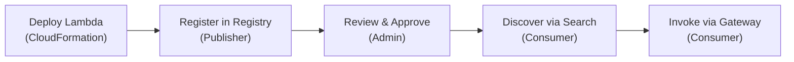

Understand the three pillars and three personas before starting the hands-on steps.

## Three Pillars

| Pillar | Service | Role |
|--------|---------|------|
| **Discovery** | [AgentCore Registry](https://docs.aws.amazon.com/bedrock-agentcore/latest/devguide/registry.html) | Searchable metadata catalog — tools publish descriptions, schemas, and tags. API-only (no CloudFormation resource). |
| **Governance** | [AgentCore Gateway](https://docs.aws.amazon.com/bedrock-agentcore/latest/devguide/gateway.html) | Governed invocation endpoint — routes to Lambda targets, applies request interceptors (audit, ACL) and response interceptors (guardrails). |
| **Identity** | Cognito + WorkloadIdentity | Human users authenticate via Cognito. Agents authenticate via WorkloadIdentity + OAuth2CredentialProvider for M2M access. |

The Registry and Gateway are **independent services**. The Registry is a catalog (discovery). The Gateway routes traffic (governance). Agent developers search the Registry to find tools, then invoke them through the Gateway.

## Three Personas

| Persona | IAM Role | Can Register | Can Approve | Can Search | Can Invoke |
|---------|----------|-------------|-------------|------------|------------|
| **Admin** | `workshop-ac-registry-admin-<region>` | Yes | Yes | Yes | Yes |
| **Publisher** | `workshop-ac-registry-publisher-<region>` | Yes | **No** | Yes | No |
| **Consumer** | `workshop-ac-registry-consumer-<region>` | No | No | Yes | Yes |

The person who builds a tool is not the person who approves it for production — this is a deliberate governance control.

## Tool Lifecycle

Steps 1 is handled by CloudFormation (pre-deployed). Steps 2-5 are interactive — you will do them in the following pages.

## What Was Pre-Deployed

The `workshop-agentcore-stack` created:

| Category | Resources |
|----------|-----------|
| **Identity** | Cognito User Pool, Admin/Publisher/Consumer IAM roles |
| **Tools** | Lambda functions: flights, hotels, product-info, search-kb, order-processing-agent |
| **Gateway** | AgentCore Gateway + 3 Lambda targets + request/response interceptors |
| **Agent Identity** | WorkloadIdentity for M2M agent auth |

::alert[The Gateway and Lambda targets are pre-deployed by CloudFormation. The **Registry** is not — you will create it interactively in the next step via the AWS CLI.]{type="info"}
